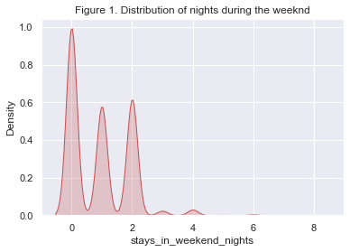
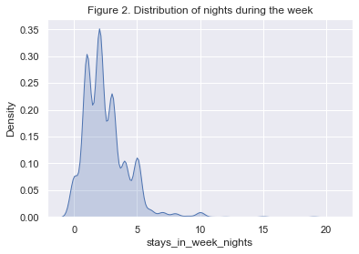
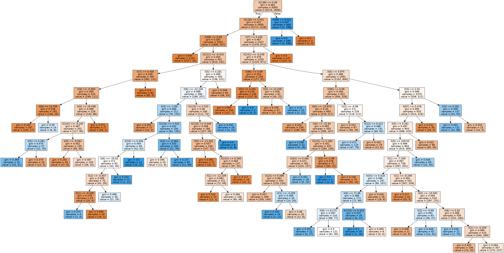

# An inquiry into hotel cancellation data

    <class 'pandas.core.frame.DataFrame'>
    RangeIndex: 5000 entries, 0 to 4999
    Data columns (total 20 columns):
     #   Column                       Non-Null Count  Dtype  
    ---  ------                       --------------  -----  
     0   hotel                        5000 non-null   object 
     1   arrival_date_month           5000 non-null   object 
     2   arrival_date_week_number     5000 non-null   int64  
     3   arrival_date_day_of_month    5000 non-null   int64  
     4   stays_in_weekend_nights      5000 non-null   int64  
     5   stays_in_week_nights         5000 non-null   int64  
     6   adults                       5000 non-null   int64  
     7   meal                         5000 non-null   object 
     8   country                      5000 non-null   object 
     9   market_segment               5000 non-null   object 
     10  distribution_channel         5000 non-null   object 
     11  reserved_room_type           5000 non-null   object 
     12  assigned_room_type           5000 non-null   object 
     13  booking_changes              5000 non-null   int64  
     14  deposit_type                 5000 non-null   object 
     15  customer_type                5000 non-null   object 
     16  adr                          5000 non-null   float64
     17  required_car_parking_spaces  5000 non-null   int64  
     18  total_of_special_requests    5000 non-null   int64  
     19  canceled                     5000 non-null   int64  
    dtypes: float64(1), int64(9), object(10)
    memory usage: 781.4+ KB

    Proportion of cancelations
    0.3652

## How are the variables distributed in the dataset

### The overall distribution of the numerical variables

A detailed summary, in the form of the main descriptive statistics of the numerical variables in the dataset, can give us a general idea about their distribution. We can in particular note that many variables show signs of distributions that are skewed to the right due to the presence of high extremme values (week of arrival, average daily rate, total of special requests etc.)

<table border="1" class="dataframe">
  <thead>
    <tr style="text-align: right;">
      <th></th>
      <th>count</th>
      <th>mean</th>
      <th>std</th>
      <th>min</th>
      <th>25%</th>
      <th>50%</th>
      <th>75%</th>
      <th>max</th>
    </tr>
  </thead>
  <tbody>
    <tr>
      <th>arrival_date_week_number</th>
      <td>5000.0</td>
      <td>27.061800</td>
      <td>13.531585</td>
      <td>1.0</td>
      <td>16.0</td>
      <td>27.0</td>
      <td>38.0</td>
      <td>53.0</td>
    </tr>
    <tr>
      <th>arrival_date_day_of_month</th>
      <td>5000.0</td>
      <td>15.708600</td>
      <td>8.791311</td>
      <td>1.0</td>
      <td>8.0</td>
      <td>16.0</td>
      <td>23.0</td>
      <td>31.0</td>
    </tr>
    <tr>
      <th>stays_in_weekend_nights</th>
      <td>5000.0</td>
      <td>0.906600</td>
      <td>0.971012</td>
      <td>0.0</td>
      <td>0.0</td>
      <td>1.0</td>
      <td>2.0</td>
      <td>8.0</td>
    </tr>
    <tr>
      <th>stays_in_week_nights</th>
      <td>5000.0</td>
      <td>2.489800</td>
      <td>1.826955</td>
      <td>0.0</td>
      <td>1.0</td>
      <td>2.0</td>
      <td>3.0</td>
      <td>20.0</td>
    </tr>
    <tr>
      <th>adults</th>
      <td>5000.0</td>
      <td>1.863000</td>
      <td>0.482781</td>
      <td>0.0</td>
      <td>2.0</td>
      <td>2.0</td>
      <td>2.0</td>
      <td>4.0</td>
    </tr>
    <tr>
      <th>booking_changes</th>
      <td>5000.0</td>
      <td>0.219000</td>
      <td>0.673446</td>
      <td>0.0</td>
      <td>0.0</td>
      <td>0.0</td>
      <td>0.0</td>
      <td>18.0</td>
    </tr>
    <tr>
      <th>adr</th>
      <td>5000.0</td>
      <td>102.669692</td>
      <td>48.879693</td>
      <td>0.0</td>
      <td>70.0</td>
      <td>94.5</td>
      <td>126.0</td>
      <td>382.0</td>
    </tr>
    <tr>
      <th>required_car_parking_spaces</th>
      <td>5000.0</td>
      <td>0.065000</td>
      <td>0.248168</td>
      <td>0.0</td>
      <td>0.0</td>
      <td>0.0</td>
      <td>0.0</td>
      <td>2.0</td>
    </tr>
    <tr>
      <th>total_of_special_requests</th>
      <td>5000.0</td>
      <td>0.574200</td>
      <td>0.793864</td>
      <td>0.0</td>
      <td>0.0</td>
      <td>0.0</td>
      <td>1.0</td>
      <td>5.0</td>
    </tr>
    <tr>
      <th>canceled</th>
      <td>5000.0</td>
      <td>0.365200</td>
      <td>0.481534</td>
      <td>0.0</td>
      <td>0.0</td>
      <td>0.0</td>
      <td>1.0</td>
      <td>1.0</td>
    </tr>
  </tbody>
</table>

### The distribution of some interesting categorical variables : travel agencies capture most of the bookings, Bed and Breakfast are particuarly demanded

For some variables, and especially the categorical ones, we can rely on counting to get sense of their occurence in the dataset. For example, the table below gives the counts of the market segments according to the operator through which the client makes her booking. In this example, we see that client usually go through online travel agencies to book a stay. In fact, travel agencies and tour operators stand as the main distribution channel of bookings in the dataset.

    Online TA        0.4694
    Offline TA/TO    0.1972
    Groups           0.1752
    Direct           0.1096
    Corporate        0.0408
    Complementary    0.0058
    Aviation         0.0020
    Name: market_segment, dtype: float64

    TA/TO        0.8130
    Direct       0.1326
    Corporate    0.0528
    GDS          0.0016
    Name: distribution_channel, dtype: float64

    BB           0.7614
    HB           0.1310
    SC           0.0876
    Undefined    0.0120
    FB           0.0080
    Name: meal, dtype: float64

### A figure is worth a thousand word:  Distributions through plots

We can also capture these features graphically by plotting the densities of the numerical variables and the counts of the categorical variables. As said before, we see graphically that the numerical variables are indeed skewed to the right. Weekend stays are concentrated around none and two a year, while week stays go up to five and rarely more. The average daily rate is around 90 dollars. The market is most dominated by online travel agencies and, to a less extent, offline travel agencies. Transcient customers represent the bulk of customer type.

## How do the variables interact with each other ?
### 1. Number of stays by market segements

The tables below give the cross-tabulation of the number of stays according the different market segments available in the dataset. The first observation we can make is that, across all the categories, the clients do not usually make more than two bookings a year for stays during the weekend, while they tend to book more stays during the week (up to 5 stays a year). The latter observation is particularly relevant for direct bookings, group bookings and bookings through an agency or an operator. The figure 8 and 9 below gives the densities of stays according to each market segment. Overall, the observation of right tail skewness that is observed across the whole dataset also translates at the granular level.

<table border="1" class="dataframe">
  <thead>
    <tr style="text-align: right;">
      <th>market_segment</th>
      <th>Aviation</th>
      <th>Complementary</th>
      <th>Corporate</th>
      <th>Direct</th>
      <th>Groups</th>
      <th>Offline TA/TO</th>
      <th>Online TA</th>
    </tr>
    <tr>
      <th>stays_in_weekend_nights</th>
      <th></th>
      <th></th>
      <th></th>
      <th></th>
      <th></th>
      <th></th>
      <th></th>
    </tr>
  </thead>
  <tbody>
    <tr>
      <th>0</th>
      <td>0.3</td>
      <td>0.724138</td>
      <td>0.691176</td>
      <td>0.481752</td>
      <td>0.484018</td>
      <td>0.437120</td>
      <td>0.395398</td>
    </tr>
    <tr>
      <th>1</th>
      <td>0.4</td>
      <td>0.137931</td>
      <td>0.235294</td>
      <td>0.244526</td>
      <td>0.283105</td>
      <td>0.215010</td>
      <td>0.270984</td>
    </tr>
    <tr>
      <th>2</th>
      <td>0.1</td>
      <td>0.137931</td>
      <td>0.053922</td>
      <td>0.239051</td>
      <td>0.218037</td>
      <td>0.301217</td>
      <td>0.312740</td>
    </tr>
    <tr>
      <th>3</th>
      <td>0.0</td>
      <td>0.000000</td>
      <td>0.009804</td>
      <td>0.025547</td>
      <td>0.003425</td>
      <td>0.014199</td>
      <td>0.008095</td>
    </tr>
    <tr>
      <th>4</th>
      <td>0.0</td>
      <td>0.000000</td>
      <td>0.000000</td>
      <td>0.009124</td>
      <td>0.006849</td>
      <td>0.030426</td>
      <td>0.010652</td>
    </tr>
    <tr>
      <th>5</th>
      <td>0.2</td>
      <td>0.000000</td>
      <td>0.004902</td>
      <td>0.000000</td>
      <td>0.000000</td>
      <td>0.000000</td>
      <td>0.000426</td>
    </tr>
    <tr>
      <th>6</th>
      <td>0.0</td>
      <td>0.000000</td>
      <td>0.000000</td>
      <td>0.000000</td>
      <td>0.004566</td>
      <td>0.002028</td>
      <td>0.001278</td>
    </tr>
    <tr>
      <th>7</th>
      <td>0.0</td>
      <td>0.000000</td>
      <td>0.004902</td>
      <td>0.000000</td>
      <td>0.000000</td>
      <td>0.000000</td>
      <td>0.000000</td>
    </tr>
    <tr>
      <th>8</th>
      <td>0.0</td>
      <td>0.000000</td>
      <td>0.000000</td>
      <td>0.000000</td>
      <td>0.000000</td>
      <td>0.000000</td>
      <td>0.000426</td>
    </tr>
  </tbody>
</table>

<table border="1" class="dataframe">
  <thead>
    <tr style="text-align: right;">
      <th>market_segment</th>
      <th>Aviation</th>
      <th>Complementary</th>
      <th>Corporate</th>
      <th>Direct</th>
      <th>Groups</th>
      <th>Offline TA/TO</th>
      <th>Online TA</th>
    </tr>
    <tr>
      <th>stays_in_week_nights</th>
      <th></th>
      <th></th>
      <th></th>
      <th></th>
      <th></th>
      <th></th>
      <th></th>
    </tr>
  </thead>
  <tbody>
    <tr>
      <th>0</th>
      <td>0.1</td>
      <td>0.172414</td>
      <td>0.137255</td>
      <td>0.093066</td>
      <td>0.033105</td>
      <td>0.040568</td>
      <td>0.064337</td>
    </tr>
    <tr>
      <th>1</th>
      <td>0.3</td>
      <td>0.413793</td>
      <td>0.495098</td>
      <td>0.333942</td>
      <td>0.272831</td>
      <td>0.192698</td>
      <td>0.222412</td>
    </tr>
    <tr>
      <th>2</th>
      <td>0.2</td>
      <td>0.310345</td>
      <td>0.166667</td>
      <td>0.213504</td>
      <td>0.399543</td>
      <td>0.325558</td>
      <td>0.259906</td>
    </tr>
    <tr>
      <th>3</th>
      <td>0.1</td>
      <td>0.068966</td>
      <td>0.112745</td>
      <td>0.142336</td>
      <td>0.165525</td>
      <td>0.199797</td>
      <td>0.210481</td>
    </tr>
    <tr>
      <th>4</th>
      <td>0.1</td>
      <td>0.034483</td>
      <td>0.029412</td>
      <td>0.069343</td>
      <td>0.050228</td>
      <td>0.069980</td>
      <td>0.112058</td>
    </tr>
    <tr>
      <th>5</th>
      <td>0.0</td>
      <td>0.000000</td>
      <td>0.029412</td>
      <td>0.096715</td>
      <td>0.063927</td>
      <td>0.111562</td>
      <td>0.098850</td>
    </tr>
    <tr>
      <th>6</th>
      <td>0.0</td>
      <td>0.000000</td>
      <td>0.004902</td>
      <td>0.018248</td>
      <td>0.002283</td>
      <td>0.011156</td>
      <td>0.013208</td>
    </tr>
    <tr>
      <th>7</th>
      <td>0.0</td>
      <td>0.000000</td>
      <td>0.004902</td>
      <td>0.016423</td>
      <td>0.004566</td>
      <td>0.008114</td>
      <td>0.006391</td>
    </tr>
    <tr>
      <th>8</th>
      <td>0.0</td>
      <td>0.000000</td>
      <td>0.000000</td>
      <td>0.007299</td>
      <td>0.000000</td>
      <td>0.013185</td>
      <td>0.004687</td>
    </tr>
    <tr>
      <th>9</th>
      <td>0.0</td>
      <td>0.000000</td>
      <td>0.004902</td>
      <td>0.001825</td>
      <td>0.000000</td>
      <td>0.004057</td>
      <td>0.001278</td>
    </tr>
    <tr>
      <th>10</th>
      <td>0.2</td>
      <td>0.000000</td>
      <td>0.004902</td>
      <td>0.005474</td>
      <td>0.001142</td>
      <td>0.020284</td>
      <td>0.004261</td>
    </tr>
    <tr>
      <th>11</th>
      <td>0.0</td>
      <td>0.000000</td>
      <td>0.004902</td>
      <td>0.000000</td>
      <td>0.001142</td>
      <td>0.000000</td>
      <td>0.000000</td>
    </tr>
    <tr>
      <th>12</th>
      <td>0.0</td>
      <td>0.000000</td>
      <td>0.000000</td>
      <td>0.000000</td>
      <td>0.001142</td>
      <td>0.001014</td>
      <td>0.000426</td>
    </tr>
    <tr>
      <th>13</th>
      <td>0.0</td>
      <td>0.000000</td>
      <td>0.000000</td>
      <td>0.000000</td>
      <td>0.000000</td>
      <td>0.001014</td>
      <td>0.000000</td>
    </tr>
    <tr>
      <th>14</th>
      <td>0.0</td>
      <td>0.000000</td>
      <td>0.000000</td>
      <td>0.000000</td>
      <td>0.000000</td>
      <td>0.000000</td>
      <td>0.000426</td>
    </tr>
    <tr>
      <th>15</th>
      <td>0.0</td>
      <td>0.000000</td>
      <td>0.004902</td>
      <td>0.001825</td>
      <td>0.000000</td>
      <td>0.001014</td>
      <td>0.000852</td>
    </tr>
    <tr>
      <th>19</th>
      <td>0.0</td>
      <td>0.000000</td>
      <td>0.000000</td>
      <td>0.000000</td>
      <td>0.004566</td>
      <td>0.000000</td>
      <td>0.000000</td>
    </tr>
    <tr>
      <th>20</th>
      <td>0.0</td>
      <td>0.000000</td>
      <td>0.000000</td>
      <td>0.000000</td>
      <td>0.000000</td>
      <td>0.000000</td>
      <td>0.000426</td>
    </tr>
  </tbody>
</table>

### 2. Number of stays by customer type

We now turn to the interaction between the number of stays and the customer types in the dataset, given by the two tables below. A general observation is that, across all types, most customer have not booked more than twice weekend nights during the year, while they book much more stays (at least five) during the week. It reflects the pattern observed on the other end of the market (supply intermediaries i.e. market segments). Comparing the bookings across categories, we see that contract customer book on average more weekend nights than group or transient customers, relative to each categories' size in the data.

<table border="1" class="dataframe">
  <thead>
    <tr style="text-align: right;">
      <th>customer_type</th>
      <th>Contract</th>
      <th>Group</th>
      <th>Transient</th>
      <th>Transient-Party</th>
    </tr>
    <tr>
      <th>stays_in_weekend_nights</th>
      <th></th>
      <th></th>
      <th></th>
      <th></th>
    </tr>
  </thead>
  <tbody>
    <tr>
      <th>0</th>
      <td>0.309942</td>
      <td>0.380952</td>
      <td>0.428188</td>
      <td>0.513389</td>
    </tr>
    <tr>
      <th>1</th>
      <td>0.245614</td>
      <td>0.380952</td>
      <td>0.265503</td>
      <td>0.228070</td>
    </tr>
    <tr>
      <th>2</th>
      <td>0.327485</td>
      <td>0.190476</td>
      <td>0.280000</td>
      <td>0.245614</td>
    </tr>
    <tr>
      <th>3</th>
      <td>0.023392</td>
      <td>0.047619</td>
      <td>0.011275</td>
      <td>0.004617</td>
    </tr>
    <tr>
      <th>4</th>
      <td>0.093567</td>
      <td>0.000000</td>
      <td>0.012617</td>
      <td>0.002770</td>
    </tr>
    <tr>
      <th>5</th>
      <td>0.000000</td>
      <td>0.000000</td>
      <td>0.000805</td>
      <td>0.000923</td>
    </tr>
    <tr>
      <th>6</th>
      <td>0.000000</td>
      <td>0.000000</td>
      <td>0.001342</td>
      <td>0.003693</td>
    </tr>
    <tr>
      <th>7</th>
      <td>0.000000</td>
      <td>0.000000</td>
      <td>0.000000</td>
      <td>0.000923</td>
    </tr>
    <tr>
      <th>8</th>
      <td>0.000000</td>
      <td>0.000000</td>
      <td>0.000268</td>
      <td>0.000000</td>
    </tr>
  </tbody>
</table>

<table border="1" class="dataframe">
  <thead>
    <tr style="text-align: right;">
      <th>customer_type</th>
      <th>Contract</th>
      <th>Group</th>
      <th>Transient</th>
      <th>Transient-Party</th>
    </tr>
    <tr>
      <th>stays_in_week_nights</th>
      <th></th>
      <th></th>
      <th></th>
      <th></th>
    </tr>
  </thead>
  <tbody>
    <tr>
      <th>0</th>
      <td>0.017544</td>
      <td>0.142857</td>
      <td>0.067383</td>
      <td>0.044321</td>
    </tr>
    <tr>
      <th>1</th>
      <td>0.187135</td>
      <td>0.285714</td>
      <td>0.241074</td>
      <td>0.289935</td>
    </tr>
    <tr>
      <th>2</th>
      <td>0.251462</td>
      <td>0.238095</td>
      <td>0.278658</td>
      <td>0.329640</td>
    </tr>
    <tr>
      <th>3</th>
      <td>0.093567</td>
      <td>0.095238</td>
      <td>0.193826</td>
      <td>0.184672</td>
    </tr>
    <tr>
      <th>4</th>
      <td>0.099415</td>
      <td>0.047619</td>
      <td>0.090201</td>
      <td>0.062789</td>
    </tr>
    <tr>
      <th>5</th>
      <td>0.204678</td>
      <td>0.095238</td>
      <td>0.092081</td>
      <td>0.071099</td>
    </tr>
    <tr>
      <th>6</th>
      <td>0.011696</td>
      <td>0.000000</td>
      <td>0.012886</td>
      <td>0.004617</td>
    </tr>
    <tr>
      <th>7</th>
      <td>0.017544</td>
      <td>0.047619</td>
      <td>0.007517</td>
      <td>0.004617</td>
    </tr>
    <tr>
      <th>8</th>
      <td>0.040936</td>
      <td>0.047619</td>
      <td>0.005101</td>
      <td>0.000923</td>
    </tr>
    <tr>
      <th>9</th>
      <td>0.005848</td>
      <td>0.000000</td>
      <td>0.001879</td>
      <td>0.000923</td>
    </tr>
    <tr>
      <th>10</th>
      <td>0.064327</td>
      <td>0.000000</td>
      <td>0.006980</td>
      <td>0.000000</td>
    </tr>
    <tr>
      <th>11</th>
      <td>0.005848</td>
      <td>0.000000</td>
      <td>0.000000</td>
      <td>0.000923</td>
    </tr>
    <tr>
      <th>12</th>
      <td>0.000000</td>
      <td>0.000000</td>
      <td>0.000537</td>
      <td>0.000923</td>
    </tr>
    <tr>
      <th>13</th>
      <td>0.000000</td>
      <td>0.000000</td>
      <td>0.000268</td>
      <td>0.000000</td>
    </tr>
    <tr>
      <th>14</th>
      <td>0.000000</td>
      <td>0.000000</td>
      <td>0.000268</td>
      <td>0.000000</td>
    </tr>
    <tr>
      <th>15</th>
      <td>0.000000</td>
      <td>0.000000</td>
      <td>0.001074</td>
      <td>0.000923</td>
    </tr>
    <tr>
      <th>19</th>
      <td>0.000000</td>
      <td>0.000000</td>
      <td>0.000000</td>
      <td>0.003693</td>
    </tr>
    <tr>
      <th>20</th>
      <td>0.000000</td>
      <td>0.000000</td>
      <td>0.000268</td>
      <td>0.000000</td>
    </tr>
  </tbody>
</table>

### 3. Number of stays by hotel type

We look at the number of stays by hotel type. We rely this time on a simple graphical representation (figures 12 and 13 below). In accodance with the overall pattern in the dataset, we see that resort hotel are more represented across bookings, whatever their type. Also, as one would expect, they match the patterns observed when considering stays by supply or demand parameters, with the notable exception that most city hotels are booked for a unique weekend stays per year.

### 4. Number of stays by arrival month of the year

A general observation is that stays are distributed almost uniformly across the year. Week stays are however more often during the months of August and July, while weekend stays are on average less in January, February and November. 

### 5. Customer types by reserved and assigned rooms, rooms by meal

The two tables below present the cross-tabluation of customer type by reserved and assigned rooms. First, we notice that most bookings concern rooms of type A, which correspond probably to the basic single or doubles rooms. Transient customer, that are over-represented in the data are also over-represented over the bookings of rooms of type A. They also tend to book rooms of higher standing (rooms D). Moreover, most customers book a room with only breakfast as a meal. Furthermore, we observe a small discrepancy between the reserved rooms and the assigned rooms. On the one hand, being small in absolute, this indicates that overall, the wishes of the customer are usually satisfied. On the other hand, it suggests that there are some periods of overbooking that arise in the data. 
    
To better capture this, we create a new variable that captures the discrepancy between reserved rooms and assigned rooms.

$$
roomchanged =\begin{cases} 1,\quad assigned \neq reserved\\
0, \quad otherwise
\end{cases}
$$

In particular, we are interested in identifying the periods where there is a higher demand. For that end, we cross-tabulated the new variable with the arrival months. It appears that overbooking happens usually early in the year between febaruary and march, and by the end of the year, in september and october, as shown in the fourth table below.

<table border="1" class="dataframe">
  <thead>
    <tr style="text-align: right;">
      <th>reserved_room_type</th>
      <th>A</th>
      <th>B</th>
      <th>C</th>
      <th>D</th>
      <th>E</th>
      <th>F</th>
      <th>G</th>
      <th>H</th>
    </tr>
    <tr>
      <th>customer_type</th>
      <th></th>
      <th></th>
      <th></th>
      <th></th>
      <th></th>
      <th></th>
      <th></th>
      <th></th>
    </tr>
  </thead>
  <tbody>
    <tr>
      <th>Contract</th>
      <td>122</td>
      <td>0</td>
      <td>1</td>
      <td>36</td>
      <td>5</td>
      <td>7</td>
      <td>0</td>
      <td>0</td>
    </tr>
    <tr>
      <th>Group</th>
      <td>17</td>
      <td>0</td>
      <td>0</td>
      <td>2</td>
      <td>2</td>
      <td>0</td>
      <td>0</td>
      <td>0</td>
    </tr>
    <tr>
      <th>Transient</th>
      <td>2481</td>
      <td>33</td>
      <td>38</td>
      <td>722</td>
      <td>221</td>
      <td>118</td>
      <td>85</td>
      <td>27</td>
    </tr>
    <tr>
      <th>Transient-Party</th>
      <td>931</td>
      <td>19</td>
      <td>6</td>
      <td>76</td>
      <td>43</td>
      <td>3</td>
      <td>5</td>
      <td>0</td>
    </tr>
  </tbody>
</table>

<table border="1" class="dataframe">
  <thead>
    <tr style="text-align: right;">
      <th>assigned_room_type</th>
      <th>A</th>
      <th>B</th>
      <th>C</th>
      <th>D</th>
      <th>E</th>
      <th>F</th>
      <th>G</th>
      <th>H</th>
      <th>I</th>
      <th>K</th>
    </tr>
    <tr>
      <th>customer_type</th>
      <th></th>
      <th></th>
      <th></th>
      <th></th>
      <th></th>
      <th></th>
      <th></th>
      <th></th>
      <th></th>
      <th></th>
    </tr>
  </thead>
  <tbody>
    <tr>
      <th>Contract</th>
      <td>109</td>
      <td>2</td>
      <td>4</td>
      <td>37</td>
      <td>7</td>
      <td>10</td>
      <td>1</td>
      <td>0</td>
      <td>1</td>
      <td>0</td>
    </tr>
    <tr>
      <th>Group</th>
      <td>13</td>
      <td>0</td>
      <td>0</td>
      <td>3</td>
      <td>2</td>
      <td>1</td>
      <td>2</td>
      <td>0</td>
      <td>0</td>
      <td>0</td>
    </tr>
    <tr>
      <th>Transient</th>
      <td>2173</td>
      <td>41</td>
      <td>81</td>
      <td>884</td>
      <td>251</td>
      <td>140</td>
      <td>103</td>
      <td>33</td>
      <td>9</td>
      <td>10</td>
    </tr>
    <tr>
      <th>Transient-Party</th>
      <td>773</td>
      <td>34</td>
      <td>22</td>
      <td>162</td>
      <td>59</td>
      <td>13</td>
      <td>7</td>
      <td>2</td>
      <td>7</td>
      <td>4</td>
    </tr>
  </tbody>
</table>

<table border="1" class="dataframe">
  <thead>
    <tr style="text-align: right;">
      <th>reserved_room_type</th>
      <th>A</th>
      <th>B</th>
      <th>C</th>
      <th>D</th>
      <th>E</th>
      <th>F</th>
      <th>G</th>
      <th>H</th>
    </tr>
    <tr>
      <th>meal</th>
      <th></th>
      <th></th>
      <th></th>
      <th></th>
      <th></th>
      <th></th>
      <th></th>
      <th></th>
    </tr>
  </thead>
  <tbody>
    <tr>
      <th>BB</th>
      <td>2627</td>
      <td>50</td>
      <td>33</td>
      <td>705</td>
      <td>192</td>
      <td>100</td>
      <td>79</td>
      <td>21</td>
    </tr>
    <tr>
      <th>FB</th>
      <td>33</td>
      <td>0</td>
      <td>2</td>
      <td>3</td>
      <td>2</td>
      <td>0</td>
      <td>0</td>
      <td>0</td>
    </tr>
    <tr>
      <th>HB</th>
      <td>413</td>
      <td>1</td>
      <td>9</td>
      <td>122</td>
      <td>72</td>
      <td>22</td>
      <td>10</td>
      <td>6</td>
    </tr>
    <tr>
      <th>SC</th>
      <td>427</td>
      <td>1</td>
      <td>0</td>
      <td>2</td>
      <td>3</td>
      <td>4</td>
      <td>1</td>
      <td>0</td>
    </tr>
    <tr>
      <th>Undefined</th>
      <td>51</td>
      <td>0</td>
      <td>1</td>
      <td>4</td>
      <td>2</td>
      <td>2</td>
      <td>0</td>
      <td>0</td>
    </tr>
  </tbody>
</table>

<table border="1" class="dataframe">
  <thead>
    <tr style="text-align: right;">
      <th>arrival_date_month</th>
      <th>April</th>
      <th>August</th>
      <th>December</th>
      <th>February</th>
      <th>January</th>
      <th>July</th>
      <th>June</th>
      <th>March</th>
      <th>May</th>
      <th>November</th>
      <th>October</th>
      <th>September</th>
    </tr>
    <tr>
      <th>room_changed</th>
      <th></th>
      <th></th>
      <th></th>
      <th></th>
      <th></th>
      <th></th>
      <th></th>
      <th></th>
      <th></th>
      <th></th>
      <th></th>
      <th></th>
    </tr>
  </thead>
  <tbody>
    <tr>
      <th>False</th>
      <td>413</td>
      <td>542</td>
      <td>213</td>
      <td>275</td>
      <td>205</td>
      <td>480</td>
      <td>423</td>
      <td>368</td>
      <td>448</td>
      <td>218</td>
      <td>405</td>
      <td>393</td>
    </tr>
    <tr>
      <th>True</th>
      <td>39</td>
      <td>43</td>
      <td>51</td>
      <td>53</td>
      <td>46</td>
      <td>40</td>
      <td>39</td>
      <td>55</td>
      <td>60</td>
      <td>46</td>
      <td>68</td>
      <td>77</td>
    </tr>
  </tbody>
</table>

## How do the variables interact with the target ?

 We know move into studying the relationship between the variables of the dataset and the variable of interest, "canceled", which takes 1 if a booking is canceled and zero otherwise. We will proceed in the same way as the previous section, crosstabulating the target variable with the other variables. The objective is to narrow the scope of the analysis to the most fundamental determinants of cancellations in the dataset.
 

### 1. Cancellation by customer types

 As show in the table below, which gives the proportions of canceled bookings, for each customer type, we observe that cancellations are most associated with Transient customers, followed by contract customers. Also, given that Transient customers represent more than 74% of the customer, then it is more likely that they are the ones responsible of the large part of the cancellations. To verify this, we change the sense of the crosstabulation in the second table, where we know now look at the respective contribution to cancellation of each customer's type. It appears that 83% of the cancellation in the dataset are indeed due to Transient customers. 

<table border="1" class="dataframe">
  <thead>
    <tr style="text-align: right;">
      <th>customer_type</th>
      <th>Contract</th>
      <th>Group</th>
      <th>Transient</th>
      <th>Transient-Party</th>
      <th>All</th>
    </tr>
    <tr>
      <th>canceled</th>
      <th></th>
      <th></th>
      <th></th>
      <th></th>
      <th></th>
    </tr>
  </thead>
  <tbody>
    <tr>
      <th>0</th>
      <td>0.672515</td>
      <td>0.904762</td>
      <td>0.591946</td>
      <td>0.771006</td>
      <td>0.6348</td>
    </tr>
    <tr>
      <th>1</th>
      <td>0.327485</td>
      <td>0.095238</td>
      <td>0.408054</td>
      <td>0.228994</td>
      <td>0.3652</td>
    </tr>
  </tbody>
</table>

<table border="1" class="dataframe">
  <thead>
    <tr style="text-align: right;">
      <th>canceled</th>
      <th>0</th>
      <th>1</th>
      <th>All</th>
    </tr>
    <tr>
      <th>customer_type</th>
      <th></th>
      <th></th>
      <th></th>
    </tr>
  </thead>
  <tbody>
    <tr>
      <th>Contract</th>
      <td>0.036232</td>
      <td>0.030668</td>
      <td>0.0342</td>
    </tr>
    <tr>
      <th>Group</th>
      <td>0.005986</td>
      <td>0.001095</td>
      <td>0.0042</td>
    </tr>
    <tr>
      <th>Transient</th>
      <td>0.694707</td>
      <td>0.832421</td>
      <td>0.7450</td>
    </tr>
    <tr>
      <th>Transient-Party</th>
      <td>0.263075</td>
      <td>0.135816</td>
      <td>0.2166</td>
    </tr>
  </tbody>
</table>

### 2. Cancellation by market segment

 We know turn to the interaction between cancellations and market segment to identify the component of the supply side of the market that suffers most from the cancellations. In the first table below, we observe that Groups are over more likely be subject to a cancellation than are the other market segment. They reprsent in fact around 28% of cancellation in the dataset. This is still less than the figure for Online Travel Agencies and Tour operators, but, relative to the size of each group, the likelihood of cancellation is more important when it comes to the former.

<table border="1" class="dataframe">
  <thead>
    <tr style="text-align: right;">
      <th>canceled</th>
      <th>0</th>
      <th>1</th>
    </tr>
    <tr>
      <th>market_segment</th>
      <th></th>
      <th></th>
    </tr>
  </thead>
  <tbody>
    <tr>
      <th>Aviation</th>
      <td>0.900000</td>
      <td>0.100000</td>
    </tr>
    <tr>
      <th>Complementary</th>
      <td>0.827586</td>
      <td>0.172414</td>
    </tr>
    <tr>
      <th>Corporate</th>
      <td>0.818627</td>
      <td>0.181373</td>
    </tr>
    <tr>
      <th>Direct</th>
      <td>0.868613</td>
      <td>0.131387</td>
    </tr>
    <tr>
      <th>Groups</th>
      <td>0.432648</td>
      <td>0.567352</td>
    </tr>
    <tr>
      <th>Offline TA/TO</th>
      <td>0.652130</td>
      <td>0.347870</td>
    </tr>
    <tr>
      <th>Online TA</th>
      <td>0.628888</td>
      <td>0.371112</td>
    </tr>
    <tr>
      <th>All</th>
      <td>0.634800</td>
      <td>0.365200</td>
    </tr>
  </tbody>
</table>

<table border="1" class="dataframe">
  <thead>
    <tr style="text-align: right;">
      <th>canceled</th>
      <th>0</th>
      <th>1</th>
      <th>All</th>
    </tr>
    <tr>
      <th>market_segment</th>
      <th></th>
      <th></th>
      <th></th>
    </tr>
  </thead>
  <tbody>
    <tr>
      <th>Aviation</th>
      <td>0.002836</td>
      <td>0.000548</td>
      <td>0.0020</td>
    </tr>
    <tr>
      <th>Complementary</th>
      <td>0.007561</td>
      <td>0.002738</td>
      <td>0.0058</td>
    </tr>
    <tr>
      <th>Corporate</th>
      <td>0.052615</td>
      <td>0.020263</td>
      <td>0.0408</td>
    </tr>
    <tr>
      <th>Direct</th>
      <td>0.149968</td>
      <td>0.039430</td>
      <td>0.1096</td>
    </tr>
    <tr>
      <th>Groups</th>
      <td>0.119408</td>
      <td>0.272180</td>
      <td>0.1752</td>
    </tr>
    <tr>
      <th>Offline TA/TO</th>
      <td>0.202583</td>
      <td>0.187842</td>
      <td>0.1972</td>
    </tr>
    <tr>
      <th>Online TA</th>
      <td>0.465028</td>
      <td>0.476999</td>
      <td>0.4694</td>
    </tr>
  </tbody>
</table>

### 3. Supply intermediaries meet demand : a more granular look into customer types and market segment

As it appears in the previous section, customer types and market segment stand as two important characteristics that determine the likelihood of cancellation. In this section, we will take a more granular approach to study the specific effect of each variable on cancellation and their interaction with other interesting variables in the dataset.

First, we look at the interactions between the two characteristics to understand the underlying mechanism behind some of the previous results. In the cross-tabulation below, it appears that one relevant, and a bit obvious, explanation of the importance of market segments in explaining cancellation is that the transient customers, which represent the essentiel part of the dataset are over-represented in every segment of the market and have a higher likelihood of cancellation as shown above. 

<table border="1" class="dataframe">
  <thead>
    <tr style="text-align: right;">
      <th>customer_type</th>
      <th>Contract</th>
      <th>Group</th>
      <th>Transient</th>
      <th>Transient-Party</th>
    </tr>
    <tr>
      <th>market_segment</th>
      <th></th>
      <th></th>
      <th></th>
      <th></th>
    </tr>
  </thead>
  <tbody>
    <tr>
      <th>Aviation</th>
      <td>0.000000</td>
      <td>0.000000</td>
      <td>1.000000</td>
      <td>0.000000</td>
    </tr>
    <tr>
      <th>Complementary</th>
      <td>0.000000</td>
      <td>0.000000</td>
      <td>0.931034</td>
      <td>0.068966</td>
    </tr>
    <tr>
      <th>Corporate</th>
      <td>0.009804</td>
      <td>0.009804</td>
      <td>0.647059</td>
      <td>0.333333</td>
    </tr>
    <tr>
      <th>Direct</th>
      <td>0.000000</td>
      <td>0.007299</td>
      <td>0.890511</td>
      <td>0.102190</td>
    </tr>
    <tr>
      <th>Groups</th>
      <td>0.037671</td>
      <td>0.002283</td>
      <td>0.396119</td>
      <td>0.563927</td>
    </tr>
    <tr>
      <th>Offline TA/TO</th>
      <td>0.073022</td>
      <td>0.006085</td>
      <td>0.602434</td>
      <td>0.318458</td>
    </tr>
    <tr>
      <th>Online TA</th>
      <td>0.027269</td>
      <td>0.002983</td>
      <td>0.906263</td>
      <td>0.063485</td>
    </tr>
    <tr>
      <th>All</th>
      <td>0.034200</td>
      <td>0.004200</td>
      <td>0.745000</td>
      <td>0.216600</td>
    </tr>
  </tbody>
</table>

#### 1. Scoring the impact of transcient customer on the hotels 

We focus in this subsection on giving a metric to assess the impact of each customer type on the hotel. For that purpose, we group the data by customer types and market segemt and look at the rate of cancellation within each cross-category, whenever it is relevant and available. The table below gives the results. We obseve that grouping by customer and market segment, contract customers who booked by groups are very likely to cancel (93%), as well as transient customers who booked by groups (96%). By looking at the sum of cancellations, we note that they account for an important part.

<table border="1" class="dataframe">
  <thead>
    <tr style="text-align: right;">
      <th>market_segment</th>
      <th>Aviation</th>
      <th>Complementary</th>
      <th>Corporate</th>
      <th>Direct</th>
      <th>Groups</th>
      <th>Offline TA/TO</th>
      <th>Online TA</th>
    </tr>
    <tr>
      <th>customer_type</th>
      <th></th>
      <th></th>
      <th></th>
      <th></th>
      <th></th>
      <th></th>
      <th></th>
    </tr>
  </thead>
  <tbody>
    <tr>
      <th>Contract</th>
      <td>NaN</td>
      <td>NaN</td>
      <td>0.000000</td>
      <td>NaN</td>
      <td>0.939394</td>
      <td>0.125000</td>
      <td>0.250000</td>
    </tr>
    <tr>
      <th>Group</th>
      <td>NaN</td>
      <td>NaN</td>
      <td>0.000000</td>
      <td>0.250000</td>
      <td>0.000000</td>
      <td>0.166667</td>
      <td>0.000000</td>
    </tr>
    <tr>
      <th>Transient</th>
      <td>0.1</td>
      <td>0.185185</td>
      <td>0.181818</td>
      <td>0.131148</td>
      <td>0.962536</td>
      <td>0.424242</td>
      <td>0.394922</td>
    </tr>
    <tr>
      <th>Transient-Party</th>
      <td>NaN</td>
      <td>0.000000</td>
      <td>0.191176</td>
      <td>0.125000</td>
      <td>0.267206</td>
      <td>0.257962</td>
      <td>0.100671</td>
    </tr>
  </tbody>
</table>

In the continuity of the previous table, we try to quantify the impact of customer types on hotel through a new metric that takes into account the rate of cancellation as well as the number of cancellation. It is constructed as follows

$$
canc\_c\_m\_piv4 = canc\_c\_m\_piv2 - 2\times canc\_c\_m\_piv3
$$
    

where $canc\_c\_m\_piv2$ corresponds to the count of cancellations  within each subgroups and $canc\_c\_m\_piv3$ to sum within each subgroups. The more negative is the metric the more negative is the effect on the hotels.
    

The table below gives the results. We see that transcient customer that book through groups and contract customers tha book through the same mean are the ones that affect most negatively hotels, with respective scores of -321 and -29.

<table border="1" class="dataframe">
  <thead>
    <tr style="text-align: right;">
      <th>market_segment</th>
      <th>Aviation</th>
      <th>Complementary</th>
      <th>Corporate</th>
      <th>Direct</th>
      <th>Groups</th>
      <th>Offline TA/TO</th>
      <th>Online TA</th>
    </tr>
    <tr>
      <th>customer_type</th>
      <th></th>
      <th></th>
      <th></th>
      <th></th>
      <th></th>
      <th></th>
      <th></th>
    </tr>
  </thead>
  <tbody>
    <tr>
      <th>Contract</th>
      <td>NaN</td>
      <td>NaN</td>
      <td>2.0</td>
      <td>NaN</td>
      <td>-29.0</td>
      <td>54.0</td>
      <td>32.0</td>
    </tr>
    <tr>
      <th>Group</th>
      <td>NaN</td>
      <td>NaN</td>
      <td>2.0</td>
      <td>2.0</td>
      <td>2.0</td>
      <td>4.0</td>
      <td>7.0</td>
    </tr>
    <tr>
      <th>Transient</th>
      <td>8.0</td>
      <td>17.0</td>
      <td>84.0</td>
      <td>360.0</td>
      <td>-321.0</td>
      <td>90.0</td>
      <td>447.0</td>
    </tr>
    <tr>
      <th>Transient-Party</th>
      <td>NaN</td>
      <td>2.0</td>
      <td>42.0</td>
      <td>42.0</td>
      <td>230.0</td>
      <td>152.0</td>
      <td>119.0</td>
    </tr>
  </tbody>
</table>

# Is this part relevant Seb ?

<table border="1" class="dataframe">
  <thead>
    <tr style="text-align: right;">
      <th></th>
      <th></th>
      <th>canceled</th>
    </tr>
    <tr>
      <th>customer_type</th>
      <th>market_segment</th>
      <th></th>
    </tr>
  </thead>
  <tbody>
    <tr>
      <th rowspan="4" valign="top">Contract</th>
      <th>Corporate</th>
      <td>0.000000</td>
    </tr>
    <tr>
      <th>Groups</th>
      <td>0.939394</td>
    </tr>
    <tr>
      <th>Offline TA/TO</th>
      <td>0.125000</td>
    </tr>
    <tr>
      <th>Online TA</th>
      <td>0.250000</td>
    </tr>
    <tr>
      <th rowspan="5" valign="top">Group</th>
      <th>Corporate</th>
      <td>0.000000</td>
    </tr>
    <tr>
      <th>Direct</th>
      <td>0.250000</td>
    </tr>
    <tr>
      <th>Groups</th>
      <td>0.000000</td>
    </tr>
    <tr>
      <th>Offline TA/TO</th>
      <td>0.166667</td>
    </tr>
    <tr>
      <th>Online TA</th>
      <td>0.000000</td>
    </tr>
    <tr>
      <th rowspan="7" valign="top">Transient</th>
      <th>Aviation</th>
      <td>0.100000</td>
    </tr>
    <tr>
      <th>Complementary</th>
      <td>0.185185</td>
    </tr>
    <tr>
      <th>Corporate</th>
      <td>0.181818</td>
    </tr>
    <tr>
      <th>Direct</th>
      <td>0.131148</td>
    </tr>
    <tr>
      <th>Groups</th>
      <td>0.962536</td>
    </tr>
    <tr>
      <th>Offline TA/TO</th>
      <td>0.424242</td>
    </tr>
    <tr>
      <th>Online TA</th>
      <td>0.394922</td>
    </tr>
    <tr>
      <th rowspan="6" valign="top">Transient-Party</th>
      <th>Complementary</th>
      <td>0.000000</td>
    </tr>
    <tr>
      <th>Corporate</th>
      <td>0.191176</td>
    </tr>
    <tr>
      <th>Direct</th>
      <td>0.125000</td>
    </tr>
    <tr>
      <th>Groups</th>
      <td>0.267206</td>
    </tr>
    <tr>
      <th>Offline TA/TO</th>
      <td>0.257962</td>
    </tr>
    <tr>
      <th>Online TA</th>
      <td>0.100671</td>
    </tr>
  </tbody>
</table>

#### 2. A focus on groups

We now turn our interest into the groups, which appeared to be very relevant for cancellation in the previous section. For that matter, we create a subset of the bookings dataset that only keeps observations where the market segment is Groups.
    

 Then, we look at the distribution of some variables within that subset. Overall, it appears that it captures the main features of the full dataset. Indeed, most variable still have a right-skewed distribution, City hotels are the most represented type of hotels. However, it appears that Transcient party customer are mor represent within Groups.

We focus now on interactions within the subgroups of the Groups market segement. One intresting question is to identify within this category the country of origin of customers that are most likely to cancel. For this, we count the countries the proportion of each country in the subset. It appears that the great majority of bookings originate in Portugal. To get more sense of this, we interact the variable country with customer type to see if there is any clear relationship that emerges. Indeed, we see that Transcient customer as well as contract customers, those who are more likely to cancel, tend to come almost exclusively from Portugal in this subset, although their respective shares in customer types are very different (5% for contract customer and 55% for Transcient).

    PRT    0.671233
    GBR    0.078767
    ESP    0.063927
    DEU    0.037671
    FRA    0.028539
    AUT    0.018265
    ISR    0.015982
    CN     0.015982
    IRL    0.012557
    ITA    0.007991
    BEL    0.006849
    SWE    0.005708
    AUS    0.005708
    USA    0.004566
    POL    0.003425
    RUS    0.003425
    MEX    0.002283
    NLD    0.002283
    EST    0.001142
    MNE    0.001142
    EGY    0.001142
    CHN    0.001142
    UKR    0.001142
    HUN    0.001142
    KNA    0.001142
    LVA    0.001142
    CAF    0.001142
    HRV    0.001142
    CHE    0.001142
    CYP    0.001142
    DNK    0.001142
    Name: country, dtype: float64

<table border="1" class="dataframe">
  <thead>
    <tr style="text-align: right;">
      <th>country</th>
      <th>AUS</th>
      <th>AUT</th>
      <th>BEL</th>
      <th>CAF</th>
      <th>CHE</th>
      <th>CHN</th>
      <th>CN</th>
      <th>CYP</th>
      <th>DEU</th>
      <th>DNK</th>
      <th>...</th>
      <th>LVA</th>
      <th>MEX</th>
      <th>MNE</th>
      <th>NLD</th>
      <th>POL</th>
      <th>PRT</th>
      <th>RUS</th>
      <th>SWE</th>
      <th>UKR</th>
      <th>USA</th>
    </tr>
    <tr>
      <th>customer_type</th>
      <th></th>
      <th></th>
      <th></th>
      <th></th>
      <th></th>
      <th></th>
      <th></th>
      <th></th>
      <th></th>
      <th></th>
      <th></th>
      <th></th>
      <th></th>
      <th></th>
      <th></th>
      <th></th>
      <th></th>
      <th></th>
      <th></th>
      <th></th>
      <th></th>
    </tr>
  </thead>
  <tbody>
    <tr>
      <th>Contract</th>
      <td>0.000000</td>
      <td>0.000000</td>
      <td>0.000000</td>
      <td>0.000000</td>
      <td>0.000000</td>
      <td>0.000000</td>
      <td>0.00000</td>
      <td>0.000000</td>
      <td>0.060606</td>
      <td>0.000000</td>
      <td>...</td>
      <td>0.000000</td>
      <td>0.000000</td>
      <td>0.000000</td>
      <td>0.000000</td>
      <td>0.000000</td>
      <td>0.939394</td>
      <td>0.000000</td>
      <td>0.000000</td>
      <td>0.000000</td>
      <td>0.000000</td>
    </tr>
    <tr>
      <th>Group</th>
      <td>0.000000</td>
      <td>0.000000</td>
      <td>0.000000</td>
      <td>0.000000</td>
      <td>0.000000</td>
      <td>0.000000</td>
      <td>0.00000</td>
      <td>0.000000</td>
      <td>0.000000</td>
      <td>0.000000</td>
      <td>...</td>
      <td>0.000000</td>
      <td>0.000000</td>
      <td>0.000000</td>
      <td>0.000000</td>
      <td>0.000000</td>
      <td>0.000000</td>
      <td>0.000000</td>
      <td>0.000000</td>
      <td>0.000000</td>
      <td>0.000000</td>
    </tr>
    <tr>
      <th>Transient</th>
      <td>0.000000</td>
      <td>0.000000</td>
      <td>0.005764</td>
      <td>0.000000</td>
      <td>0.000000</td>
      <td>0.000000</td>
      <td>0.00000</td>
      <td>0.000000</td>
      <td>0.000000</td>
      <td>0.000000</td>
      <td>...</td>
      <td>0.002882</td>
      <td>0.000000</td>
      <td>0.000000</td>
      <td>0.000000</td>
      <td>0.002882</td>
      <td>0.933718</td>
      <td>0.002882</td>
      <td>0.000000</td>
      <td>0.000000</td>
      <td>0.000000</td>
    </tr>
    <tr>
      <th>Transient-Party</th>
      <td>0.010121</td>
      <td>0.032389</td>
      <td>0.008097</td>
      <td>0.002024</td>
      <td>0.002024</td>
      <td>0.002024</td>
      <td>0.02834</td>
      <td>0.002024</td>
      <td>0.062753</td>
      <td>0.002024</td>
      <td>...</td>
      <td>0.000000</td>
      <td>0.004049</td>
      <td>0.002024</td>
      <td>0.004049</td>
      <td>0.004049</td>
      <td>0.471660</td>
      <td>0.004049</td>
      <td>0.010121</td>
      <td>0.002024</td>
      <td>0.008097</td>
    </tr>
  </tbody>
</table>

4 rows  31 columns

Finally, we look at the interaction between the country of origin and the target variable to see whether there is a particular pattern for the country that is most represented in Groups. We find indeed that guests of Portugese origin have indeed a higher rate of cancellation. Much higher than that of the overall dataset.

<table border="1" class="dataframe">
  <thead>
    <tr>
      <th></th>
      <th>country</th>
      <th colspan="2" halign="left">canceled</th>
    </tr>
    <tr>
      <th></th>
      <th></th>
      <th>mean</th>
      <th>count</th>
    </tr>
  </thead>
  <tbody>
    <tr>
      <th>0</th>
      <td>False</td>
      <td>0.065972</td>
      <td>288</td>
    </tr>
    <tr>
      <th>1</th>
      <td>True</td>
      <td>0.812925</td>
      <td>588</td>
    </tr>
  </tbody>
</table>

<table border="1" class="dataframe">
  <thead>
    <tr>
      <th></th>
      <th>country</th>
      <th colspan="2" halign="left">canceled</th>
    </tr>
    <tr>
      <th></th>
      <th></th>
      <th>mean</th>
      <th>count</th>
    </tr>
  </thead>
  <tbody>
    <tr>
      <th>0</th>
      <td>False</td>
      <td>0.226287</td>
      <td>2952</td>
    </tr>
    <tr>
      <th>1</th>
      <td>True</td>
      <td>0.565430</td>
      <td>2048</td>
    </tr>
  </tbody>
</table>

#### 3. Transcient and contract customers within groups

First, we look at some properties of this types of customers. First, we compare the densities of stays in this subset as compared to overall dataset. The distribution have the same shape across both ensembles. However, 2 nights week stays are more present in the subset of Transcient customers within groups. This is indeed confirmed by the countplots. Transcient customers appear to favor week stays to weekend stays during the year. 

We do the same for contract customers and it appears that distribution in Groups is smoother and looks like a Gaussian with a large right tail, centered around two days week stays.

We explore further characteristics of the subset of transcient and contract customers within groups. For example, we see whether the distributions of hotel types is the same across across the two ensembles, which is given by the graphs below. It is indeed the same with a dominant part of City Hotels. 

We now turn to cancellation patterns across the two customers type. The cross-tabulations below give the interaction between each customer type within Groups and the target variable. We find that among the Contract type, all customers that come from Portugal have canceled their bookings during the year. Portuguese Transcient customers have account for 95% of the cancellation in this type subgroup.

<table border="1" class="dataframe">
  <thead>
    <tr style="text-align: right;">
      <th>canceled</th>
      <th>0</th>
      <th>1</th>
    </tr>
    <tr>
      <th>country</th>
      <th></th>
      <th></th>
    </tr>
  </thead>
  <tbody>
    <tr>
      <th>DEU</th>
      <td>1.0</td>
      <td>0.0</td>
    </tr>
    <tr>
      <th>PRT</th>
      <td>0.0</td>
      <td>1.0</td>
    </tr>
  </tbody>
</table>

<table border="1" class="dataframe">
  <thead>
    <tr style="text-align: right;">
      <th>country</th>
      <th>BEL</th>
      <th>ESP</th>
      <th>EST</th>
      <th>GBR</th>
      <th>HRV</th>
      <th>LVA</th>
      <th>POL</th>
      <th>PRT</th>
      <th>RUS</th>
    </tr>
    <tr>
      <th>canceled</th>
      <th></th>
      <th></th>
      <th></th>
      <th></th>
      <th></th>
      <th></th>
      <th></th>
      <th></th>
      <th></th>
    </tr>
  </thead>
  <tbody>
    <tr>
      <th>0</th>
      <td>0.076923</td>
      <td>0.076923</td>
      <td>0.076923</td>
      <td>0.076923</td>
      <td>0.076923</td>
      <td>0.076923</td>
      <td>0.000000</td>
      <td>0.461538</td>
      <td>0.076923</td>
    </tr>
    <tr>
      <th>1</th>
      <td>0.002994</td>
      <td>0.032934</td>
      <td>0.000000</td>
      <td>0.008982</td>
      <td>0.000000</td>
      <td>0.000000</td>
      <td>0.002994</td>
      <td>0.952096</td>
      <td>0.000000</td>
    </tr>
  </tbody>
</table>

According to hotel types, it appears that both types have strong likelihood to face a cancellation but it is slighlty higher for city hotels, as show in the following pattern.

<table border="1" class="dataframe">
  <thead>
    <tr style="text-align: right;">
      <th>canceled</th>
      <th>0</th>
      <th>1</th>
    </tr>
    <tr>
      <th>hotel</th>
      <th></th>
      <th></th>
    </tr>
  </thead>
  <tbody>
    <tr>
      <th>City Hotel</th>
      <td>0.021583</td>
      <td>0.978417</td>
    </tr>
    <tr>
      <th>Resort Hotel</th>
      <td>0.101449</td>
      <td>0.898551</td>
    </tr>
  </tbody>
</table>

We now consider the interaction with Groups between the requirement for a non-refundable deposit for a booking and the target variable. The table below gives the crosstabulation for these two instances. Suprisingly, we find that bookings where a non-refundable deposit is required belong all to the canceled category. This result seems a bit puzzling as one would expect a deposit-scheme to be a way to guarantee the commitment of the customer. This pattern  does not only concern the transcient customer but also the contract customer using Groups as a means of booking, but also over the whole dataset, as shown in the subsequent tables.

<table border="1" class="dataframe">
  <thead>
    <tr style="text-align: right;">
      <th>canceled</th>
      <th>0</th>
      <th>1</th>
    </tr>
    <tr>
      <th>deposit_type</th>
      <th></th>
      <th></th>
    </tr>
  </thead>
  <tbody>
    <tr>
      <th>No Deposit</th>
      <td>0.619048</td>
      <td>0.380952</td>
    </tr>
    <tr>
      <th>Non Refund</th>
      <td>0.000000</td>
      <td>1.000000</td>
    </tr>
  </tbody>
</table>

<table border="1" class="dataframe">
  <thead>
    <tr style="text-align: right;">
      <th>canceled</th>
      <th>0</th>
      <th>1</th>
    </tr>
    <tr>
      <th>deposit_type</th>
      <th></th>
      <th></th>
    </tr>
  </thead>
  <tbody>
    <tr>
      <th>No Deposit</th>
      <td>0.25</td>
      <td>0.75</td>
    </tr>
    <tr>
      <th>Non Refund</th>
      <td>0.00</td>
      <td>1.00</td>
    </tr>
  </tbody>
</table>

<table border="1" class="dataframe">
  <thead>
    <tr style="text-align: right;">
      <th>canceled</th>
      <th>0</th>
      <th>1</th>
    </tr>
    <tr>
      <th>deposit_type</th>
      <th></th>
      <th></th>
    </tr>
  </thead>
  <tbody>
    <tr>
      <th>No Deposit</th>
      <td>0.720655</td>
      <td>0.279345</td>
    </tr>
    <tr>
      <th>Non Refund</th>
      <td>0.003333</td>
      <td>0.996667</td>
    </tr>
    <tr>
      <th>Refundable</th>
      <td>1.000000</td>
      <td>0.000000</td>
    </tr>
  </tbody>
</table>

To verify the consistency of this pattern we plot the distribution of observations for the deposit variable within the two subgroups of custmer types as well as within the whole dataset. First, we note that non-refundable deposits represent the majority option, for both customer type, using Groups bookings. This pattern is not generalized in the full dataset, as it appears that customers usually book rooms requiring no deposits. Hence, we are observing on a feature of the subset of the full dataset. 

#### 4. Rationalizing the irrational : an explation for the deposit puzzle

We will try to rationalize this feature of the dataset by exploiting previous general characteristics we have observed. First, remember that we had found that the dataset is in majority composed by customers from Portugal. In particular, we cross-tabulate deposit types and Portugal. It appears that Portugal accounts for 97% of customers requiring non-refundable deposits, overall. In the second table, we group the data by Portugal and deposit types, testing for positive cancellations, we find that 580 obsevations that corresponds to that feature in the whole dataset. Hence, it seems that indeed Portuguese customer are required to pay a non-refundable deposit. The possible explantion to that could be reverse causality. Perhaps, as Portuguese customer are responsible for the most cancellations, hotels systematically ask them to give a deposit.

<table border="1" class="dataframe">
  <thead>
    <tr style="text-align: right;">
      <th>deposit_type</th>
      <th>False</th>
      <th>True</th>
    </tr>
    <tr>
      <th>country</th>
      <th></th>
      <th></th>
    </tr>
  </thead>
  <tbody>
    <tr>
      <th>False</th>
      <td>0.666364</td>
      <td>0.033333</td>
    </tr>
    <tr>
      <th>True</th>
      <td>0.333636</td>
      <td>0.966667</td>
    </tr>
  </tbody>
</table>

<table border="1" class="dataframe">
  <thead>
    <tr style="text-align: right;">
      <th></th>
      <th></th>
      <th>0</th>
      <th>1</th>
      <th>2</th>
      <th>3</th>
    </tr>
  </thead>
  <tbody>
    <tr>
      <th>country</th>
      <th></th>
      <td>False</td>
      <td>False</td>
      <td>True</td>
      <td>True</td>
    </tr>
    <tr>
      <th>deposit_type</th>
      <th></th>
      <td>False</td>
      <td>True</td>
      <td>False</td>
      <td>True</td>
    </tr>
    <tr>
      <th>canceled</th>
      <th>count</th>
      <td>2932</td>
      <td>20</td>
      <td>1468</td>
      <td>580</td>
    </tr>
  </tbody>
</table>

#### 5. Exploring Deposit types

In this part, we will try to identify other variables than could explain the deposit types' pattern. We are interested in finding strong interactions. 
    

We start first by looking at the bookings length, where we interact deposits with stays. As it appears, in the following two tables, customers usually book without a deposit, irrespective of the number of nights they spend in a hotel. 
    

The second dimension we explore is time. We cannot identify any seasonal pattern in the data, whereby hotels requires more deposits. For the most part, hotels ask for no deposits. We then explore distirbution channels and customer types. Again, there is no relevant pattern we can use to infer on deposits. 
    

However, the interaction with market segments seems relevant. Groups and Offline Travel Agencies/Tour Operators ask more often for a deposit than the other market segments. One reason could be the cost of verification related to offline bookings, which induce a risk for the operator. For Groups, besides the Portuguese explanation, another reason could be that the deposit serves as a minimum compensation on cancellation hazard that induces an opportunity cost of not giving the booking to a third part customer.

<table border="1" class="dataframe">
  <thead>
    <tr style="text-align: right;">
      <th>stays_in_week_nights</th>
      <th>0</th>
      <th>1</th>
      <th>2</th>
      <th>3</th>
      <th>4</th>
      <th>5</th>
      <th>6</th>
      <th>7</th>
      <th>8</th>
      <th>9</th>
      <th>10</th>
      <th>11</th>
      <th>12</th>
      <th>13</th>
      <th>14</th>
      <th>15</th>
      <th>19</th>
      <th>20</th>
      <th>All</th>
    </tr>
    <tr>
      <th>deposit_type</th>
      <th></th>
      <th></th>
      <th></th>
      <th></th>
      <th></th>
      <th></th>
      <th></th>
      <th></th>
      <th></th>
      <th></th>
      <th></th>
      <th></th>
      <th></th>
      <th></th>
      <th></th>
      <th></th>
      <th></th>
      <th></th>
      <th></th>
    </tr>
  </thead>
  <tbody>
    <tr>
      <th>No Deposit</th>
      <td>0.947541</td>
      <td>0.8928</td>
      <td>0.79903</td>
      <td>0.872340</td>
      <td>0.938389</td>
      <td>0.962801</td>
      <td>1.0</td>
      <td>1.0</td>
      <td>1.0</td>
      <td>1.0</td>
      <td>0.972973</td>
      <td>1.0</td>
      <td>1.0</td>
      <td>1.0</td>
      <td>1.0</td>
      <td>1.0</td>
      <td>1.0</td>
      <td>1.0</td>
      <td>0.8792</td>
    </tr>
    <tr>
      <th>Non Refund</th>
      <td>0.049180</td>
      <td>0.1064</td>
      <td>0.20097</td>
      <td>0.125532</td>
      <td>0.061611</td>
      <td>0.037199</td>
      <td>0.0</td>
      <td>0.0</td>
      <td>0.0</td>
      <td>0.0</td>
      <td>0.027027</td>
      <td>0.0</td>
      <td>0.0</td>
      <td>0.0</td>
      <td>0.0</td>
      <td>0.0</td>
      <td>0.0</td>
      <td>0.0</td>
      <td>0.1200</td>
    </tr>
    <tr>
      <th>Refundable</th>
      <td>0.003279</td>
      <td>0.0008</td>
      <td>0.00000</td>
      <td>0.002128</td>
      <td>0.000000</td>
      <td>0.000000</td>
      <td>0.0</td>
      <td>0.0</td>
      <td>0.0</td>
      <td>0.0</td>
      <td>0.000000</td>
      <td>0.0</td>
      <td>0.0</td>
      <td>0.0</td>
      <td>0.0</td>
      <td>0.0</td>
      <td>0.0</td>
      <td>0.0</td>
      <td>0.0008</td>
    </tr>
  </tbody>
</table>

<table border="1" class="dataframe">
  <thead>
    <tr style="text-align: right;">
      <th>stays_in_weekend_nights</th>
      <th>0</th>
      <th>1</th>
      <th>2</th>
      <th>3</th>
      <th>4</th>
      <th>5</th>
      <th>6</th>
      <th>7</th>
      <th>8</th>
      <th>All</th>
    </tr>
    <tr>
      <th>deposit_type</th>
      <th></th>
      <th></th>
      <th></th>
      <th></th>
      <th></th>
      <th></th>
      <th></th>
      <th></th>
      <th></th>
      <th></th>
    </tr>
  </thead>
  <tbody>
    <tr>
      <th>No Deposit</th>
      <td>0.846293</td>
      <td>0.869362</td>
      <td>0.931337</td>
      <td>1.0</td>
      <td>0.969697</td>
      <td>1.0</td>
      <td>1.0</td>
      <td>1.0</td>
      <td>1.0</td>
      <td>0.8792</td>
    </tr>
    <tr>
      <th>Non Refund</th>
      <td>0.153255</td>
      <td>0.128305</td>
      <td>0.068663</td>
      <td>0.0</td>
      <td>0.030303</td>
      <td>0.0</td>
      <td>0.0</td>
      <td>0.0</td>
      <td>0.0</td>
      <td>0.1200</td>
    </tr>
    <tr>
      <th>Refundable</th>
      <td>0.000452</td>
      <td>0.002333</td>
      <td>0.000000</td>
      <td>0.0</td>
      <td>0.000000</td>
      <td>0.0</td>
      <td>0.0</td>
      <td>0.0</td>
      <td>0.0</td>
      <td>0.0008</td>
    </tr>
  </tbody>
</table>

<table border="1" class="dataframe">
  <thead>
    <tr style="text-align: right;">
      <th>stays_in_week_nights</th>
      <th>0</th>
      <th>1</th>
      <th>2</th>
      <th>3</th>
      <th>4</th>
      <th>5</th>
      <th>10</th>
      <th>All</th>
    </tr>
    <tr>
      <th>deposit_type</th>
      <th></th>
      <th></th>
      <th></th>
      <th></th>
      <th></th>
      <th></th>
      <th></th>
      <th></th>
    </tr>
  </thead>
  <tbody>
    <tr>
      <th>No Deposit</th>
      <td>0.111111</td>
      <td>0.098765</td>
      <td>0.045714</td>
      <td>0.038462</td>
      <td>0.076923</td>
      <td>0.0625</td>
      <td>0.0</td>
      <td>0.060519</td>
    </tr>
    <tr>
      <th>Non Refund</th>
      <td>0.888889</td>
      <td>0.901235</td>
      <td>0.954286</td>
      <td>0.961538</td>
      <td>0.923077</td>
      <td>0.9375</td>
      <td>1.0</td>
      <td>0.939481</td>
    </tr>
  </tbody>
</table>

<table border="1" class="dataframe">
  <thead>
    <tr style="text-align: right;">
      <th>arrival_date_day_of_month</th>
      <th>1</th>
      <th>2</th>
      <th>3</th>
      <th>4</th>
      <th>5</th>
      <th>6</th>
      <th>7</th>
      <th>8</th>
      <th>9</th>
      <th>10</th>
      <th>...</th>
      <th>23</th>
      <th>24</th>
      <th>25</th>
      <th>26</th>
      <th>27</th>
      <th>28</th>
      <th>29</th>
      <th>30</th>
      <th>31</th>
      <th>All</th>
    </tr>
    <tr>
      <th>deposit_type</th>
      <th></th>
      <th></th>
      <th></th>
      <th></th>
      <th></th>
      <th></th>
      <th></th>
      <th></th>
      <th></th>
      <th></th>
      <th></th>
      <th></th>
      <th></th>
      <th></th>
      <th></th>
      <th></th>
      <th></th>
      <th></th>
      <th></th>
      <th></th>
      <th></th>
    </tr>
  </thead>
  <tbody>
    <tr>
      <th>No Deposit</th>
      <td>0.879195</td>
      <td>0.89441</td>
      <td>0.884393</td>
      <td>0.921212</td>
      <td>0.880952</td>
      <td>0.860215</td>
      <td>0.862069</td>
      <td>0.859551</td>
      <td>0.83432</td>
      <td>0.912409</td>
      <td>...</td>
      <td>0.890411</td>
      <td>0.859551</td>
      <td>0.933735</td>
      <td>0.872832</td>
      <td>0.868421</td>
      <td>0.865385</td>
      <td>0.917241</td>
      <td>0.837989</td>
      <td>0.879121</td>
      <td>0.8792</td>
    </tr>
    <tr>
      <th>Non Refund</th>
      <td>0.120805</td>
      <td>0.10559</td>
      <td>0.115607</td>
      <td>0.078788</td>
      <td>0.119048</td>
      <td>0.139785</td>
      <td>0.137931</td>
      <td>0.140449</td>
      <td>0.16568</td>
      <td>0.087591</td>
      <td>...</td>
      <td>0.109589</td>
      <td>0.140449</td>
      <td>0.066265</td>
      <td>0.127168</td>
      <td>0.131579</td>
      <td>0.134615</td>
      <td>0.082759</td>
      <td>0.162011</td>
      <td>0.098901</td>
      <td>0.1200</td>
    </tr>
    <tr>
      <th>Refundable</th>
      <td>0.000000</td>
      <td>0.00000</td>
      <td>0.000000</td>
      <td>0.000000</td>
      <td>0.000000</td>
      <td>0.000000</td>
      <td>0.000000</td>
      <td>0.000000</td>
      <td>0.00000</td>
      <td>0.000000</td>
      <td>...</td>
      <td>0.000000</td>
      <td>0.000000</td>
      <td>0.000000</td>
      <td>0.000000</td>
      <td>0.000000</td>
      <td>0.000000</td>
      <td>0.000000</td>
      <td>0.000000</td>
      <td>0.021978</td>
      <td>0.0008</td>
    </tr>
  </tbody>
</table>

3 rows  32 columns

<table border="1" class="dataframe">
  <thead>
    <tr style="text-align: right;">
      <th>distribution_channel</th>
      <th>Corporate</th>
      <th>Direct</th>
      <th>GDS</th>
      <th>TA/TO</th>
      <th>All</th>
    </tr>
    <tr>
      <th>deposit_type</th>
      <th></th>
      <th></th>
      <th></th>
      <th></th>
      <th></th>
    </tr>
  </thead>
  <tbody>
    <tr>
      <th>No Deposit</th>
      <td>0.928030</td>
      <td>0.974359</td>
      <td>1.0</td>
      <td>0.860271</td>
      <td>0.8792</td>
    </tr>
    <tr>
      <th>Non Refund</th>
      <td>0.068182</td>
      <td>0.022624</td>
      <td>0.0</td>
      <td>0.139483</td>
      <td>0.1200</td>
    </tr>
    <tr>
      <th>Refundable</th>
      <td>0.003788</td>
      <td>0.003017</td>
      <td>0.0</td>
      <td>0.000246</td>
      <td>0.0008</td>
    </tr>
  </tbody>
</table>

<table border="1" class="dataframe">
  <thead>
    <tr style="text-align: right;">
      <th>customer_type</th>
      <th>Contract</th>
      <th>Group</th>
      <th>Transient</th>
      <th>Transient-Party</th>
      <th>All</th>
    </tr>
    <tr>
      <th>deposit_type</th>
      <th></th>
      <th></th>
      <th></th>
      <th></th>
      <th></th>
    </tr>
  </thead>
  <tbody>
    <tr>
      <th>No Deposit</th>
      <td>0.853801</td>
      <td>0.952381</td>
      <td>0.85557</td>
      <td>0.963066</td>
      <td>0.8792</td>
    </tr>
    <tr>
      <th>Non Refund</th>
      <td>0.146199</td>
      <td>0.000000</td>
      <td>0.14443</td>
      <td>0.034164</td>
      <td>0.1200</td>
    </tr>
    <tr>
      <th>Refundable</th>
      <td>0.000000</td>
      <td>0.047619</td>
      <td>0.00000</td>
      <td>0.002770</td>
      <td>0.0008</td>
    </tr>
  </tbody>
</table>

<table border="1" class="dataframe">
  <thead>
    <tr style="text-align: right;">
      <th>market_segment</th>
      <th>Aviation</th>
      <th>Complementary</th>
      <th>Corporate</th>
      <th>Direct</th>
      <th>Groups</th>
      <th>Offline TA/TO</th>
      <th>Online TA</th>
      <th>All</th>
    </tr>
    <tr>
      <th>deposit_type</th>
      <th></th>
      <th></th>
      <th></th>
      <th></th>
      <th></th>
      <th></th>
      <th></th>
      <th></th>
    </tr>
  </thead>
  <tbody>
    <tr>
      <th>No Deposit</th>
      <td>1.0</td>
      <td>1.0</td>
      <td>0.936275</td>
      <td>1.0</td>
      <td>0.569635</td>
      <td>0.782961</td>
      <td>1.0</td>
      <td>0.8792</td>
    </tr>
    <tr>
      <th>Non Refund</th>
      <td>0.0</td>
      <td>0.0</td>
      <td>0.058824</td>
      <td>0.0</td>
      <td>0.426941</td>
      <td>0.217039</td>
      <td>0.0</td>
      <td>0.1200</td>
    </tr>
    <tr>
      <th>Refundable</th>
      <td>0.0</td>
      <td>0.0</td>
      <td>0.004902</td>
      <td>0.0</td>
      <td>0.003425</td>
      <td>0.000000</td>
      <td>0.0</td>
      <td>0.0008</td>
    </tr>
  </tbody>
</table>

#### 6. How satisfied are the customers ?

To answer this question, we compare the reserved rooms with the assigned rooms using the variable room_changed that we had created before. As it appears in the table below, we see that usually changes in rooms are associated with less cancellations

    /opt/anaconda3/lib/python3.8/site-packages/pandas/core/indexing.py:1773: SettingWithCopyWarning: 
    A value is trying to be set on a copy of a slice from a DataFrame.
    Try using .loc[row_indexer,col_indexer] = value instead
    
    See the caveats in the documentation: https://pandas.pydata.org/pandas-docs/stable/user_guide/indexing.html#returning-a-view-versus-a-copy
      self._setitem_single_column(ilocs[0], value, pi)

<table border="1" class="dataframe">
  <thead>
    <tr style="text-align: right;">
      <th>canceled</th>
      <th>0</th>
      <th>1</th>
    </tr>
    <tr>
      <th>room_changed</th>
      <th></th>
      <th></th>
    </tr>
  </thead>
  <tbody>
    <tr>
      <th>False</th>
      <td>0.589551</td>
      <td>0.410449</td>
    </tr>
    <tr>
      <th>True</th>
      <td>0.956240</td>
      <td>0.043760</td>
    </tr>
  </tbody>
</table>

## Optional : An attempt at developping a classification model

In this section we try to show statistically which variable are determine most the probability of cancellation. For that purpose, we try different kind of models. 
 

 We start by fitting a simple linear probability model estimated by ordinary least squares. Our conjecture is that his model has a huge risk of given fuzzy estimates of the linkages between the probability, because of a high likelihood of multicollinerarity, but we do it for the sake of illustration. As it appears in the summary below, the model suffers indeed from multicollinearity, despite centering the independent variables.
    

 In a second step, we do a very a naive attempt at choosing a Machine Learning classifying algorithm that would fit the data and serve as a mean of prediction: we used K-NN, Logit and DecisionTrees classifier. For K-NN and DTC, we were able to apply the Cross-validation algorithm without any problem. We present below the main metrics for each model. For the logit model, although usually it is suitable for binary data, we could not manage to run it through a cross-validation process due to problems of convergence, despite changing the meta-parameters (increasing the number of iteration, changing the penalty function and the degree of the regularization). Also note that the models are run on very small sample selection of random states (5 for the KNN, 2 for the DTC). We present them of the sake of illustration.

<table class="simpletable">
<caption>OLS Regression Results</caption>
<tr>
  <th>Dep. Variable:</th>        <td>canceled</td>     <th>  R-squared (uncentered):</th>      <td>   0.261</td> 
</tr>
<tr>
  <th>Model:</th>                   <td>OLS</td>       <th>  Adj. R-squared (uncentered):</th> <td>   0.239</td> 
</tr>
<tr>
  <th>Method:</th>             <td>Least Squares</td>  <th>  F-statistic:       </th>          <td>   11.98</td> 
</tr>
<tr>
  <th>Date:</th>             <td>Wed, 24 Nov 2021</td> <th>  Prob (F-statistic):</th>          <td>2.35e-222</td>
</tr>
<tr>
  <th>Time:</th>                 <td>20:36:43</td>     <th>  Log-Likelihood:    </th>          <td> -3821.2</td> 
</tr>
<tr>
  <th>No. Observations:</th>      <td>  5000</td>      <th>  AIC:               </th>          <td>   7928.</td> 
</tr>
<tr>
  <th>Df Residuals:</th>          <td>  4857</td>      <th>  BIC:               </th>          <td>   8860.</td> 
</tr>
<tr>
  <th>Df Model:</th>              <td>   143</td>      <th>                     </th>              <td> </td>    
</tr>
<tr>
  <th>Covariance Type:</th>      <td>nonrobust</td>    <th>                     </th>              <td> </td>    
</tr>
</table>
<table class="simpletable">
<tr>
                <td></td>                   <th>coef</th>     <th>std err</th>      <th>t</th>      <th>P>|t|</th>  <th>[0.025</th>    <th>0.975]</th>  
</tr>
<tr>
  <th>arrival_date_week_number</th>      <td>   -0.0266</td> <td>    0.017</td> <td>   -1.550</td> <td> 0.121</td> <td>   -0.060</td> <td>    0.007</td>
</tr>
<tr>
  <th>arrival_date_day_of_month</th>     <td>    0.0028</td> <td>    0.003</td> <td>    1.058</td> <td> 0.290</td> <td>   -0.002</td> <td>    0.008</td>
</tr>
<tr>
  <th>stays_in_weekend_nights</th>       <td>    0.0012</td> <td>    0.009</td> <td>    0.130</td> <td> 0.897</td> <td>   -0.017</td> <td>    0.019</td>
</tr>
<tr>
  <th>stays_in_week_nights</th>          <td>    0.0190</td> <td>    0.005</td> <td>    3.841</td> <td> 0.000</td> <td>    0.009</td> <td>    0.029</td>
</tr>
<tr>
  <th>adults</th>                        <td>    0.0261</td> <td>    0.018</td> <td>    1.456</td> <td> 0.145</td> <td>   -0.009</td> <td>    0.061</td>
</tr>
<tr>
  <th>booking_changes</th>               <td>   -0.0481</td> <td>    0.012</td> <td>   -4.111</td> <td> 0.000</td> <td>   -0.071</td> <td>   -0.025</td>
</tr>
<tr>
  <th>adr</th>                           <td>    0.0005</td> <td>    0.000</td> <td>    2.031</td> <td> 0.042</td> <td> 1.65e-05</td> <td>    0.001</td>
</tr>
<tr>
  <th>required_car_parking_spaces</th>   <td>   -0.2789</td> <td>    0.032</td> <td>   -8.592</td> <td> 0.000</td> <td>   -0.342</td> <td>   -0.215</td>
</tr>
<tr>
  <th>hotel_Resort Hotel</th>            <td>   -0.0171</td> <td>    0.021</td> <td>   -0.804</td> <td> 0.422</td> <td>   -0.059</td> <td>    0.025</td>
</tr>
<tr>
  <th>arrival_date_month_August</th>     <td>    0.4504</td> <td>    0.304</td> <td>    1.481</td> <td> 0.139</td> <td>   -0.146</td> <td>    1.047</td>
</tr>
<tr>
  <th>arrival_date_month_December</th>   <td>    0.8902</td> <td>    0.605</td> <td>    1.471</td> <td> 0.141</td> <td>   -0.296</td> <td>    2.076</td>
</tr>
<tr>
  <th>arrival_date_month_February</th>   <td>   -0.2219</td> <td>    0.152</td> <td>   -1.460</td> <td> 0.144</td> <td>   -0.520</td> <td>    0.076</td>
</tr>
<tr>
  <th>arrival_date_month_January</th>    <td>   -0.4357</td> <td>    0.228</td> <td>   -1.913</td> <td> 0.056</td> <td>   -0.882</td> <td>    0.011</td>
</tr>
<tr>
  <th>arrival_date_month_July</th>       <td>    0.3788</td> <td>    0.227</td> <td>    1.670</td> <td> 0.095</td> <td>   -0.066</td> <td>    0.824</td>
</tr>
<tr>
  <th>arrival_date_month_June</th>       <td>    0.2027</td> <td>    0.154</td> <td>    1.313</td> <td> 0.189</td> <td>   -0.100</td> <td>    0.505</td>
</tr>
<tr>
  <th>arrival_date_month_March</th>      <td>   -0.1974</td> <td>    0.085</td> <td>   -2.330</td> <td> 0.020</td> <td>   -0.364</td> <td>   -0.031</td>
</tr>
<tr>
  <th>arrival_date_month_May</th>        <td>    0.1176</td> <td>    0.082</td> <td>    1.441</td> <td> 0.150</td> <td>   -0.042</td> <td>    0.278</td>
</tr>
<tr>
  <th>arrival_date_month_November</th>   <td>    0.7576</td> <td>    0.532</td> <td>    1.423</td> <td> 0.155</td> <td>   -0.286</td> <td>    1.801</td>
</tr>
<tr>
  <th>arrival_date_month_October</th>    <td>    0.6977</td> <td>    0.456</td> <td>    1.531</td> <td> 0.126</td> <td>   -0.196</td> <td>    1.591</td>
</tr>
<tr>
  <th>arrival_date_month_September</th>  <td>    0.5474</td> <td>    0.383</td> <td>    1.431</td> <td> 0.153</td> <td>   -0.203</td> <td>    1.297</td>
</tr>
<tr>
  <th>meal_FB</th>                       <td>    0.0418</td> <td>    0.088</td> <td>    0.477</td> <td> 0.634</td> <td>   -0.130</td> <td>    0.214</td>
</tr>
<tr>
  <th>meal_HB</th>                       <td>   -0.0049</td> <td>    0.025</td> <td>   -0.195</td> <td> 0.845</td> <td>   -0.054</td> <td>    0.044</td>
</tr>
<tr>
  <th>meal_SC</th>                       <td>    0.0365</td> <td>    0.031</td> <td>    1.196</td> <td> 0.232</td> <td>   -0.023</td> <td>    0.096</td>
</tr>
<tr>
  <th>meal_Undefined</th>                <td>   -0.1525</td> <td>    0.074</td> <td>   -2.060</td> <td> 0.039</td> <td>   -0.298</td> <td>   -0.007</td>
</tr>
<tr>
  <th>country_AGO</th>                   <td>    0.7641</td> <td>    0.558</td> <td>    1.368</td> <td> 0.171</td> <td>   -0.331</td> <td>    1.859</td>
</tr>
<tr>
  <th>country_ARE</th>                   <td>    1.0313</td> <td>    0.647</td> <td>    1.593</td> <td> 0.111</td> <td>   -0.238</td> <td>    2.300</td>
</tr>
<tr>
  <th>country_ARG</th>                   <td>    0.4818</td> <td>    0.561</td> <td>    0.859</td> <td> 0.391</td> <td>   -0.618</td> <td>    1.582</td>
</tr>
<tr>
  <th>country_ARM</th>                   <td>    0.0165</td> <td>    0.748</td> <td>    0.022</td> <td> 0.982</td> <td>   -1.450</td> <td>    1.483</td>
</tr>
<tr>
  <th>country_AUS</th>                   <td>    0.2884</td> <td>    0.543</td> <td>    0.531</td> <td> 0.595</td> <td>   -0.776</td> <td>    1.353</td>
</tr>
<tr>
  <th>country_AUT</th>                   <td>    0.2295</td> <td>    0.533</td> <td>    0.430</td> <td> 0.667</td> <td>   -0.816</td> <td>    1.275</td>
</tr>
<tr>
  <th>country_BEL</th>                   <td>    0.3078</td> <td>    0.531</td> <td>    0.579</td> <td> 0.563</td> <td>   -0.734</td> <td>    1.350</td>
</tr>
<tr>
  <th>country_BGR</th>                   <td>    0.0729</td> <td>    0.611</td> <td>    0.119</td> <td> 0.905</td> <td>   -1.124</td> <td>    1.270</td>
</tr>
<tr>
  <th>country_BIH</th>                   <td>    0.3453</td> <td>    0.748</td> <td>    0.462</td> <td> 0.644</td> <td>   -1.120</td> <td>    1.811</td>
</tr>
<tr>
  <th>country_BLR</th>                   <td>   -0.0596</td> <td>    0.747</td> <td>   -0.080</td> <td> 0.936</td> <td>   -1.524</td> <td>    1.405</td>
</tr>
<tr>
  <th>country_BRA</th>                   <td>    0.4929</td> <td>    0.532</td> <td>    0.926</td> <td> 0.354</td> <td>   -0.550</td> <td>    1.536</td>
</tr>
<tr>
  <th>country_CAF</th>                   <td>    0.2740</td> <td>    0.650</td> <td>    0.422</td> <td> 0.673</td> <td>   -1.000</td> <td>    1.548</td>
</tr>
<tr>
  <th>country_CHE</th>                   <td>    0.2995</td> <td>    0.533</td> <td>    0.562</td> <td> 0.574</td> <td>   -0.745</td> <td>    1.343</td>
</tr>
<tr>
  <th>country_CHL</th>                   <td>    0.0045</td> <td>    0.748</td> <td>    0.006</td> <td> 0.995</td> <td>   -1.462</td> <td>    1.471</td>
</tr>
<tr>
  <th>country_CHN</th>                   <td>    0.5078</td> <td>    0.536</td> <td>    0.946</td> <td> 0.344</td> <td>   -0.544</td> <td>    1.559</td>
</tr>
<tr>
  <th>country_CN</th>                    <td>    0.2782</td> <td>    0.534</td> <td>    0.521</td> <td> 0.602</td> <td>   -0.768</td> <td>    1.325</td>
</tr>
<tr>
  <th>country_COL</th>                   <td>    0.4397</td> <td>    0.611</td> <td>    0.719</td> <td> 0.472</td> <td>   -0.759</td> <td>    1.638</td>
</tr>
<tr>
  <th>country_CPV</th>                   <td>    0.0082</td> <td>    0.748</td> <td>    0.011</td> <td> 0.991</td> <td>   -1.458</td> <td>    1.475</td>
</tr>
<tr>
  <th>country_CRI</th>                   <td>    0.0359</td> <td>    0.747</td> <td>    0.048</td> <td> 0.962</td> <td>   -1.429</td> <td>    1.501</td>
</tr>
<tr>
  <th>country_CUB</th>                   <td>    0.3240</td> <td>    0.748</td> <td>    0.433</td> <td> 0.665</td> <td>   -1.142</td> <td>    1.790</td>
</tr>
<tr>
  <th>country_CYP</th>                   <td>    0.5481</td> <td>    0.611</td> <td>    0.897</td> <td> 0.370</td> <td>   -0.650</td> <td>    1.746</td>
</tr>
<tr>
  <th>country_CZE</th>                   <td>    0.1612</td> <td>    0.580</td> <td>    0.278</td> <td> 0.781</td> <td>   -0.975</td> <td>    1.298</td>
</tr>
<tr>
  <th>country_DEU</th>                   <td>    0.3047</td> <td>    0.530</td> <td>    0.575</td> <td> 0.565</td> <td>   -0.734</td> <td>    1.343</td>
</tr>
<tr>
  <th>country_DNK</th>                   <td>    0.3851</td> <td>    0.543</td> <td>    0.709</td> <td> 0.478</td> <td>   -0.679</td> <td>    1.450</td>
</tr>
<tr>
  <th>country_DZA</th>                   <td>    0.3700</td> <td>    0.614</td> <td>    0.603</td> <td> 0.547</td> <td>   -0.833</td> <td>    1.573</td>
</tr>
<tr>
  <th>country_ECU</th>                   <td>    0.1900</td> <td>    0.648</td> <td>    0.293</td> <td> 0.770</td> <td>   -1.081</td> <td>    1.461</td>
</tr>
<tr>
  <th>country_EGY</th>                   <td>    0.4130</td> <td>    0.749</td> <td>    0.552</td> <td> 0.581</td> <td>   -1.055</td> <td>    1.881</td>
</tr>
<tr>
  <th>country_ESP</th>                   <td>    0.4223</td> <td>    0.530</td> <td>    0.797</td> <td> 0.425</td> <td>   -0.616</td> <td>    1.461</td>
</tr>
<tr>
  <th>country_EST</th>                   <td>    0.5655</td> <td>    0.579</td> <td>    0.976</td> <td> 0.329</td> <td>   -0.570</td> <td>    1.701</td>
</tr>
<tr>
  <th>country_FIN</th>                   <td>    0.3177</td> <td>    0.544</td> <td>    0.584</td> <td> 0.559</td> <td>   -0.750</td> <td>    1.385</td>
</tr>
<tr>
  <th>country_FRA</th>                   <td>    0.3211</td> <td>    0.530</td> <td>    0.606</td> <td> 0.544</td> <td>   -0.717</td> <td>    1.359</td>
</tr>
<tr>
  <th>country_GBR</th>                   <td>    0.3419</td> <td>    0.530</td> <td>    0.646</td> <td> 0.519</td> <td>   -0.696</td> <td>    1.380</td>
</tr>
<tr>
  <th>country_GEO</th>                   <td>    0.9422</td> <td>    0.747</td> <td>    1.261</td> <td> 0.207</td> <td>   -0.523</td> <td>    2.407</td>
</tr>
<tr>
  <th>country_GHA</th>                   <td>    0.2047</td> <td>    0.756</td> <td>    0.271</td> <td> 0.786</td> <td>   -1.277</td> <td>    1.686</td>
</tr>
<tr>
  <th>country_GIB</th>                   <td>    1.0078</td> <td>    0.647</td> <td>    1.557</td> <td> 0.120</td> <td>   -0.261</td> <td>    2.277</td>
</tr>
<tr>
  <th>country_GNB</th>                   <td>    0.5290</td> <td>    0.752</td> <td>    0.704</td> <td> 0.482</td> <td>   -0.945</td> <td>    2.003</td>
</tr>
<tr>
  <th>country_GRC</th>                   <td>    0.5083</td> <td>    0.591</td> <td>    0.860</td> <td> 0.390</td> <td>   -0.650</td> <td>    1.667</td>
</tr>
<tr>
  <th>country_GTM</th>                   <td>    0.1323</td> <td>    0.748</td> <td>    0.177</td> <td> 0.860</td> <td>   -1.334</td> <td>    1.599</td>
</tr>
<tr>
  <th>country_HKG</th>                   <td>    0.7658</td> <td>    0.591</td> <td>    1.295</td> <td> 0.195</td> <td>   -0.393</td> <td>    1.925</td>
</tr>
<tr>
  <th>country_HRV</th>                   <td>    0.2770</td> <td>    0.580</td> <td>    0.478</td> <td> 0.633</td> <td>   -0.860</td> <td>    1.414</td>
</tr>
<tr>
  <th>country_HUN</th>                   <td>    0.5338</td> <td>    0.551</td> <td>    0.970</td> <td> 0.332</td> <td>   -0.545</td> <td>    1.613</td>
</tr>
<tr>
  <th>country_IND</th>                   <td>    0.2508</td> <td>    0.579</td> <td>    0.433</td> <td> 0.665</td> <td>   -0.885</td> <td>    1.386</td>
</tr>
<tr>
  <th>country_IRL</th>                   <td>    0.3087</td> <td>    0.531</td> <td>    0.581</td> <td> 0.561</td> <td>   -0.733</td> <td>    1.350</td>
</tr>
<tr>
  <th>country_IRN</th>                   <td>    0.7691</td> <td>    0.649</td> <td>    1.185</td> <td> 0.236</td> <td>   -0.504</td> <td>    2.042</td>
</tr>
<tr>
  <th>country_ISL</th>                   <td>    0.3002</td> <td>    0.748</td> <td>    0.401</td> <td> 0.688</td> <td>   -1.167</td> <td>    1.767</td>
</tr>
<tr>
  <th>country_ISR</th>                   <td>    0.3619</td> <td>    0.538</td> <td>    0.673</td> <td> 0.501</td> <td>   -0.693</td> <td>    1.417</td>
</tr>
<tr>
  <th>country_ITA</th>                   <td>    0.4735</td> <td>    0.531</td> <td>    0.892</td> <td> 0.372</td> <td>   -0.567</td> <td>    1.514</td>
</tr>
<tr>
  <th>country_JPN</th>                   <td>    0.1556</td> <td>    0.555</td> <td>    0.281</td> <td> 0.779</td> <td>   -0.932</td> <td>    1.243</td>
</tr>
<tr>
  <th>country_KNA</th>                   <td>    0.3309</td> <td>    0.749</td> <td>    0.442</td> <td> 0.659</td> <td>   -1.137</td> <td>    1.798</td>
</tr>
<tr>
  <th>country_KOR</th>                   <td>    0.6850</td> <td>    0.610</td> <td>    1.122</td> <td> 0.262</td> <td>   -0.512</td> <td>    1.882</td>
</tr>
<tr>
  <th>country_LBN</th>                   <td>    0.0437</td> <td>    0.749</td> <td>    0.058</td> <td> 0.953</td> <td>   -1.424</td> <td>    1.512</td>
</tr>
<tr>
  <th>country_LTU</th>                   <td>    0.1542</td> <td>    0.748</td> <td>    0.206</td> <td> 0.837</td> <td>   -1.313</td> <td>    1.621</td>
</tr>
<tr>
  <th>country_LUX</th>                   <td>    0.4623</td> <td>    0.548</td> <td>    0.844</td> <td> 0.398</td> <td>   -0.611</td> <td>    1.536</td>
</tr>
<tr>
  <th>country_LVA</th>                   <td>    0.1899</td> <td>    0.612</td> <td>    0.310</td> <td> 0.756</td> <td>   -1.010</td> <td>    1.389</td>
</tr>
<tr>
  <th>country_MAC</th>                   <td>    1.0498</td> <td>    0.748</td> <td>    1.404</td> <td> 0.160</td> <td>   -0.416</td> <td>    2.516</td>
</tr>
<tr>
  <th>country_MAR</th>                   <td>    0.5384</td> <td>    0.553</td> <td>    0.974</td> <td> 0.330</td> <td>   -0.545</td> <td>    1.622</td>
</tr>
<tr>
  <th>country_MEX</th>                   <td>    0.1644</td> <td>    0.592</td> <td>    0.278</td> <td> 0.781</td> <td>   -0.996</td> <td>    1.324</td>
</tr>
<tr>
  <th>country_MLT</th>                   <td>    0.3809</td> <td>    0.648</td> <td>    0.587</td> <td> 0.557</td> <td>   -0.890</td> <td>    1.652</td>
</tr>
<tr>
  <th>country_MNE</th>                   <td>    0.3081</td> <td>    0.749</td> <td>    0.412</td> <td> 0.681</td> <td>   -1.159</td> <td>    1.776</td>
</tr>
<tr>
  <th>country_MYS</th>                   <td>    0.4062</td> <td>    0.611</td> <td>    0.665</td> <td> 0.506</td> <td>   -0.791</td> <td>    1.604</td>
</tr>
<tr>
  <th>country_MYT</th>                   <td>    1.0409</td> <td>    0.747</td> <td>    1.393</td> <td> 0.164</td> <td>   -0.424</td> <td>    2.506</td>
</tr>
<tr>
  <th>country_NAM</th>                   <td>    0.0045</td> <td>    0.747</td> <td>    0.006</td> <td> 0.995</td> <td>   -1.461</td> <td>    1.470</td>
</tr>
<tr>
  <th>country_NGA</th>                   <td>    0.8345</td> <td>    0.649</td> <td>    1.287</td> <td> 0.198</td> <td>   -0.437</td> <td>    2.106</td>
</tr>
<tr>
  <th>country_NLD</th>                   <td>    0.1993</td> <td>    0.531</td> <td>    0.375</td> <td> 0.708</td> <td>   -0.843</td> <td>    1.241</td>
</tr>
<tr>
  <th>country_NOR</th>                   <td>    0.2611</td> <td>    0.539</td> <td>    0.485</td> <td> 0.628</td> <td>   -0.795</td> <td>    1.317</td>
</tr>
<tr>
  <th>country_NZL</th>                   <td>    0.4232</td> <td>    0.592</td> <td>    0.715</td> <td> 0.474</td> <td>   -0.737</td> <td>    1.583</td>
</tr>
<tr>
  <th>country_OMN</th>                   <td>    0.0522</td> <td>    0.750</td> <td>    0.070</td> <td> 0.945</td> <td>   -1.418</td> <td>    1.522</td>
</tr>
<tr>
  <th>country_PAN</th>                   <td>    0.1313</td> <td>    0.748</td> <td>    0.176</td> <td> 0.861</td> <td>   -1.335</td> <td>    1.597</td>
</tr>
<tr>
  <th>country_PER</th>                   <td>    0.1763</td> <td>    0.755</td> <td>    0.233</td> <td> 0.815</td> <td>   -1.305</td> <td>    1.657</td>
</tr>
<tr>
  <th>country_PHL</th>                   <td>    0.9481</td> <td>    0.748</td> <td>    1.268</td> <td> 0.205</td> <td>   -0.518</td> <td>    2.414</td>
</tr>
<tr>
  <th>country_PLW</th>                   <td>   -0.0765</td> <td>    0.748</td> <td>   -0.102</td> <td> 0.918</td> <td>   -1.543</td> <td>    1.389</td>
</tr>
<tr>
  <th>country_POL</th>                   <td>    0.3894</td> <td>    0.538</td> <td>    0.723</td> <td> 0.470</td> <td>   -0.666</td> <td>    1.445</td>
</tr>
<tr>
  <th>country_PRT</th>                   <td>    0.6255</td> <td>    0.529</td> <td>    1.182</td> <td> 0.237</td> <td>   -0.412</td> <td>    1.663</td>
</tr>
<tr>
  <th>country_PRY</th>                   <td>   -0.0264</td> <td>    0.747</td> <td>   -0.035</td> <td> 0.972</td> <td>   -1.491</td> <td>    1.439</td>
</tr>
<tr>
  <th>country_QAT</th>                   <td>    0.9737</td> <td>    0.747</td> <td>    1.303</td> <td> 0.193</td> <td>   -0.491</td> <td>    2.439</td>
</tr>
<tr>
  <th>country_ROU</th>                   <td>    0.4521</td> <td>    0.539</td> <td>    0.839</td> <td> 0.402</td> <td>   -0.605</td> <td>    1.509</td>
</tr>
<tr>
  <th>country_RUS</th>                   <td>    0.5549</td> <td>    0.536</td> <td>    1.035</td> <td> 0.301</td> <td>   -0.496</td> <td>    1.606</td>
</tr>
<tr>
  <th>country_SAU</th>                   <td>    0.9798</td> <td>    0.649</td> <td>    1.509</td> <td> 0.131</td> <td>   -0.293</td> <td>    2.253</td>
</tr>
<tr>
  <th>country_SRB</th>                   <td>    0.4141</td> <td>    0.592</td> <td>    0.700</td> <td> 0.484</td> <td>   -0.746</td> <td>    1.574</td>
</tr>
<tr>
  <th>country_SUR</th>                   <td>   -0.0308</td> <td>    0.649</td> <td>   -0.047</td> <td> 0.962</td> <td>   -1.302</td> <td>    1.241</td>
</tr>
<tr>
  <th>country_SVK</th>                   <td>    0.6836</td> <td>    0.648</td> <td>    1.055</td> <td> 0.291</td> <td>   -0.586</td> <td>    1.953</td>
</tr>
<tr>
  <th>country_SWE</th>                   <td>    0.2469</td> <td>    0.538</td> <td>    0.459</td> <td> 0.646</td> <td>   -0.807</td> <td>    1.301</td>
</tr>
<tr>
  <th>country_THA</th>                   <td>    0.0740</td> <td>    0.748</td> <td>    0.099</td> <td> 0.921</td> <td>   -1.392</td> <td>    1.540</td>
</tr>
<tr>
  <th>country_TUR</th>                   <td>    0.7969</td> <td>    0.580</td> <td>    1.375</td> <td> 0.169</td> <td>   -0.340</td> <td>    1.933</td>
</tr>
<tr>
  <th>country_TWN</th>                   <td>    0.0456</td> <td>    0.648</td> <td>    0.070</td> <td> 0.944</td> <td>   -1.224</td> <td>    1.316</td>
</tr>
<tr>
  <th>country_UKR</th>                   <td>    0.5001</td> <td>    0.611</td> <td>    0.818</td> <td> 0.413</td> <td>   -0.698</td> <td>    1.698</td>
</tr>
<tr>
  <th>country_URY</th>                   <td>    0.0080</td> <td>    0.648</td> <td>    0.012</td> <td> 0.990</td> <td>   -1.262</td> <td>    1.278</td>
</tr>
<tr>
  <th>country_USA</th>                   <td>    0.3475</td> <td>    0.533</td> <td>    0.653</td> <td> 0.514</td> <td>   -0.697</td> <td>    1.392</td>
</tr>
<tr>
  <th>country_ZAF</th>                   <td>    0.7309</td> <td>    0.611</td> <td>    1.196</td> <td> 0.232</td> <td>   -0.467</td> <td>    1.929</td>
</tr>
<tr>
  <th>market_segment_Complementary</th>  <td>    0.1695</td> <td>    0.211</td> <td>    0.804</td> <td> 0.422</td> <td>   -0.244</td> <td>    0.583</td>
</tr>
<tr>
  <th>market_segment_Corporate</th>      <td>    0.0828</td> <td>    0.177</td> <td>    0.467</td> <td> 0.641</td> <td>   -0.265</td> <td>    0.430</td>
</tr>
<tr>
  <th>market_segment_Direct</th>         <td>    0.1043</td> <td>    0.188</td> <td>    0.554</td> <td> 0.580</td> <td>   -0.265</td> <td>    0.474</td>
</tr>
<tr>
  <th>market_segment_Groups</th>         <td>    0.2598</td> <td>    0.184</td> <td>    1.408</td> <td> 0.159</td> <td>   -0.102</td> <td>    0.621</td>
</tr>
<tr>
  <th>market_segment_Offline TA/TO</th>  <td>    0.1748</td> <td>    0.185</td> <td>    0.947</td> <td> 0.344</td> <td>   -0.187</td> <td>    0.537</td>
</tr>
<tr>
  <th>market_segment_Online TA</th>      <td>    0.3386</td> <td>    0.184</td> <td>    1.838</td> <td> 0.066</td> <td>   -0.023</td> <td>    0.700</td>
</tr>
<tr>
  <th>distribution_channel_Direct</th>   <td>   -0.0531</td> <td>    0.071</td> <td>   -0.746</td> <td> 0.456</td> <td>   -0.193</td> <td>    0.087</td>
</tr>
<tr>
  <th>distribution_channel_GDS</th>      <td>   -0.0493</td> <td>    0.199</td> <td>   -0.248</td> <td> 0.804</td> <td>   -0.440</td> <td>    0.341</td>
</tr>
<tr>
  <th>distribution_channel_TA/TO</th>    <td>   -0.0522</td> <td>    0.062</td> <td>   -0.838</td> <td> 0.402</td> <td>   -0.174</td> <td>    0.070</td>
</tr>
<tr>
  <th>reserved_room_type_B</th>          <td>    0.1183</td> <td>    0.103</td> <td>    1.144</td> <td> 0.253</td> <td>   -0.084</td> <td>    0.321</td>
</tr>
<tr>
  <th>reserved_room_type_C</th>          <td>    0.2238</td> <td>    0.104</td> <td>    2.146</td> <td> 0.032</td> <td>    0.019</td> <td>    0.428</td>
</tr>
<tr>
  <th>reserved_room_type_D</th>          <td>    0.1430</td> <td>    0.035</td> <td>    4.128</td> <td> 0.000</td> <td>    0.075</td> <td>    0.211</td>
</tr>
<tr>
  <th>reserved_room_type_E</th>          <td>    0.2292</td> <td>    0.063</td> <td>    3.659</td> <td> 0.000</td> <td>    0.106</td> <td>    0.352</td>
</tr>
<tr>
  <th>reserved_room_type_F</th>          <td>    0.2543</td> <td>    0.092</td> <td>    2.771</td> <td> 0.006</td> <td>    0.074</td> <td>    0.434</td>
</tr>
<tr>
  <th>reserved_room_type_G</th>          <td>    0.1149</td> <td>    0.117</td> <td>    0.985</td> <td> 0.325</td> <td>   -0.114</td> <td>    0.344</td>
</tr>
<tr>
  <th>reserved_room_type_H</th>          <td>    0.2826</td> <td>    0.217</td> <td>    1.302</td> <td> 0.193</td> <td>   -0.143</td> <td>    0.708</td>
</tr>
<tr>
  <th>assigned_room_type_B</th>          <td>   -0.0745</td> <td>    0.085</td> <td>   -0.875</td> <td> 0.381</td> <td>   -0.241</td> <td>    0.092</td>
</tr>
<tr>
  <th>assigned_room_type_C</th>          <td>   -0.1872</td> <td>    0.069</td> <td>   -2.714</td> <td> 0.007</td> <td>   -0.322</td> <td>   -0.052</td>
</tr>
<tr>
  <th>assigned_room_type_D</th>          <td>   -0.1492</td> <td>    0.031</td> <td>   -4.813</td> <td> 0.000</td> <td>   -0.210</td> <td>   -0.088</td>
</tr>
<tr>
  <th>assigned_room_type_E</th>          <td>   -0.2286</td> <td>    0.057</td> <td>   -3.984</td> <td> 0.000</td> <td>   -0.341</td> <td>   -0.116</td>
</tr>
<tr>
  <th>assigned_room_type_F</th>          <td>   -0.2399</td> <td>    0.082</td> <td>   -2.935</td> <td> 0.003</td> <td>   -0.400</td> <td>   -0.080</td>
</tr>
<tr>
  <th>assigned_room_type_G</th>          <td>   -0.1039</td> <td>    0.106</td> <td>   -0.980</td> <td> 0.327</td> <td>   -0.312</td> <td>    0.104</td>
</tr>
<tr>
  <th>assigned_room_type_H</th>          <td>   -0.1915</td> <td>    0.189</td> <td>   -1.012</td> <td> 0.312</td> <td>   -0.562</td> <td>    0.179</td>
</tr>
<tr>
  <th>assigned_room_type_I</th>          <td>   -0.2422</td> <td>    0.132</td> <td>   -1.837</td> <td> 0.066</td> <td>   -0.501</td> <td>    0.016</td>
</tr>
<tr>
  <th>assigned_room_type_K</th>          <td>   -0.2784</td> <td>    0.143</td> <td>   -1.941</td> <td> 0.052</td> <td>   -0.560</td> <td>    0.003</td>
</tr>
<tr>
  <th>deposit_type_Non Refund</th>       <td>    0.5341</td> <td>    0.035</td> <td>   15.409</td> <td> 0.000</td> <td>    0.466</td> <td>    0.602</td>
</tr>
<tr>
  <th>deposit_type_Refundable</th>       <td>    0.0222</td> <td>    0.269</td> <td>    0.083</td> <td> 0.934</td> <td>   -0.504</td> <td>    0.549</td>
</tr>
<tr>
  <th>customer_type_Group</th>           <td>   -0.0089</td> <td>    0.124</td> <td>   -0.072</td> <td> 0.942</td> <td>   -0.252</td> <td>    0.234</td>
</tr>
<tr>
  <th>customer_type_Transient</th>       <td>    0.1018</td> <td>    0.043</td> <td>    2.343</td> <td> 0.019</td> <td>    0.017</td> <td>    0.187</td>
</tr>
<tr>
  <th>customer_type_Transient-Party</th> <td>    0.0340</td> <td>    0.047</td> <td>    0.731</td> <td> 0.465</td> <td>   -0.057</td> <td>    0.125</td>
</tr>
</table>
<table class="simpletable">
<tr>
  <th>Omnibus:</th>       <td>417.935</td> <th>  Durbin-Watson:     </th> <td>   0.989</td>
</tr>
<tr>
  <th>Prob(Omnibus):</th> <td> 0.000</td>  <th>  Jarque-Bera (JB):  </th> <td> 351.919</td>
</tr>
<tr>
  <th>Skew:</th>          <td> 0.570</td>  <th>  Prob(JB):          </th> <td>3.82e-77</td>
</tr>
<tr>
  <th>Kurtosis:</th>      <td> 2.375</td>  <th>  Cond. No.          </th> <td>3.28e+04</td>
</tr>
</table>  Notes: [1] R is computed without centering (uncentered) since the model does not contain a constant. [2] Standard Errors assume that the covariance matrix of the errors is correctly specified. [3] The condition number is large, 3.28e+04. This might indicate that there are strong multicollinearity or other numerical problems.

### KNN
We run here the KNN selection algorithm through cross-validation. We find that the optimal model has a main metaparameter of 10 neighbors. Under this model, we produce a vector of predictions and compare it to the actual data. We follow the standard procedure of splitting the dataset into a test and a training subsets. On the test subset, we provide the usual reporting: a confusion matrix, a classification report and the ROC curve. It appears that the model under hand has a better predictive power than a simple coin toss. Most of the metrics are above the threshold of 50%. In termes of accuracy, the KNN(10) has an accuracy of 74%. However, it delivers poor results on the prediction of 1s.

    /opt/anaconda3/lib/python3.8/site-packages/sklearn/base.py:441: UserWarning: X does not have valid feature names, but KNeighborsClassifier was fitted with feature names
      warnings.warn(
    /opt/anaconda3/lib/python3.8/site-packages/sklearn/base.py:441: UserWarning: X does not have valid feature names, but KNeighborsClassifier was fitted with feature names
      warnings.warn(
    /opt/anaconda3/lib/python3.8/site-packages/sklearn/base.py:441: UserWarning: X does not have valid feature names, but KNeighborsClassifier was fitted with feature names
      warnings.warn(
    /opt/anaconda3/lib/python3.8/site-packages/sklearn/base.py:441: UserWarning: X does not have valid feature names, but KNeighborsClassifier was fitted with feature names
      warnings.warn(
    /opt/anaconda3/lib/python3.8/site-packages/sklearn/base.py:441: UserWarning: X does not have valid feature names, but KNeighborsClassifier was fitted with feature names
      warnings.warn(
    /opt/anaconda3/lib/python3.8/site-packages/sklearn/base.py:441: UserWarning: X does not have valid feature names, but KNeighborsClassifier was fitted with feature names
      warnings.warn(
    /opt/anaconda3/lib/python3.8/site-packages/sklearn/base.py:441: UserWarning: X does not have valid feature names, but KNeighborsClassifier was fitted with feature names
      warnings.warn(
    /opt/anaconda3/lib/python3.8/site-packages/sklearn/base.py:441: UserWarning: X does not have valid feature names, but KNeighborsClassifier was fitted with feature names
      warnings.warn(
    /opt/anaconda3/lib/python3.8/site-packages/sklearn/base.py:441: UserWarning: X does not have valid feature names, but KNeighborsClassifier was fitted with feature names
      warnings.warn(
    /opt/anaconda3/lib/python3.8/site-packages/sklearn/base.py:441: UserWarning: X does not have valid feature names, but KNeighborsClassifier was fitted with feature names
      warnings.warn(
    /opt/anaconda3/lib/python3.8/site-packages/sklearn/base.py:441: UserWarning: X does not have valid feature names, but KNeighborsClassifier was fitted with feature names
      warnings.warn(
    /opt/anaconda3/lib/python3.8/site-packages/sklearn/base.py:441: UserWarning: X does not have valid feature names, but KNeighborsClassifier was fitted with feature names
      warnings.warn(
    /opt/anaconda3/lib/python3.8/site-packages/sklearn/base.py:441: UserWarning: X does not have valid feature names, but KNeighborsClassifier was fitted with feature names
      warnings.warn(
    /opt/anaconda3/lib/python3.8/site-packages/sklearn/base.py:441: UserWarning: X does not have valid feature names, but KNeighborsClassifier was fitted with feature names
      warnings.warn(
    /opt/anaconda3/lib/python3.8/site-packages/sklearn/base.py:441: UserWarning: X does not have valid feature names, but KNeighborsClassifier was fitted with feature names
      warnings.warn(
    /opt/anaconda3/lib/python3.8/site-packages/sklearn/base.py:441: UserWarning: X does not have valid feature names, but KNeighborsClassifier was fitted with feature names
      warnings.warn(
    /opt/anaconda3/lib/python3.8/site-packages/sklearn/base.py:441: UserWarning: X does not have valid feature names, but KNeighborsClassifier was fitted with feature names
      warnings.warn(
    /opt/anaconda3/lib/python3.8/site-packages/sklearn/base.py:441: UserWarning: X does not have valid feature names, but KNeighborsClassifier was fitted with feature names
      warnings.warn(
    /opt/anaconda3/lib/python3.8/site-packages/sklearn/base.py:441: UserWarning: X does not have valid feature names, but KNeighborsClassifier was fitted with feature names
      warnings.warn(
    /opt/anaconda3/lib/python3.8/site-packages/sklearn/base.py:441: UserWarning: X does not have valid feature names, but KNeighborsClassifier was fitted with feature names
      warnings.warn(
    /opt/anaconda3/lib/python3.8/site-packages/sklearn/base.py:441: UserWarning: X does not have valid feature names, but KNeighborsClassifier was fitted with feature names
      warnings.warn(
    /opt/anaconda3/lib/python3.8/site-packages/sklearn/base.py:441: UserWarning: X does not have valid feature names, but KNeighborsClassifier was fitted with feature names
      warnings.warn(
    /opt/anaconda3/lib/python3.8/site-packages/sklearn/base.py:441: UserWarning: X does not have valid feature names, but KNeighborsClassifier was fitted with feature names
      warnings.warn(
    /opt/anaconda3/lib/python3.8/site-packages/sklearn/base.py:441: UserWarning: X does not have valid feature names, but KNeighborsClassifier was fitted with feature names
      warnings.warn(
    /opt/anaconda3/lib/python3.8/site-packages/sklearn/base.py:441: UserWarning: X does not have valid feature names, but KNeighborsClassifier was fitted with feature names
      warnings.warn(
    /opt/anaconda3/lib/python3.8/site-packages/sklearn/base.py:441: UserWarning: X does not have valid feature names, but KNeighborsClassifier was fitted with feature names
      warnings.warn(
    /opt/anaconda3/lib/python3.8/site-packages/sklearn/base.py:441: UserWarning: X does not have valid feature names, but KNeighborsClassifier was fitted with feature names
      warnings.warn(
    /opt/anaconda3/lib/python3.8/site-packages/sklearn/base.py:441: UserWarning: X does not have valid feature names, but KNeighborsClassifier was fitted with feature names
      warnings.warn(
    /opt/anaconda3/lib/python3.8/site-packages/sklearn/base.py:441: UserWarning: X does not have valid feature names, but KNeighborsClassifier was fitted with feature names
      warnings.warn(
    /opt/anaconda3/lib/python3.8/site-packages/sklearn/base.py:441: UserWarning: X does not have valid feature names, but KNeighborsClassifier was fitted with feature names
      warnings.warn(
    /opt/anaconda3/lib/python3.8/site-packages/sklearn/base.py:441: UserWarning: X does not have valid feature names, but KNeighborsClassifier was fitted with feature names
      warnings.warn(
    /opt/anaconda3/lib/python3.8/site-packages/sklearn/base.py:441: UserWarning: X does not have valid feature names, but KNeighborsClassifier was fitted with feature names
      warnings.warn(
    /opt/anaconda3/lib/python3.8/site-packages/sklearn/base.py:441: UserWarning: X does not have valid feature names, but KNeighborsClassifier was fitted with feature names
      warnings.warn(
    /opt/anaconda3/lib/python3.8/site-packages/sklearn/base.py:441: UserWarning: X does not have valid feature names, but KNeighborsClassifier was fitted with feature names
      warnings.warn(
    /opt/anaconda3/lib/python3.8/site-packages/sklearn/base.py:441: UserWarning: X does not have valid feature names, but KNeighborsClassifier was fitted with feature names
      warnings.warn(
    /opt/anaconda3/lib/python3.8/site-packages/sklearn/base.py:441: UserWarning: X does not have valid feature names, but KNeighborsClassifier was fitted with feature names
      warnings.warn(
    /opt/anaconda3/lib/python3.8/site-packages/sklearn/base.py:441: UserWarning: X does not have valid feature names, but KNeighborsClassifier was fitted with feature names
      warnings.warn(
    /opt/anaconda3/lib/python3.8/site-packages/sklearn/base.py:441: UserWarning: X does not have valid feature names, but KNeighborsClassifier was fitted with feature names
      warnings.warn(
    /opt/anaconda3/lib/python3.8/site-packages/sklearn/base.py:441: UserWarning: X does not have valid feature names, but KNeighborsClassifier was fitted with feature names
      warnings.warn(
    /opt/anaconda3/lib/python3.8/site-packages/sklearn/base.py:441: UserWarning: X does not have valid feature names, but KNeighborsClassifier was fitted with feature names
      warnings.warn(
    /opt/anaconda3/lib/python3.8/site-packages/sklearn/base.py:441: UserWarning: X does not have valid feature names, but KNeighborsClassifier was fitted with feature names
      warnings.warn(
    /opt/anaconda3/lib/python3.8/site-packages/sklearn/base.py:441: UserWarning: X does not have valid feature names, but KNeighborsClassifier was fitted with feature names
      warnings.warn(
    /opt/anaconda3/lib/python3.8/site-packages/sklearn/base.py:441: UserWarning: X does not have valid feature names, but KNeighborsClassifier was fitted with feature names
      warnings.warn(
    /opt/anaconda3/lib/python3.8/site-packages/sklearn/base.py:441: UserWarning: X does not have valid feature names, but KNeighborsClassifier was fitted with feature names
      warnings.warn(
    /opt/anaconda3/lib/python3.8/site-packages/sklearn/base.py:441: UserWarning: X does not have valid feature names, but KNeighborsClassifier was fitted with feature names
      warnings.warn(
    /opt/anaconda3/lib/python3.8/site-packages/sklearn/base.py:441: UserWarning: X does not have valid feature names, but KNeighborsClassifier was fitted with feature names
      warnings.warn(
    /opt/anaconda3/lib/python3.8/site-packages/sklearn/base.py:441: UserWarning: X does not have valid feature names, but KNeighborsClassifier was fitted with feature names
      warnings.warn(
    /opt/anaconda3/lib/python3.8/site-packages/sklearn/base.py:441: UserWarning: X does not have valid feature names, but KNeighborsClassifier was fitted with feature names
      warnings.warn(
    /opt/anaconda3/lib/python3.8/site-packages/sklearn/base.py:441: UserWarning: X does not have valid feature names, but KNeighborsClassifier was fitted with feature names
      warnings.warn(
    /opt/anaconda3/lib/python3.8/site-packages/sklearn/base.py:441: UserWarning: X does not have valid feature names, but KNeighborsClassifier was fitted with feature names
      warnings.warn(
    /opt/anaconda3/lib/python3.8/site-packages/sklearn/base.py:441: UserWarning: X does not have valid feature names, but KNeighborsClassifier was fitted with feature names
      warnings.warn(
    /opt/anaconda3/lib/python3.8/site-packages/sklearn/base.py:441: UserWarning: X does not have valid feature names, but KNeighborsClassifier was fitted with feature names
      warnings.warn(
    /opt/anaconda3/lib/python3.8/site-packages/sklearn/base.py:441: UserWarning: X does not have valid feature names, but KNeighborsClassifier was fitted with feature names
      warnings.warn(
    /opt/anaconda3/lib/python3.8/site-packages/sklearn/base.py:441: UserWarning: X does not have valid feature names, but KNeighborsClassifier was fitted with feature names
      warnings.warn(
    /opt/anaconda3/lib/python3.8/site-packages/sklearn/base.py:441: UserWarning: X does not have valid feature names, but KNeighborsClassifier was fitted with feature names
      warnings.warn(
    /opt/anaconda3/lib/python3.8/site-packages/sklearn/base.py:441: UserWarning: X does not have valid feature names, but KNeighborsClassifier was fitted with feature names
      warnings.warn(
    /opt/anaconda3/lib/python3.8/site-packages/sklearn/base.py:441: UserWarning: X does not have valid feature names, but KNeighborsClassifier was fitted with feature names
      warnings.warn(
    /opt/anaconda3/lib/python3.8/site-packages/sklearn/base.py:441: UserWarning: X does not have valid feature names, but KNeighborsClassifier was fitted with feature names
      warnings.warn(
    /opt/anaconda3/lib/python3.8/site-packages/sklearn/base.py:441: UserWarning: X does not have valid feature names, but KNeighborsClassifier was fitted with feature names
      warnings.warn(
    /opt/anaconda3/lib/python3.8/site-packages/sklearn/base.py:441: UserWarning: X does not have valid feature names, but KNeighborsClassifier was fitted with feature names
      warnings.warn(
    /opt/anaconda3/lib/python3.8/site-packages/sklearn/base.py:441: UserWarning: X does not have valid feature names, but KNeighborsClassifier was fitted with feature names
      warnings.warn(
    /opt/anaconda3/lib/python3.8/site-packages/sklearn/base.py:441: UserWarning: X does not have valid feature names, but KNeighborsClassifier was fitted with feature names
      warnings.warn(
    /opt/anaconda3/lib/python3.8/site-packages/sklearn/base.py:441: UserWarning: X does not have valid feature names, but KNeighborsClassifier was fitted with feature names
      warnings.warn(
    /opt/anaconda3/lib/python3.8/site-packages/sklearn/base.py:441: UserWarning: X does not have valid feature names, but KNeighborsClassifier was fitted with feature names
      warnings.warn(
    /opt/anaconda3/lib/python3.8/site-packages/sklearn/base.py:441: UserWarning: X does not have valid feature names, but KNeighborsClassifier was fitted with feature names
      warnings.warn(
    /opt/anaconda3/lib/python3.8/site-packages/sklearn/base.py:441: UserWarning: X does not have valid feature names, but KNeighborsClassifier was fitted with feature names
      warnings.warn(
    /opt/anaconda3/lib/python3.8/site-packages/sklearn/base.py:441: UserWarning: X does not have valid feature names, but KNeighborsClassifier was fitted with feature names
      warnings.warn(
    /opt/anaconda3/lib/python3.8/site-packages/sklearn/base.py:441: UserWarning: X does not have valid feature names, but KNeighborsClassifier was fitted with feature names
      warnings.warn(
    /opt/anaconda3/lib/python3.8/site-packages/sklearn/base.py:441: UserWarning: X does not have valid feature names, but KNeighborsClassifier was fitted with feature names
      warnings.warn(
    /opt/anaconda3/lib/python3.8/site-packages/sklearn/base.py:441: UserWarning: X does not have valid feature names, but KNeighborsClassifier was fitted with feature names
      warnings.warn(
    /opt/anaconda3/lib/python3.8/site-packages/sklearn/base.py:441: UserWarning: X does not have valid feature names, but KNeighborsClassifier was fitted with feature names
      warnings.warn(
    /opt/anaconda3/lib/python3.8/site-packages/sklearn/base.py:441: UserWarning: X does not have valid feature names, but KNeighborsClassifier was fitted with feature names
      warnings.warn(
    /opt/anaconda3/lib/python3.8/site-packages/sklearn/base.py:441: UserWarning: X does not have valid feature names, but KNeighborsClassifier was fitted with feature names
      warnings.warn(
    /opt/anaconda3/lib/python3.8/site-packages/sklearn/base.py:441: UserWarning: X does not have valid feature names, but KNeighborsClassifier was fitted with feature names
      warnings.warn(
    /opt/anaconda3/lib/python3.8/site-packages/sklearn/base.py:441: UserWarning: X does not have valid feature names, but KNeighborsClassifier was fitted with feature names
      warnings.warn(
    /opt/anaconda3/lib/python3.8/site-packages/sklearn/base.py:441: UserWarning: X does not have valid feature names, but KNeighborsClassifier was fitted with feature names
      warnings.warn(
    /opt/anaconda3/lib/python3.8/site-packages/sklearn/base.py:441: UserWarning: X does not have valid feature names, but KNeighborsClassifier was fitted with feature names
      warnings.warn(
    /opt/anaconda3/lib/python3.8/site-packages/sklearn/base.py:441: UserWarning: X does not have valid feature names, but KNeighborsClassifier was fitted with feature names
      warnings.warn(
    /opt/anaconda3/lib/python3.8/site-packages/sklearn/base.py:441: UserWarning: X does not have valid feature names, but KNeighborsClassifier was fitted with feature names
      warnings.warn(
    /opt/anaconda3/lib/python3.8/site-packages/sklearn/base.py:441: UserWarning: X does not have valid feature names, but KNeighborsClassifier was fitted with feature names
      warnings.warn(
    /opt/anaconda3/lib/python3.8/site-packages/sklearn/base.py:441: UserWarning: X does not have valid feature names, but KNeighborsClassifier was fitted with feature names
      warnings.warn(
    /opt/anaconda3/lib/python3.8/site-packages/sklearn/base.py:441: UserWarning: X does not have valid feature names, but KNeighborsClassifier was fitted with feature names
      warnings.warn(
    /opt/anaconda3/lib/python3.8/site-packages/sklearn/base.py:441: UserWarning: X does not have valid feature names, but KNeighborsClassifier was fitted with feature names
      warnings.warn(
    /opt/anaconda3/lib/python3.8/site-packages/sklearn/base.py:441: UserWarning: X does not have valid feature names, but KNeighborsClassifier was fitted with feature names
      warnings.warn(
    /opt/anaconda3/lib/python3.8/site-packages/sklearn/base.py:441: UserWarning: X does not have valid feature names, but KNeighborsClassifier was fitted with feature names
      warnings.warn(
    /opt/anaconda3/lib/python3.8/site-packages/sklearn/base.py:441: UserWarning: X does not have valid feature names, but KNeighborsClassifier was fitted with feature names
      warnings.warn(
    /opt/anaconda3/lib/python3.8/site-packages/sklearn/base.py:441: UserWarning: X does not have valid feature names, but KNeighborsClassifier was fitted with feature names
      warnings.warn(
    /opt/anaconda3/lib/python3.8/site-packages/sklearn/base.py:441: UserWarning: X does not have valid feature names, but KNeighborsClassifier was fitted with feature names
      warnings.warn(
    /opt/anaconda3/lib/python3.8/site-packages/sklearn/base.py:441: UserWarning: X does not have valid feature names, but KNeighborsClassifier was fitted with feature names
      warnings.warn(
    /opt/anaconda3/lib/python3.8/site-packages/sklearn/base.py:441: UserWarning: X does not have valid feature names, but KNeighborsClassifier was fitted with feature names
      warnings.warn(
    /opt/anaconda3/lib/python3.8/site-packages/sklearn/base.py:441: UserWarning: X does not have valid feature names, but KNeighborsClassifier was fitted with feature names
      warnings.warn(
    /opt/anaconda3/lib/python3.8/site-packages/sklearn/base.py:441: UserWarning: X does not have valid feature names, but KNeighborsClassifier was fitted with feature names
      warnings.warn(
    /opt/anaconda3/lib/python3.8/site-packages/sklearn/base.py:441: UserWarning: X does not have valid feature names, but KNeighborsClassifier was fitted with feature names
      warnings.warn(
    /opt/anaconda3/lib/python3.8/site-packages/sklearn/base.py:441: UserWarning: X does not have valid feature names, but KNeighborsClassifier was fitted with feature names
      warnings.warn(
    /opt/anaconda3/lib/python3.8/site-packages/sklearn/base.py:441: UserWarning: X does not have valid feature names, but KNeighborsClassifier was fitted with feature names
      warnings.warn(
    /opt/anaconda3/lib/python3.8/site-packages/sklearn/base.py:441: UserWarning: X does not have valid feature names, but KNeighborsClassifier was fitted with feature names
      warnings.warn(
    /opt/anaconda3/lib/python3.8/site-packages/sklearn/base.py:441: UserWarning: X does not have valid feature names, but KNeighborsClassifier was fitted with feature names
      warnings.warn(
    /opt/anaconda3/lib/python3.8/site-packages/sklearn/base.py:441: UserWarning: X does not have valid feature names, but KNeighborsClassifier was fitted with feature names
      warnings.warn(
    /opt/anaconda3/lib/python3.8/site-packages/sklearn/base.py:441: UserWarning: X does not have valid feature names, but KNeighborsClassifier was fitted with feature names
      warnings.warn(
    /opt/anaconda3/lib/python3.8/site-packages/sklearn/base.py:441: UserWarning: X does not have valid feature names, but KNeighborsClassifier was fitted with feature names
      warnings.warn(
    /opt/anaconda3/lib/python3.8/site-packages/sklearn/base.py:441: UserWarning: X does not have valid feature names, but KNeighborsClassifier was fitted with feature names
      warnings.warn(
    /opt/anaconda3/lib/python3.8/site-packages/sklearn/base.py:441: UserWarning: X does not have valid feature names, but KNeighborsClassifier was fitted with feature names
      warnings.warn(
    /opt/anaconda3/lib/python3.8/site-packages/sklearn/base.py:441: UserWarning: X does not have valid feature names, but KNeighborsClassifier was fitted with feature names
      warnings.warn(
    /opt/anaconda3/lib/python3.8/site-packages/sklearn/base.py:441: UserWarning: X does not have valid feature names, but KNeighborsClassifier was fitted with feature names
      warnings.warn(
    /opt/anaconda3/lib/python3.8/site-packages/sklearn/base.py:441: UserWarning: X does not have valid feature names, but KNeighborsClassifier was fitted with feature names
      warnings.warn(
    /opt/anaconda3/lib/python3.8/site-packages/sklearn/base.py:441: UserWarning: X does not have valid feature names, but KNeighborsClassifier was fitted with feature names
      warnings.warn(
    /opt/anaconda3/lib/python3.8/site-packages/sklearn/base.py:441: UserWarning: X does not have valid feature names, but KNeighborsClassifier was fitted with feature names
      warnings.warn(
    /opt/anaconda3/lib/python3.8/site-packages/sklearn/base.py:441: UserWarning: X does not have valid feature names, but KNeighborsClassifier was fitted with feature names
      warnings.warn(
    /opt/anaconda3/lib/python3.8/site-packages/sklearn/base.py:441: UserWarning: X does not have valid feature names, but KNeighborsClassifier was fitted with feature names
      warnings.warn(
    /opt/anaconda3/lib/python3.8/site-packages/sklearn/base.py:441: UserWarning: X does not have valid feature names, but KNeighborsClassifier was fitted with feature names
      warnings.warn(
    /opt/anaconda3/lib/python3.8/site-packages/sklearn/base.py:441: UserWarning: X does not have valid feature names, but KNeighborsClassifier was fitted with feature names
      warnings.warn(
    /opt/anaconda3/lib/python3.8/site-packages/sklearn/base.py:441: UserWarning: X does not have valid feature names, but KNeighborsClassifier was fitted with feature names
      warnings.warn(
    /opt/anaconda3/lib/python3.8/site-packages/sklearn/base.py:441: UserWarning: X does not have valid feature names, but KNeighborsClassifier was fitted with feature names
      warnings.warn(
    /opt/anaconda3/lib/python3.8/site-packages/sklearn/base.py:441: UserWarning: X does not have valid feature names, but KNeighborsClassifier was fitted with feature names
      warnings.warn(
    /opt/anaconda3/lib/python3.8/site-packages/sklearn/base.py:441: UserWarning: X does not have valid feature names, but KNeighborsClassifier was fitted with feature names
      warnings.warn(
    /opt/anaconda3/lib/python3.8/site-packages/sklearn/base.py:441: UserWarning: X does not have valid feature names, but KNeighborsClassifier was fitted with feature names
      warnings.warn(
    /opt/anaconda3/lib/python3.8/site-packages/sklearn/base.py:441: UserWarning: X does not have valid feature names, but KNeighborsClassifier was fitted with feature names
      warnings.warn(
    /opt/anaconda3/lib/python3.8/site-packages/sklearn/base.py:441: UserWarning: X does not have valid feature names, but KNeighborsClassifier was fitted with feature names
      warnings.warn(
    /opt/anaconda3/lib/python3.8/site-packages/sklearn/base.py:441: UserWarning: X does not have valid feature names, but KNeighborsClassifier was fitted with feature names
      warnings.warn(
    /opt/anaconda3/lib/python3.8/site-packages/sklearn/base.py:441: UserWarning: X does not have valid feature names, but KNeighborsClassifier was fitted with feature names
      warnings.warn(
    /opt/anaconda3/lib/python3.8/site-packages/sklearn/base.py:441: UserWarning: X does not have valid feature names, but KNeighborsClassifier was fitted with feature names
      warnings.warn(
    /opt/anaconda3/lib/python3.8/site-packages/sklearn/base.py:441: UserWarning: X does not have valid feature names, but KNeighborsClassifier was fitted with feature names
      warnings.warn(
    /opt/anaconda3/lib/python3.8/site-packages/sklearn/base.py:441: UserWarning: X does not have valid feature names, but KNeighborsClassifier was fitted with feature names
      warnings.warn(
    /opt/anaconda3/lib/python3.8/site-packages/sklearn/base.py:441: UserWarning: X does not have valid feature names, but KNeighborsClassifier was fitted with feature names
      warnings.warn(
    /opt/anaconda3/lib/python3.8/site-packages/sklearn/base.py:441: UserWarning: X does not have valid feature names, but KNeighborsClassifier was fitted with feature names
      warnings.warn(
    /opt/anaconda3/lib/python3.8/site-packages/sklearn/base.py:441: UserWarning: X does not have valid feature names, but KNeighborsClassifier was fitted with feature names
      warnings.warn(
    /opt/anaconda3/lib/python3.8/site-packages/sklearn/base.py:441: UserWarning: X does not have valid feature names, but KNeighborsClassifier was fitted with feature names
      warnings.warn(
    /opt/anaconda3/lib/python3.8/site-packages/sklearn/base.py:441: UserWarning: X does not have valid feature names, but KNeighborsClassifier was fitted with feature names
      warnings.warn(
    /opt/anaconda3/lib/python3.8/site-packages/sklearn/base.py:441: UserWarning: X does not have valid feature names, but KNeighborsClassifier was fitted with feature names
      warnings.warn(
    /opt/anaconda3/lib/python3.8/site-packages/sklearn/base.py:441: UserWarning: X does not have valid feature names, but KNeighborsClassifier was fitted with feature names
      warnings.warn(
    /opt/anaconda3/lib/python3.8/site-packages/sklearn/base.py:441: UserWarning: X does not have valid feature names, but KNeighborsClassifier was fitted with feature names
      warnings.warn(
    /opt/anaconda3/lib/python3.8/site-packages/sklearn/base.py:441: UserWarning: X does not have valid feature names, but KNeighborsClassifier was fitted with feature names
      warnings.warn(
    /opt/anaconda3/lib/python3.8/site-packages/sklearn/base.py:441: UserWarning: X does not have valid feature names, but KNeighborsClassifier was fitted with feature names
      warnings.warn(
    /opt/anaconda3/lib/python3.8/site-packages/sklearn/base.py:441: UserWarning: X does not have valid feature names, but KNeighborsClassifier was fitted with feature names
      warnings.warn(
    /opt/anaconda3/lib/python3.8/site-packages/sklearn/base.py:441: UserWarning: X does not have valid feature names, but KNeighborsClassifier was fitted with feature names
      warnings.warn(
    /opt/anaconda3/lib/python3.8/site-packages/sklearn/base.py:441: UserWarning: X does not have valid feature names, but KNeighborsClassifier was fitted with feature names
      warnings.warn(
    /opt/anaconda3/lib/python3.8/site-packages/sklearn/base.py:441: UserWarning: X does not have valid feature names, but KNeighborsClassifier was fitted with feature names
      warnings.warn(
    /opt/anaconda3/lib/python3.8/site-packages/sklearn/base.py:441: UserWarning: X does not have valid feature names, but KNeighborsClassifier was fitted with feature names
      warnings.warn(
    /opt/anaconda3/lib/python3.8/site-packages/sklearn/base.py:441: UserWarning: X does not have valid feature names, but KNeighborsClassifier was fitted with feature names
      warnings.warn(
    /opt/anaconda3/lib/python3.8/site-packages/sklearn/base.py:441: UserWarning: X does not have valid feature names, but KNeighborsClassifier was fitted with feature names
      warnings.warn(
    /opt/anaconda3/lib/python3.8/site-packages/sklearn/base.py:441: UserWarning: X does not have valid feature names, but KNeighborsClassifier was fitted with feature names
      warnings.warn(
    /opt/anaconda3/lib/python3.8/site-packages/sklearn/base.py:441: UserWarning: X does not have valid feature names, but KNeighborsClassifier was fitted with feature names
      warnings.warn(
    /opt/anaconda3/lib/python3.8/site-packages/sklearn/base.py:441: UserWarning: X does not have valid feature names, but KNeighborsClassifier was fitted with feature names
      warnings.warn(
    /opt/anaconda3/lib/python3.8/site-packages/sklearn/base.py:441: UserWarning: X does not have valid feature names, but KNeighborsClassifier was fitted with feature names
      warnings.warn(
    /opt/anaconda3/lib/python3.8/site-packages/sklearn/base.py:441: UserWarning: X does not have valid feature names, but KNeighborsClassifier was fitted with feature names
      warnings.warn(
    /opt/anaconda3/lib/python3.8/site-packages/sklearn/base.py:441: UserWarning: X does not have valid feature names, but KNeighborsClassifier was fitted with feature names
      warnings.warn(
    /opt/anaconda3/lib/python3.8/site-packages/sklearn/base.py:441: UserWarning: X does not have valid feature names, but KNeighborsClassifier was fitted with feature names
      warnings.warn(
    /opt/anaconda3/lib/python3.8/site-packages/sklearn/base.py:441: UserWarning: X does not have valid feature names, but KNeighborsClassifier was fitted with feature names
      warnings.warn(
    /opt/anaconda3/lib/python3.8/site-packages/sklearn/base.py:441: UserWarning: X does not have valid feature names, but KNeighborsClassifier was fitted with feature names
      warnings.warn(
    /opt/anaconda3/lib/python3.8/site-packages/sklearn/base.py:441: UserWarning: X does not have valid feature names, but KNeighborsClassifier was fitted with feature names
      warnings.warn(
    /opt/anaconda3/lib/python3.8/site-packages/sklearn/base.py:441: UserWarning: X does not have valid feature names, but KNeighborsClassifier was fitted with feature names
      warnings.warn(
    /opt/anaconda3/lib/python3.8/site-packages/sklearn/base.py:441: UserWarning: X does not have valid feature names, but KNeighborsClassifier was fitted with feature names
      warnings.warn(
    /opt/anaconda3/lib/python3.8/site-packages/sklearn/base.py:441: UserWarning: X does not have valid feature names, but KNeighborsClassifier was fitted with feature names
      warnings.warn(
    /opt/anaconda3/lib/python3.8/site-packages/sklearn/base.py:441: UserWarning: X does not have valid feature names, but KNeighborsClassifier was fitted with feature names
      warnings.warn(
    /opt/anaconda3/lib/python3.8/site-packages/sklearn/base.py:441: UserWarning: X does not have valid feature names, but KNeighborsClassifier was fitted with feature names
      warnings.warn(
    /opt/anaconda3/lib/python3.8/site-packages/sklearn/base.py:441: UserWarning: X does not have valid feature names, but KNeighborsClassifier was fitted with feature names
      warnings.warn(
    /opt/anaconda3/lib/python3.8/site-packages/sklearn/base.py:441: UserWarning: X does not have valid feature names, but KNeighborsClassifier was fitted with feature names
      warnings.warn(
    /opt/anaconda3/lib/python3.8/site-packages/sklearn/base.py:441: UserWarning: X does not have valid feature names, but KNeighborsClassifier was fitted with feature names
      warnings.warn(
    /opt/anaconda3/lib/python3.8/site-packages/sklearn/base.py:441: UserWarning: X does not have valid feature names, but KNeighborsClassifier was fitted with feature names
      warnings.warn(
    /opt/anaconda3/lib/python3.8/site-packages/sklearn/base.py:441: UserWarning: X does not have valid feature names, but KNeighborsClassifier was fitted with feature names
      warnings.warn(
    /opt/anaconda3/lib/python3.8/site-packages/sklearn/base.py:441: UserWarning: X does not have valid feature names, but KNeighborsClassifier was fitted with feature names
      warnings.warn(
    /opt/anaconda3/lib/python3.8/site-packages/sklearn/base.py:441: UserWarning: X does not have valid feature names, but KNeighborsClassifier was fitted with feature names
      warnings.warn(
    /opt/anaconda3/lib/python3.8/site-packages/sklearn/base.py:441: UserWarning: X does not have valid feature names, but KNeighborsClassifier was fitted with feature names
      warnings.warn(
    /opt/anaconda3/lib/python3.8/site-packages/sklearn/base.py:441: UserWarning: X does not have valid feature names, but KNeighborsClassifier was fitted with feature names
      warnings.warn(
    /opt/anaconda3/lib/python3.8/site-packages/sklearn/base.py:441: UserWarning: X does not have valid feature names, but KNeighborsClassifier was fitted with feature names
      warnings.warn(
    /opt/anaconda3/lib/python3.8/site-packages/sklearn/base.py:441: UserWarning: X does not have valid feature names, but KNeighborsClassifier was fitted with feature names
      warnings.warn(
    /opt/anaconda3/lib/python3.8/site-packages/sklearn/base.py:441: UserWarning: X does not have valid feature names, but KNeighborsClassifier was fitted with feature names
      warnings.warn(
    /opt/anaconda3/lib/python3.8/site-packages/sklearn/base.py:441: UserWarning: X does not have valid feature names, but KNeighborsClassifier was fitted with feature names
      warnings.warn(
    /opt/anaconda3/lib/python3.8/site-packages/sklearn/base.py:441: UserWarning: X does not have valid feature names, but KNeighborsClassifier was fitted with feature names
      warnings.warn(
    /opt/anaconda3/lib/python3.8/site-packages/sklearn/base.py:441: UserWarning: X does not have valid feature names, but KNeighborsClassifier was fitted with feature names
      warnings.warn(
    /opt/anaconda3/lib/python3.8/site-packages/sklearn/base.py:441: UserWarning: X does not have valid feature names, but KNeighborsClassifier was fitted with feature names
      warnings.warn(
    /opt/anaconda3/lib/python3.8/site-packages/sklearn/base.py:441: UserWarning: X does not have valid feature names, but KNeighborsClassifier was fitted with feature names
      warnings.warn(
    /opt/anaconda3/lib/python3.8/site-packages/sklearn/base.py:441: UserWarning: X does not have valid feature names, but KNeighborsClassifier was fitted with feature names
      warnings.warn(
    /opt/anaconda3/lib/python3.8/site-packages/sklearn/base.py:441: UserWarning: X does not have valid feature names, but KNeighborsClassifier was fitted with feature names
      warnings.warn(
    /opt/anaconda3/lib/python3.8/site-packages/sklearn/base.py:441: UserWarning: X does not have valid feature names, but KNeighborsClassifier was fitted with feature names
      warnings.warn(
    /opt/anaconda3/lib/python3.8/site-packages/sklearn/base.py:441: UserWarning: X does not have valid feature names, but KNeighborsClassifier was fitted with feature names
      warnings.warn(
    /opt/anaconda3/lib/python3.8/site-packages/sklearn/base.py:441: UserWarning: X does not have valid feature names, but KNeighborsClassifier was fitted with feature names
      warnings.warn(
    /opt/anaconda3/lib/python3.8/site-packages/sklearn/base.py:441: UserWarning: X does not have valid feature names, but KNeighborsClassifier was fitted with feature names
      warnings.warn(
    /opt/anaconda3/lib/python3.8/site-packages/sklearn/base.py:441: UserWarning: X does not have valid feature names, but KNeighborsClassifier was fitted with feature names
      warnings.warn(
    /opt/anaconda3/lib/python3.8/site-packages/sklearn/base.py:441: UserWarning: X does not have valid feature names, but KNeighborsClassifier was fitted with feature names
      warnings.warn(
    /opt/anaconda3/lib/python3.8/site-packages/sklearn/base.py:441: UserWarning: X does not have valid feature names, but KNeighborsClassifier was fitted with feature names
      warnings.warn(
    /opt/anaconda3/lib/python3.8/site-packages/sklearn/base.py:441: UserWarning: X does not have valid feature names, but KNeighborsClassifier was fitted with feature names
      warnings.warn(
    /opt/anaconda3/lib/python3.8/site-packages/sklearn/base.py:441: UserWarning: X does not have valid feature names, but KNeighborsClassifier was fitted with feature names
      warnings.warn(
    /opt/anaconda3/lib/python3.8/site-packages/sklearn/base.py:441: UserWarning: X does not have valid feature names, but KNeighborsClassifier was fitted with feature names
      warnings.warn(
    /opt/anaconda3/lib/python3.8/site-packages/sklearn/base.py:441: UserWarning: X does not have valid feature names, but KNeighborsClassifier was fitted with feature names
      warnings.warn(
    /opt/anaconda3/lib/python3.8/site-packages/sklearn/base.py:441: UserWarning: X does not have valid feature names, but KNeighborsClassifier was fitted with feature names
      warnings.warn(
    /opt/anaconda3/lib/python3.8/site-packages/sklearn/base.py:441: UserWarning: X does not have valid feature names, but KNeighborsClassifier was fitted with feature names
      warnings.warn(
    /opt/anaconda3/lib/python3.8/site-packages/sklearn/base.py:441: UserWarning: X does not have valid feature names, but KNeighborsClassifier was fitted with feature names
      warnings.warn(
    /opt/anaconda3/lib/python3.8/site-packages/sklearn/base.py:441: UserWarning: X does not have valid feature names, but KNeighborsClassifier was fitted with feature names
      warnings.warn(
    /opt/anaconda3/lib/python3.8/site-packages/sklearn/base.py:441: UserWarning: X does not have valid feature names, but KNeighborsClassifier was fitted with feature names
      warnings.warn(
    /opt/anaconda3/lib/python3.8/site-packages/sklearn/base.py:441: UserWarning: X does not have valid feature names, but KNeighborsClassifier was fitted with feature names
      warnings.warn(
    /opt/anaconda3/lib/python3.8/site-packages/sklearn/base.py:441: UserWarning: X does not have valid feature names, but KNeighborsClassifier was fitted with feature names
      warnings.warn(
    /opt/anaconda3/lib/python3.8/site-packages/sklearn/base.py:441: UserWarning: X does not have valid feature names, but KNeighborsClassifier was fitted with feature names
      warnings.warn(
    /opt/anaconda3/lib/python3.8/site-packages/sklearn/base.py:441: UserWarning: X does not have valid feature names, but KNeighborsClassifier was fitted with feature names
      warnings.warn(
    /opt/anaconda3/lib/python3.8/site-packages/sklearn/base.py:441: UserWarning: X does not have valid feature names, but KNeighborsClassifier was fitted with feature names
      warnings.warn(
    /opt/anaconda3/lib/python3.8/site-packages/sklearn/base.py:441: UserWarning: X does not have valid feature names, but KNeighborsClassifier was fitted with feature names
      warnings.warn(
    /opt/anaconda3/lib/python3.8/site-packages/sklearn/base.py:441: UserWarning: X does not have valid feature names, but KNeighborsClassifier was fitted with feature names
      warnings.warn(
    /opt/anaconda3/lib/python3.8/site-packages/sklearn/base.py:441: UserWarning: X does not have valid feature names, but KNeighborsClassifier was fitted with feature names
      warnings.warn(
    /opt/anaconda3/lib/python3.8/site-packages/sklearn/base.py:441: UserWarning: X does not have valid feature names, but KNeighborsClassifier was fitted with feature names
      warnings.warn(
    /opt/anaconda3/lib/python3.8/site-packages/sklearn/base.py:441: UserWarning: X does not have valid feature names, but KNeighborsClassifier was fitted with feature names
      warnings.warn(
    /opt/anaconda3/lib/python3.8/site-packages/sklearn/base.py:441: UserWarning: X does not have valid feature names, but KNeighborsClassifier was fitted with feature names
      warnings.warn(
    /opt/anaconda3/lib/python3.8/site-packages/sklearn/base.py:441: UserWarning: X does not have valid feature names, but KNeighborsClassifier was fitted with feature names
      warnings.warn(
    /opt/anaconda3/lib/python3.8/site-packages/sklearn/base.py:441: UserWarning: X does not have valid feature names, but KNeighborsClassifier was fitted with feature names
      warnings.warn(
    /opt/anaconda3/lib/python3.8/site-packages/sklearn/base.py:441: UserWarning: X does not have valid feature names, but KNeighborsClassifier was fitted with feature names
      warnings.warn(
    /opt/anaconda3/lib/python3.8/site-packages/sklearn/base.py:441: UserWarning: X does not have valid feature names, but KNeighborsClassifier was fitted with feature names
      warnings.warn(
    /opt/anaconda3/lib/python3.8/site-packages/sklearn/base.py:441: UserWarning: X does not have valid feature names, but KNeighborsClassifier was fitted with feature names
      warnings.warn(
    /opt/anaconda3/lib/python3.8/site-packages/sklearn/base.py:441: UserWarning: X does not have valid feature names, but KNeighborsClassifier was fitted with feature names
      warnings.warn(
    /opt/anaconda3/lib/python3.8/site-packages/sklearn/base.py:441: UserWarning: X does not have valid feature names, but KNeighborsClassifier was fitted with feature names
      warnings.warn(
    /opt/anaconda3/lib/python3.8/site-packages/sklearn/base.py:441: UserWarning: X does not have valid feature names, but KNeighborsClassifier was fitted with feature names
      warnings.warn(
    /opt/anaconda3/lib/python3.8/site-packages/sklearn/base.py:441: UserWarning: X does not have valid feature names, but KNeighborsClassifier was fitted with feature names
      warnings.warn(
    /opt/anaconda3/lib/python3.8/site-packages/sklearn/base.py:441: UserWarning: X does not have valid feature names, but KNeighborsClassifier was fitted with feature names
      warnings.warn(
    /opt/anaconda3/lib/python3.8/site-packages/sklearn/base.py:441: UserWarning: X does not have valid feature names, but KNeighborsClassifier was fitted with feature names
      warnings.warn(
    /opt/anaconda3/lib/python3.8/site-packages/sklearn/base.py:441: UserWarning: X does not have valid feature names, but KNeighborsClassifier was fitted with feature names
      warnings.warn(
    /opt/anaconda3/lib/python3.8/site-packages/sklearn/base.py:441: UserWarning: X does not have valid feature names, but KNeighborsClassifier was fitted with feature names
      warnings.warn(
    /opt/anaconda3/lib/python3.8/site-packages/sklearn/base.py:441: UserWarning: X does not have valid feature names, but KNeighborsClassifier was fitted with feature names
      warnings.warn(
    /opt/anaconda3/lib/python3.8/site-packages/sklearn/base.py:441: UserWarning: X does not have valid feature names, but KNeighborsClassifier was fitted with feature names
      warnings.warn(
    /opt/anaconda3/lib/python3.8/site-packages/sklearn/base.py:441: UserWarning: X does not have valid feature names, but KNeighborsClassifier was fitted with feature names
      warnings.warn(
    /opt/anaconda3/lib/python3.8/site-packages/sklearn/base.py:441: UserWarning: X does not have valid feature names, but KNeighborsClassifier was fitted with feature names
      warnings.warn(
    /opt/anaconda3/lib/python3.8/site-packages/sklearn/base.py:441: UserWarning: X does not have valid feature names, but KNeighborsClassifier was fitted with feature names
      warnings.warn(
    /opt/anaconda3/lib/python3.8/site-packages/sklearn/base.py:441: UserWarning: X does not have valid feature names, but KNeighborsClassifier was fitted with feature names
      warnings.warn(
    /opt/anaconda3/lib/python3.8/site-packages/sklearn/base.py:441: UserWarning: X does not have valid feature names, but KNeighborsClassifier was fitted with feature names
      warnings.warn(
    /opt/anaconda3/lib/python3.8/site-packages/sklearn/base.py:441: UserWarning: X does not have valid feature names, but KNeighborsClassifier was fitted with feature names
      warnings.warn(
    /opt/anaconda3/lib/python3.8/site-packages/sklearn/base.py:441: UserWarning: X does not have valid feature names, but KNeighborsClassifier was fitted with feature names
      warnings.warn(
    /opt/anaconda3/lib/python3.8/site-packages/sklearn/base.py:441: UserWarning: X does not have valid feature names, but KNeighborsClassifier was fitted with feature names
      warnings.warn(
    /opt/anaconda3/lib/python3.8/site-packages/sklearn/base.py:441: UserWarning: X does not have valid feature names, but KNeighborsClassifier was fitted with feature names
      warnings.warn(
    /opt/anaconda3/lib/python3.8/site-packages/sklearn/base.py:441: UserWarning: X does not have valid feature names, but KNeighborsClassifier was fitted with feature names
      warnings.warn(
    /opt/anaconda3/lib/python3.8/site-packages/sklearn/base.py:441: UserWarning: X does not have valid feature names, but KNeighborsClassifier was fitted with feature names
      warnings.warn(
    /opt/anaconda3/lib/python3.8/site-packages/sklearn/base.py:441: UserWarning: X does not have valid feature names, but KNeighborsClassifier was fitted with feature names
      warnings.warn(
    /opt/anaconda3/lib/python3.8/site-packages/sklearn/base.py:441: UserWarning: X does not have valid feature names, but KNeighborsClassifier was fitted with feature names
      warnings.warn(
    /opt/anaconda3/lib/python3.8/site-packages/sklearn/base.py:441: UserWarning: X does not have valid feature names, but KNeighborsClassifier was fitted with feature names
      warnings.warn(
    /opt/anaconda3/lib/python3.8/site-packages/sklearn/base.py:441: UserWarning: X does not have valid feature names, but KNeighborsClassifier was fitted with feature names
      warnings.warn(
    /opt/anaconda3/lib/python3.8/site-packages/sklearn/base.py:441: UserWarning: X does not have valid feature names, but KNeighborsClassifier was fitted with feature names
      warnings.warn(
    /opt/anaconda3/lib/python3.8/site-packages/sklearn/base.py:441: UserWarning: X does not have valid feature names, but KNeighborsClassifier was fitted with feature names
      warnings.warn(
    /opt/anaconda3/lib/python3.8/site-packages/sklearn/base.py:441: UserWarning: X does not have valid feature names, but KNeighborsClassifier was fitted with feature names
      warnings.warn(
    /opt/anaconda3/lib/python3.8/site-packages/sklearn/base.py:441: UserWarning: X does not have valid feature names, but KNeighborsClassifier was fitted with feature names
      warnings.warn(
    /opt/anaconda3/lib/python3.8/site-packages/sklearn/base.py:441: UserWarning: X does not have valid feature names, but KNeighborsClassifier was fitted with feature names
      warnings.warn(
    /opt/anaconda3/lib/python3.8/site-packages/sklearn/base.py:441: UserWarning: X does not have valid feature names, but KNeighborsClassifier was fitted with feature names
      warnings.warn(
    /opt/anaconda3/lib/python3.8/site-packages/sklearn/base.py:441: UserWarning: X does not have valid feature names, but KNeighborsClassifier was fitted with feature names
      warnings.warn(
    /opt/anaconda3/lib/python3.8/site-packages/sklearn/base.py:441: UserWarning: X does not have valid feature names, but KNeighborsClassifier was fitted with feature names
      warnings.warn(
    /opt/anaconda3/lib/python3.8/site-packages/sklearn/base.py:441: UserWarning: X does not have valid feature names, but KNeighborsClassifier was fitted with feature names
      warnings.warn(
    /opt/anaconda3/lib/python3.8/site-packages/sklearn/base.py:441: UserWarning: X does not have valid feature names, but KNeighborsClassifier was fitted with feature names
      warnings.warn(
    /opt/anaconda3/lib/python3.8/site-packages/sklearn/base.py:441: UserWarning: X does not have valid feature names, but KNeighborsClassifier was fitted with feature names
      warnings.warn(
    /opt/anaconda3/lib/python3.8/site-packages/sklearn/base.py:441: UserWarning: X does not have valid feature names, but KNeighborsClassifier was fitted with feature names
      warnings.warn(
    /opt/anaconda3/lib/python3.8/site-packages/sklearn/base.py:441: UserWarning: X does not have valid feature names, but KNeighborsClassifier was fitted with feature names
      warnings.warn(
    /opt/anaconda3/lib/python3.8/site-packages/sklearn/base.py:441: UserWarning: X does not have valid feature names, but KNeighborsClassifier was fitted with feature names
      warnings.warn(
    /opt/anaconda3/lib/python3.8/site-packages/sklearn/base.py:441: UserWarning: X does not have valid feature names, but KNeighborsClassifier was fitted with feature names
      warnings.warn(
    /opt/anaconda3/lib/python3.8/site-packages/sklearn/base.py:441: UserWarning: X does not have valid feature names, but KNeighborsClassifier was fitted with feature names
      warnings.warn(
    /opt/anaconda3/lib/python3.8/site-packages/sklearn/base.py:441: UserWarning: X does not have valid feature names, but KNeighborsClassifier was fitted with feature names
      warnings.warn(
    /opt/anaconda3/lib/python3.8/site-packages/sklearn/base.py:441: UserWarning: X does not have valid feature names, but KNeighborsClassifier was fitted with feature names
      warnings.warn(
    /opt/anaconda3/lib/python3.8/site-packages/sklearn/base.py:441: UserWarning: X does not have valid feature names, but KNeighborsClassifier was fitted with feature names
      warnings.warn(
    /opt/anaconda3/lib/python3.8/site-packages/sklearn/base.py:441: UserWarning: X does not have valid feature names, but KNeighborsClassifier was fitted with feature names
      warnings.warn(
    /opt/anaconda3/lib/python3.8/site-packages/sklearn/base.py:441: UserWarning: X does not have valid feature names, but KNeighborsClassifier was fitted with feature names
      warnings.warn(
    /opt/anaconda3/lib/python3.8/site-packages/sklearn/base.py:441: UserWarning: X does not have valid feature names, but KNeighborsClassifier was fitted with feature names
      warnings.warn(
    /opt/anaconda3/lib/python3.8/site-packages/sklearn/base.py:441: UserWarning: X does not have valid feature names, but KNeighborsClassifier was fitted with feature names
      warnings.warn(
    /opt/anaconda3/lib/python3.8/site-packages/sklearn/base.py:441: UserWarning: X does not have valid feature names, but KNeighborsClassifier was fitted with feature names
      warnings.warn(
    /opt/anaconda3/lib/python3.8/site-packages/sklearn/base.py:441: UserWarning: X does not have valid feature names, but KNeighborsClassifier was fitted with feature names
      warnings.warn(
    /opt/anaconda3/lib/python3.8/site-packages/sklearn/base.py:441: UserWarning: X does not have valid feature names, but KNeighborsClassifier was fitted with feature names
      warnings.warn(
    /opt/anaconda3/lib/python3.8/site-packages/sklearn/base.py:441: UserWarning: X does not have valid feature names, but KNeighborsClassifier was fitted with feature names
      warnings.warn(
    /opt/anaconda3/lib/python3.8/site-packages/sklearn/base.py:441: UserWarning: X does not have valid feature names, but KNeighborsClassifier was fitted with feature names
      warnings.warn(
    /opt/anaconda3/lib/python3.8/site-packages/sklearn/base.py:441: UserWarning: X does not have valid feature names, but KNeighborsClassifier was fitted with feature names
      warnings.warn(
    /opt/anaconda3/lib/python3.8/site-packages/sklearn/base.py:441: UserWarning: X does not have valid feature names, but KNeighborsClassifier was fitted with feature names
      warnings.warn(
    /opt/anaconda3/lib/python3.8/site-packages/sklearn/base.py:441: UserWarning: X does not have valid feature names, but KNeighborsClassifier was fitted with feature names
      warnings.warn(
    /opt/anaconda3/lib/python3.8/site-packages/sklearn/base.py:441: UserWarning: X does not have valid feature names, but KNeighborsClassifier was fitted with feature names
      warnings.warn(
    /opt/anaconda3/lib/python3.8/site-packages/sklearn/base.py:441: UserWarning: X does not have valid feature names, but KNeighborsClassifier was fitted with feature names
      warnings.warn(
    /opt/anaconda3/lib/python3.8/site-packages/sklearn/base.py:441: UserWarning: X does not have valid feature names, but KNeighborsClassifier was fitted with feature names
      warnings.warn(
    /opt/anaconda3/lib/python3.8/site-packages/sklearn/base.py:441: UserWarning: X does not have valid feature names, but KNeighborsClassifier was fitted with feature names
      warnings.warn(
    /opt/anaconda3/lib/python3.8/site-packages/sklearn/base.py:441: UserWarning: X does not have valid feature names, but KNeighborsClassifier was fitted with feature names
      warnings.warn(
    /opt/anaconda3/lib/python3.8/site-packages/sklearn/base.py:441: UserWarning: X does not have valid feature names, but KNeighborsClassifier was fitted with feature names
      warnings.warn(
    /opt/anaconda3/lib/python3.8/site-packages/sklearn/base.py:441: UserWarning: X does not have valid feature names, but KNeighborsClassifier was fitted with feature names
      warnings.warn(
    /opt/anaconda3/lib/python3.8/site-packages/sklearn/base.py:441: UserWarning: X does not have valid feature names, but KNeighborsClassifier was fitted with feature names
      warnings.warn(
    /opt/anaconda3/lib/python3.8/site-packages/sklearn/base.py:441: UserWarning: X does not have valid feature names, but KNeighborsClassifier was fitted with feature names
      warnings.warn(
    /opt/anaconda3/lib/python3.8/site-packages/sklearn/base.py:441: UserWarning: X does not have valid feature names, but KNeighborsClassifier was fitted with feature names
      warnings.warn(
    /opt/anaconda3/lib/python3.8/site-packages/sklearn/base.py:441: UserWarning: X does not have valid feature names, but KNeighborsClassifier was fitted with feature names
      warnings.warn(
    /opt/anaconda3/lib/python3.8/site-packages/sklearn/base.py:441: UserWarning: X does not have valid feature names, but KNeighborsClassifier was fitted with feature names
      warnings.warn(
    /opt/anaconda3/lib/python3.8/site-packages/sklearn/base.py:441: UserWarning: X does not have valid feature names, but KNeighborsClassifier was fitted with feature names
      warnings.warn(
    /opt/anaconda3/lib/python3.8/site-packages/sklearn/base.py:441: UserWarning: X does not have valid feature names, but KNeighborsClassifier was fitted with feature names
      warnings.warn(
    /opt/anaconda3/lib/python3.8/site-packages/sklearn/base.py:441: UserWarning: X does not have valid feature names, but KNeighborsClassifier was fitted with feature names
      warnings.warn(
    /opt/anaconda3/lib/python3.8/site-packages/sklearn/base.py:441: UserWarning: X does not have valid feature names, but KNeighborsClassifier was fitted with feature names
      warnings.warn(
    /opt/anaconda3/lib/python3.8/site-packages/sklearn/base.py:441: UserWarning: X does not have valid feature names, but KNeighborsClassifier was fitted with feature names
      warnings.warn(
    /opt/anaconda3/lib/python3.8/site-packages/sklearn/base.py:441: UserWarning: X does not have valid feature names, but KNeighborsClassifier was fitted with feature names
      warnings.warn(
    /opt/anaconda3/lib/python3.8/site-packages/sklearn/base.py:441: UserWarning: X does not have valid feature names, but KNeighborsClassifier was fitted with feature names
      warnings.warn(
    /opt/anaconda3/lib/python3.8/site-packages/sklearn/base.py:441: UserWarning: X does not have valid feature names, but KNeighborsClassifier was fitted with feature names
      warnings.warn(
    /opt/anaconda3/lib/python3.8/site-packages/sklearn/base.py:441: UserWarning: X does not have valid feature names, but KNeighborsClassifier was fitted with feature names
      warnings.warn(
    /opt/anaconda3/lib/python3.8/site-packages/sklearn/base.py:441: UserWarning: X does not have valid feature names, but KNeighborsClassifier was fitted with feature names
      warnings.warn(
    /opt/anaconda3/lib/python3.8/site-packages/sklearn/base.py:441: UserWarning: X does not have valid feature names, but KNeighborsClassifier was fitted with feature names
      warnings.warn(
    /opt/anaconda3/lib/python3.8/site-packages/sklearn/base.py:441: UserWarning: X does not have valid feature names, but KNeighborsClassifier was fitted with feature names
      warnings.warn(
    /opt/anaconda3/lib/python3.8/site-packages/sklearn/base.py:441: UserWarning: X does not have valid feature names, but KNeighborsClassifier was fitted with feature names
      warnings.warn(
    /opt/anaconda3/lib/python3.8/site-packages/sklearn/base.py:441: UserWarning: X does not have valid feature names, but KNeighborsClassifier was fitted with feature names
      warnings.warn(
    /opt/anaconda3/lib/python3.8/site-packages/sklearn/base.py:441: UserWarning: X does not have valid feature names, but KNeighborsClassifier was fitted with feature names
      warnings.warn(
    /opt/anaconda3/lib/python3.8/site-packages/sklearn/base.py:441: UserWarning: X does not have valid feature names, but KNeighborsClassifier was fitted with feature names
      warnings.warn(
    /opt/anaconda3/lib/python3.8/site-packages/sklearn/base.py:441: UserWarning: X does not have valid feature names, but KNeighborsClassifier was fitted with feature names
      warnings.warn(
    /opt/anaconda3/lib/python3.8/site-packages/sklearn/base.py:441: UserWarning: X does not have valid feature names, but KNeighborsClassifier was fitted with feature names
      warnings.warn(
    /opt/anaconda3/lib/python3.8/site-packages/sklearn/base.py:441: UserWarning: X does not have valid feature names, but KNeighborsClassifier was fitted with feature names
      warnings.warn(
    /opt/anaconda3/lib/python3.8/site-packages/sklearn/base.py:441: UserWarning: X does not have valid feature names, but KNeighborsClassifier was fitted with feature names
      warnings.warn(
    /opt/anaconda3/lib/python3.8/site-packages/sklearn/base.py:441: UserWarning: X does not have valid feature names, but KNeighborsClassifier was fitted with feature names
      warnings.warn(
    /opt/anaconda3/lib/python3.8/site-packages/sklearn/base.py:441: UserWarning: X does not have valid feature names, but KNeighborsClassifier was fitted with feature names
      warnings.warn(
    /opt/anaconda3/lib/python3.8/site-packages/sklearn/base.py:441: UserWarning: X does not have valid feature names, but KNeighborsClassifier was fitted with feature names
      warnings.warn(
    /opt/anaconda3/lib/python3.8/site-packages/sklearn/base.py:441: UserWarning: X does not have valid feature names, but KNeighborsClassifier was fitted with feature names
      warnings.warn(
    /opt/anaconda3/lib/python3.8/site-packages/sklearn/base.py:441: UserWarning: X does not have valid feature names, but KNeighborsClassifier was fitted with feature names
      warnings.warn(
    /opt/anaconda3/lib/python3.8/site-packages/sklearn/base.py:441: UserWarning: X does not have valid feature names, but KNeighborsClassifier was fitted with feature names
      warnings.warn(
    /opt/anaconda3/lib/python3.8/site-packages/sklearn/base.py:441: UserWarning: X does not have valid feature names, but KNeighborsClassifier was fitted with feature names
      warnings.warn(
    /opt/anaconda3/lib/python3.8/site-packages/sklearn/base.py:441: UserWarning: X does not have valid feature names, but KNeighborsClassifier was fitted with feature names
      warnings.warn(
    /opt/anaconda3/lib/python3.8/site-packages/sklearn/base.py:441: UserWarning: X does not have valid feature names, but KNeighborsClassifier was fitted with feature names
      warnings.warn(
    /opt/anaconda3/lib/python3.8/site-packages/sklearn/base.py:441: UserWarning: X does not have valid feature names, but KNeighborsClassifier was fitted with feature names
      warnings.warn(
    /opt/anaconda3/lib/python3.8/site-packages/sklearn/base.py:441: UserWarning: X does not have valid feature names, but KNeighborsClassifier was fitted with feature names
      warnings.warn(
    /opt/anaconda3/lib/python3.8/site-packages/sklearn/base.py:441: UserWarning: X does not have valid feature names, but KNeighborsClassifier was fitted with feature names
      warnings.warn(
    /opt/anaconda3/lib/python3.8/site-packages/sklearn/base.py:441: UserWarning: X does not have valid feature names, but KNeighborsClassifier was fitted with feature names
      warnings.warn(
    /opt/anaconda3/lib/python3.8/site-packages/sklearn/base.py:441: UserWarning: X does not have valid feature names, but KNeighborsClassifier was fitted with feature names
      warnings.warn(
    /opt/anaconda3/lib/python3.8/site-packages/sklearn/base.py:441: UserWarning: X does not have valid feature names, but KNeighborsClassifier was fitted with feature names
      warnings.warn(
    /opt/anaconda3/lib/python3.8/site-packages/sklearn/base.py:441: UserWarning: X does not have valid feature names, but KNeighborsClassifier was fitted with feature names
      warnings.warn(
    /opt/anaconda3/lib/python3.8/site-packages/sklearn/base.py:441: UserWarning: X does not have valid feature names, but KNeighborsClassifier was fitted with feature names
      warnings.warn(
    /opt/anaconda3/lib/python3.8/site-packages/sklearn/base.py:441: UserWarning: X does not have valid feature names, but KNeighborsClassifier was fitted with feature names
      warnings.warn(
    /opt/anaconda3/lib/python3.8/site-packages/sklearn/base.py:441: UserWarning: X does not have valid feature names, but KNeighborsClassifier was fitted with feature names
      warnings.warn(
    /opt/anaconda3/lib/python3.8/site-packages/sklearn/base.py:441: UserWarning: X does not have valid feature names, but KNeighborsClassifier was fitted with feature names
      warnings.warn(
    /opt/anaconda3/lib/python3.8/site-packages/sklearn/base.py:441: UserWarning: X does not have valid feature names, but KNeighborsClassifier was fitted with feature names
      warnings.warn(
    /opt/anaconda3/lib/python3.8/site-packages/sklearn/base.py:441: UserWarning: X does not have valid feature names, but KNeighborsClassifier was fitted with feature names
      warnings.warn(
    /opt/anaconda3/lib/python3.8/site-packages/sklearn/base.py:441: UserWarning: X does not have valid feature names, but KNeighborsClassifier was fitted with feature names
      warnings.warn(
    /opt/anaconda3/lib/python3.8/site-packages/sklearn/base.py:441: UserWarning: X does not have valid feature names, but KNeighborsClassifier was fitted with feature names
      warnings.warn(
    /opt/anaconda3/lib/python3.8/site-packages/sklearn/base.py:441: UserWarning: X does not have valid feature names, but KNeighborsClassifier was fitted with feature names
      warnings.warn(
    /opt/anaconda3/lib/python3.8/site-packages/sklearn/base.py:441: UserWarning: X does not have valid feature names, but KNeighborsClassifier was fitted with feature names
      warnings.warn(
    /opt/anaconda3/lib/python3.8/site-packages/sklearn/base.py:441: UserWarning: X does not have valid feature names, but KNeighborsClassifier was fitted with feature names
      warnings.warn(
    /opt/anaconda3/lib/python3.8/site-packages/sklearn/base.py:441: UserWarning: X does not have valid feature names, but KNeighborsClassifier was fitted with feature names
      warnings.warn(
    /opt/anaconda3/lib/python3.8/site-packages/sklearn/base.py:441: UserWarning: X does not have valid feature names, but KNeighborsClassifier was fitted with feature names
      warnings.warn(
    /opt/anaconda3/lib/python3.8/site-packages/sklearn/base.py:441: UserWarning: X does not have valid feature names, but KNeighborsClassifier was fitted with feature names
      warnings.warn(
    /opt/anaconda3/lib/python3.8/site-packages/sklearn/base.py:441: UserWarning: X does not have valid feature names, but KNeighborsClassifier was fitted with feature names
      warnings.warn(
    /opt/anaconda3/lib/python3.8/site-packages/sklearn/base.py:441: UserWarning: X does not have valid feature names, but KNeighborsClassifier was fitted with feature names
      warnings.warn(
    /opt/anaconda3/lib/python3.8/site-packages/sklearn/base.py:441: UserWarning: X does not have valid feature names, but KNeighborsClassifier was fitted with feature names
      warnings.warn(
    /opt/anaconda3/lib/python3.8/site-packages/sklearn/base.py:441: UserWarning: X does not have valid feature names, but KNeighborsClassifier was fitted with feature names
      warnings.warn(
    /opt/anaconda3/lib/python3.8/site-packages/sklearn/base.py:441: UserWarning: X does not have valid feature names, but KNeighborsClassifier was fitted with feature names
      warnings.warn(
    /opt/anaconda3/lib/python3.8/site-packages/sklearn/base.py:441: UserWarning: X does not have valid feature names, but KNeighborsClassifier was fitted with feature names
      warnings.warn(
    /opt/anaconda3/lib/python3.8/site-packages/sklearn/base.py:441: UserWarning: X does not have valid feature names, but KNeighborsClassifier was fitted with feature names
      warnings.warn(
    /opt/anaconda3/lib/python3.8/site-packages/sklearn/base.py:441: UserWarning: X does not have valid feature names, but KNeighborsClassifier was fitted with feature names
      warnings.warn(
    /opt/anaconda3/lib/python3.8/site-packages/sklearn/base.py:441: UserWarning: X does not have valid feature names, but KNeighborsClassifier was fitted with feature names
      warnings.warn(
    /opt/anaconda3/lib/python3.8/site-packages/sklearn/base.py:441: UserWarning: X does not have valid feature names, but KNeighborsClassifier was fitted with feature names
      warnings.warn(
    /opt/anaconda3/lib/python3.8/site-packages/sklearn/base.py:441: UserWarning: X does not have valid feature names, but KNeighborsClassifier was fitted with feature names
      warnings.warn(
    /opt/anaconda3/lib/python3.8/site-packages/sklearn/base.py:441: UserWarning: X does not have valid feature names, but KNeighborsClassifier was fitted with feature names
      warnings.warn(
    /opt/anaconda3/lib/python3.8/site-packages/sklearn/base.py:441: UserWarning: X does not have valid feature names, but KNeighborsClassifier was fitted with feature names
      warnings.warn(
    /opt/anaconda3/lib/python3.8/site-packages/sklearn/base.py:441: UserWarning: X does not have valid feature names, but KNeighborsClassifier was fitted with feature names
      warnings.warn(
    /opt/anaconda3/lib/python3.8/site-packages/sklearn/base.py:441: UserWarning: X does not have valid feature names, but KNeighborsClassifier was fitted with feature names
      warnings.warn(
    /opt/anaconda3/lib/python3.8/site-packages/sklearn/base.py:441: UserWarning: X does not have valid feature names, but KNeighborsClassifier was fitted with feature names
      warnings.warn(
    /opt/anaconda3/lib/python3.8/site-packages/sklearn/base.py:441: UserWarning: X does not have valid feature names, but KNeighborsClassifier was fitted with feature names
      warnings.warn(
    /opt/anaconda3/lib/python3.8/site-packages/sklearn/base.py:441: UserWarning: X does not have valid feature names, but KNeighborsClassifier was fitted with feature names
      warnings.warn(
    /opt/anaconda3/lib/python3.8/site-packages/sklearn/base.py:441: UserWarning: X does not have valid feature names, but KNeighborsClassifier was fitted with feature names
      warnings.warn(
    /opt/anaconda3/lib/python3.8/site-packages/sklearn/base.py:441: UserWarning: X does not have valid feature names, but KNeighborsClassifier was fitted with feature names
      warnings.warn(
    /opt/anaconda3/lib/python3.8/site-packages/sklearn/base.py:441: UserWarning: X does not have valid feature names, but KNeighborsClassifier was fitted with feature names
      warnings.warn(
    /opt/anaconda3/lib/python3.8/site-packages/sklearn/base.py:441: UserWarning: X does not have valid feature names, but KNeighborsClassifier was fitted with feature names
      warnings.warn(
    /opt/anaconda3/lib/python3.8/site-packages/sklearn/base.py:441: UserWarning: X does not have valid feature names, but KNeighborsClassifier was fitted with feature names
      warnings.warn(
    /opt/anaconda3/lib/python3.8/site-packages/sklearn/base.py:441: UserWarning: X does not have valid feature names, but KNeighborsClassifier was fitted with feature names
      warnings.warn(
    /opt/anaconda3/lib/python3.8/site-packages/sklearn/base.py:441: UserWarning: X does not have valid feature names, but KNeighborsClassifier was fitted with feature names
      warnings.warn(
    /opt/anaconda3/lib/python3.8/site-packages/sklearn/base.py:441: UserWarning: X does not have valid feature names, but KNeighborsClassifier was fitted with feature names
      warnings.warn(
    /opt/anaconda3/lib/python3.8/site-packages/sklearn/base.py:441: UserWarning: X does not have valid feature names, but KNeighborsClassifier was fitted with feature names
      warnings.warn(
    /opt/anaconda3/lib/python3.8/site-packages/sklearn/base.py:441: UserWarning: X does not have valid feature names, but KNeighborsClassifier was fitted with feature names
      warnings.warn(
    /opt/anaconda3/lib/python3.8/site-packages/sklearn/base.py:441: UserWarning: X does not have valid feature names, but KNeighborsClassifier was fitted with feature names
      warnings.warn(
    /opt/anaconda3/lib/python3.8/site-packages/sklearn/base.py:441: UserWarning: X does not have valid feature names, but KNeighborsClassifier was fitted with feature names
      warnings.warn(
    /opt/anaconda3/lib/python3.8/site-packages/sklearn/base.py:441: UserWarning: X does not have valid feature names, but KNeighborsClassifier was fitted with feature names
      warnings.warn(
    /opt/anaconda3/lib/python3.8/site-packages/sklearn/base.py:441: UserWarning: X does not have valid feature names, but KNeighborsClassifier was fitted with feature names
      warnings.warn(
    /opt/anaconda3/lib/python3.8/site-packages/sklearn/base.py:441: UserWarning: X does not have valid feature names, but KNeighborsClassifier was fitted with feature names
      warnings.warn(
    /opt/anaconda3/lib/python3.8/site-packages/sklearn/base.py:441: UserWarning: X does not have valid feature names, but KNeighborsClassifier was fitted with feature names
      warnings.warn(
    /opt/anaconda3/lib/python3.8/site-packages/sklearn/base.py:441: UserWarning: X does not have valid feature names, but KNeighborsClassifier was fitted with feature names
      warnings.warn(
    /opt/anaconda3/lib/python3.8/site-packages/sklearn/base.py:441: UserWarning: X does not have valid feature names, but KNeighborsClassifier was fitted with feature names
      warnings.warn(
    /opt/anaconda3/lib/python3.8/site-packages/sklearn/base.py:441: UserWarning: X does not have valid feature names, but KNeighborsClassifier was fitted with feature names
      warnings.warn(
    /opt/anaconda3/lib/python3.8/site-packages/sklearn/base.py:441: UserWarning: X does not have valid feature names, but KNeighborsClassifier was fitted with feature names
      warnings.warn(
    /opt/anaconda3/lib/python3.8/site-packages/sklearn/base.py:441: UserWarning: X does not have valid feature names, but KNeighborsClassifier was fitted with feature names
      warnings.warn(
    /opt/anaconda3/lib/python3.8/site-packages/sklearn/base.py:441: UserWarning: X does not have valid feature names, but KNeighborsClassifier was fitted with feature names
      warnings.warn(
    /opt/anaconda3/lib/python3.8/site-packages/sklearn/base.py:441: UserWarning: X does not have valid feature names, but KNeighborsClassifier was fitted with feature names
      warnings.warn(
    /opt/anaconda3/lib/python3.8/site-packages/sklearn/base.py:441: UserWarning: X does not have valid feature names, but KNeighborsClassifier was fitted with feature names
      warnings.warn(
    /opt/anaconda3/lib/python3.8/site-packages/sklearn/base.py:441: UserWarning: X does not have valid feature names, but KNeighborsClassifier was fitted with feature names
      warnings.warn(
    /opt/anaconda3/lib/python3.8/site-packages/sklearn/base.py:441: UserWarning: X does not have valid feature names, but KNeighborsClassifier was fitted with feature names
      warnings.warn(
    /opt/anaconda3/lib/python3.8/site-packages/sklearn/base.py:441: UserWarning: X does not have valid feature names, but KNeighborsClassifier was fitted with feature names
      warnings.warn(
    /opt/anaconda3/lib/python3.8/site-packages/sklearn/base.py:441: UserWarning: X does not have valid feature names, but KNeighborsClassifier was fitted with feature names
      warnings.warn(
    /opt/anaconda3/lib/python3.8/site-packages/sklearn/base.py:441: UserWarning: X does not have valid feature names, but KNeighborsClassifier was fitted with feature names
      warnings.warn(
    /opt/anaconda3/lib/python3.8/site-packages/sklearn/base.py:441: UserWarning: X does not have valid feature names, but KNeighborsClassifier was fitted with feature names
      warnings.warn(
    /opt/anaconda3/lib/python3.8/site-packages/sklearn/base.py:441: UserWarning: X does not have valid feature names, but KNeighborsClassifier was fitted with feature names
      warnings.warn(
    /opt/anaconda3/lib/python3.8/site-packages/sklearn/base.py:441: UserWarning: X does not have valid feature names, but KNeighborsClassifier was fitted with feature names
      warnings.warn(
    /opt/anaconda3/lib/python3.8/site-packages/sklearn/base.py:441: UserWarning: X does not have valid feature names, but KNeighborsClassifier was fitted with feature names
      warnings.warn(
    /opt/anaconda3/lib/python3.8/site-packages/sklearn/base.py:441: UserWarning: X does not have valid feature names, but KNeighborsClassifier was fitted with feature names
      warnings.warn(
    /opt/anaconda3/lib/python3.8/site-packages/sklearn/base.py:441: UserWarning: X does not have valid feature names, but KNeighborsClassifier was fitted with feature names
      warnings.warn(
    /opt/anaconda3/lib/python3.8/site-packages/sklearn/base.py:441: UserWarning: X does not have valid feature names, but KNeighborsClassifier was fitted with feature names
      warnings.warn(
    /opt/anaconda3/lib/python3.8/site-packages/sklearn/base.py:441: UserWarning: X does not have valid feature names, but KNeighborsClassifier was fitted with feature names
      warnings.warn(
    /opt/anaconda3/lib/python3.8/site-packages/sklearn/base.py:441: UserWarning: X does not have valid feature names, but KNeighborsClassifier was fitted with feature names
      warnings.warn(
    /opt/anaconda3/lib/python3.8/site-packages/sklearn/base.py:441: UserWarning: X does not have valid feature names, but KNeighborsClassifier was fitted with feature names
      warnings.warn(
    /opt/anaconda3/lib/python3.8/site-packages/sklearn/base.py:441: UserWarning: X does not have valid feature names, but KNeighborsClassifier was fitted with feature names
      warnings.warn(
    /opt/anaconda3/lib/python3.8/site-packages/sklearn/base.py:441: UserWarning: X does not have valid feature names, but KNeighborsClassifier was fitted with feature names
      warnings.warn(
    /opt/anaconda3/lib/python3.8/site-packages/sklearn/base.py:441: UserWarning: X does not have valid feature names, but KNeighborsClassifier was fitted with feature names
      warnings.warn(
    /opt/anaconda3/lib/python3.8/site-packages/sklearn/base.py:441: UserWarning: X does not have valid feature names, but KNeighborsClassifier was fitted with feature names
      warnings.warn(
    /opt/anaconda3/lib/python3.8/site-packages/sklearn/base.py:441: UserWarning: X does not have valid feature names, but KNeighborsClassifier was fitted with feature names
      warnings.warn(
    /opt/anaconda3/lib/python3.8/site-packages/sklearn/base.py:441: UserWarning: X does not have valid feature names, but KNeighborsClassifier was fitted with feature names
      warnings.warn(
    /opt/anaconda3/lib/python3.8/site-packages/sklearn/base.py:441: UserWarning: X does not have valid feature names, but KNeighborsClassifier was fitted with feature names
      warnings.warn(
    /opt/anaconda3/lib/python3.8/site-packages/sklearn/base.py:441: UserWarning: X does not have valid feature names, but KNeighborsClassifier was fitted with feature names
      warnings.warn(
    /opt/anaconda3/lib/python3.8/site-packages/sklearn/base.py:441: UserWarning: X does not have valid feature names, but KNeighborsClassifier was fitted with feature names
      warnings.warn(
    /opt/anaconda3/lib/python3.8/site-packages/sklearn/base.py:441: UserWarning: X does not have valid feature names, but KNeighborsClassifier was fitted with feature names
      warnings.warn(
    /opt/anaconda3/lib/python3.8/site-packages/sklearn/base.py:441: UserWarning: X does not have valid feature names, but KNeighborsClassifier was fitted with feature names
      warnings.warn(
    /opt/anaconda3/lib/python3.8/site-packages/sklearn/base.py:441: UserWarning: X does not have valid feature names, but KNeighborsClassifier was fitted with feature names
      warnings.warn(
    /opt/anaconda3/lib/python3.8/site-packages/sklearn/base.py:441: UserWarning: X does not have valid feature names, but KNeighborsClassifier was fitted with feature names
      warnings.warn(
    /opt/anaconda3/lib/python3.8/site-packages/sklearn/base.py:441: UserWarning: X does not have valid feature names, but KNeighborsClassifier was fitted with feature names
      warnings.warn(
    /opt/anaconda3/lib/python3.8/site-packages/sklearn/base.py:441: UserWarning: X does not have valid feature names, but KNeighborsClassifier was fitted with feature names
      warnings.warn(
    /opt/anaconda3/lib/python3.8/site-packages/sklearn/base.py:441: UserWarning: X does not have valid feature names, but KNeighborsClassifier was fitted with feature names
      warnings.warn(
    /opt/anaconda3/lib/python3.8/site-packages/sklearn/base.py:441: UserWarning: X does not have valid feature names, but KNeighborsClassifier was fitted with feature names
      warnings.warn(
    /opt/anaconda3/lib/python3.8/site-packages/sklearn/base.py:441: UserWarning: X does not have valid feature names, but KNeighborsClassifier was fitted with feature names
      warnings.warn(
    /opt/anaconda3/lib/python3.8/site-packages/sklearn/base.py:441: UserWarning: X does not have valid feature names, but KNeighborsClassifier was fitted with feature names
      warnings.warn(
    /opt/anaconda3/lib/python3.8/site-packages/sklearn/base.py:441: UserWarning: X does not have valid feature names, but KNeighborsClassifier was fitted with feature names
      warnings.warn(
    /opt/anaconda3/lib/python3.8/site-packages/sklearn/base.py:441: UserWarning: X does not have valid feature names, but KNeighborsClassifier was fitted with feature names
      warnings.warn(
    /opt/anaconda3/lib/python3.8/site-packages/sklearn/base.py:441: UserWarning: X does not have valid feature names, but KNeighborsClassifier was fitted with feature names
      warnings.warn(
    /opt/anaconda3/lib/python3.8/site-packages/sklearn/base.py:441: UserWarning: X does not have valid feature names, but KNeighborsClassifier was fitted with feature names
      warnings.warn(
    /opt/anaconda3/lib/python3.8/site-packages/sklearn/base.py:441: UserWarning: X does not have valid feature names, but KNeighborsClassifier was fitted with feature names
      warnings.warn(
    /opt/anaconda3/lib/python3.8/site-packages/sklearn/base.py:441: UserWarning: X does not have valid feature names, but KNeighborsClassifier was fitted with feature names
      warnings.warn(
    /opt/anaconda3/lib/python3.8/site-packages/sklearn/base.py:441: UserWarning: X does not have valid feature names, but KNeighborsClassifier was fitted with feature names
      warnings.warn(
    /opt/anaconda3/lib/python3.8/site-packages/sklearn/base.py:441: UserWarning: X does not have valid feature names, but KNeighborsClassifier was fitted with feature names
      warnings.warn(
    /opt/anaconda3/lib/python3.8/site-packages/sklearn/base.py:441: UserWarning: X does not have valid feature names, but KNeighborsClassifier was fitted with feature names
      warnings.warn(
    /opt/anaconda3/lib/python3.8/site-packages/sklearn/base.py:441: UserWarning: X does not have valid feature names, but KNeighborsClassifier was fitted with feature names
      warnings.warn(
    /opt/anaconda3/lib/python3.8/site-packages/sklearn/base.py:441: UserWarning: X does not have valid feature names, but KNeighborsClassifier was fitted with feature names
      warnings.warn(
    /opt/anaconda3/lib/python3.8/site-packages/sklearn/base.py:441: UserWarning: X does not have valid feature names, but KNeighborsClassifier was fitted with feature names
      warnings.warn(
    /opt/anaconda3/lib/python3.8/site-packages/sklearn/base.py:441: UserWarning: X does not have valid feature names, but KNeighborsClassifier was fitted with feature names
      warnings.warn(
    /opt/anaconda3/lib/python3.8/site-packages/sklearn/base.py:441: UserWarning: X does not have valid feature names, but KNeighborsClassifier was fitted with feature names
      warnings.warn(
    /opt/anaconda3/lib/python3.8/site-packages/sklearn/base.py:441: UserWarning: X does not have valid feature names, but KNeighborsClassifier was fitted with feature names
      warnings.warn(
    /opt/anaconda3/lib/python3.8/site-packages/sklearn/base.py:441: UserWarning: X does not have valid feature names, but KNeighborsClassifier was fitted with feature names
      warnings.warn(
    /opt/anaconda3/lib/python3.8/site-packages/sklearn/base.py:441: UserWarning: X does not have valid feature names, but KNeighborsClassifier was fitted with feature names
      warnings.warn(
    /opt/anaconda3/lib/python3.8/site-packages/sklearn/base.py:441: UserWarning: X does not have valid feature names, but KNeighborsClassifier was fitted with feature names
      warnings.warn(
    /opt/anaconda3/lib/python3.8/site-packages/sklearn/base.py:441: UserWarning: X does not have valid feature names, but KNeighborsClassifier was fitted with feature names
      warnings.warn(
    /opt/anaconda3/lib/python3.8/site-packages/sklearn/base.py:441: UserWarning: X does not have valid feature names, but KNeighborsClassifier was fitted with feature names
      warnings.warn(
    /opt/anaconda3/lib/python3.8/site-packages/sklearn/base.py:441: UserWarning: X does not have valid feature names, but KNeighborsClassifier was fitted with feature names
      warnings.warn(
    /opt/anaconda3/lib/python3.8/site-packages/sklearn/base.py:441: UserWarning: X does not have valid feature names, but KNeighborsClassifier was fitted with feature names
      warnings.warn(
    /opt/anaconda3/lib/python3.8/site-packages/sklearn/base.py:441: UserWarning: X does not have valid feature names, but KNeighborsClassifier was fitted with feature names
      warnings.warn(
    /opt/anaconda3/lib/python3.8/site-packages/sklearn/base.py:441: UserWarning: X does not have valid feature names, but KNeighborsClassifier was fitted with feature names
      warnings.warn(

    Average difference of 0.005800 with std. dev. of 0.004721.

    /opt/anaconda3/lib/python3.8/site-packages/sklearn/base.py:441: UserWarning: X does not have valid feature names, but KNeighborsClassifier was fitted with feature names
      warnings.warn(

    KNeighborsClassifier(n_neighbors=10)

    /opt/anaconda3/lib/python3.8/site-packages/sklearn/base.py:441: UserWarning: X does not have valid feature names, but KNeighborsClassifier was fitted with feature names
      warnings.warn(

                  precision    recall  f1-score   support
    
               0       0.74      0.92      0.82       967
               1       0.74      0.40      0.52       533
    
        accuracy                           0.74      1500
       macro avg       0.74      0.66      0.67      1500
    weighted avg       0.74      0.74      0.71      1500
    

### Logit

 The logit model we have here confirms some of the intuitions that we had in the explanatory phase. We find indeed that non-refundable deposits cancelation, bookings through the groups market segment and being Portugese all lead to an increase in the probability of cancelation. Still, the parameters could be biased. Also the model explains little of the variance as the R-squared is really low.

    LogisticRegression(max_iter=1000, solver='newton-cg')

<table border="1" class="dataframe">
  <thead>
    <tr style="text-align: right;">
      <th></th>
      <th>coef</th>
    </tr>
  </thead>
  <tbody>
    <tr>
      <th>constante</th>
      <td>-6.696724e-01</td>
    </tr>
    <tr>
      <th>arrival_date_week_number</th>
      <td>-1.150528e-02</td>
    </tr>
    <tr>
      <th>arrival_date_day_of_month</th>
      <td>-1.494973e-03</td>
    </tr>
    <tr>
      <th>stays_in_weekend_nights</th>
      <td>1.724778e-02</td>
    </tr>
    <tr>
      <th>stays_in_week_nights</th>
      <td>1.097883e-01</td>
    </tr>
    <tr>
      <th>adults</th>
      <td>2.809381e-01</td>
    </tr>
    <tr>
      <th>booking_changes</th>
      <td>-4.388982e-01</td>
    </tr>
    <tr>
      <th>adr</th>
      <td>4.126800e-03</td>
    </tr>
    <tr>
      <th>required_car_parking_spaces</th>
      <td>-3.531692e+00</td>
    </tr>
    <tr>
      <th>hotel_Resort Hotel</th>
      <td>-2.516814e-01</td>
    </tr>
    <tr>
      <th>arrival_date_month_August</th>
      <td>1.210350e-02</td>
    </tr>
    <tr>
      <th>arrival_date_month_December</th>
      <td>2.137949e-01</td>
    </tr>
    <tr>
      <th>arrival_date_month_February</th>
      <td>-4.906500e-03</td>
    </tr>
    <tr>
      <th>arrival_date_month_January</th>
      <td>-4.197515e-01</td>
    </tr>
    <tr>
      <th>arrival_date_month_July</th>
      <td>1.985200e-01</td>
    </tr>
    <tr>
      <th>arrival_date_month_June</th>
      <td>-4.270845e-02</td>
    </tr>
    <tr>
      <th>arrival_date_month_March</th>
      <td>-5.288007e-01</td>
    </tr>
    <tr>
      <th>arrival_date_month_May</th>
      <td>1.943077e-03</td>
    </tr>
    <tr>
      <th>arrival_date_month_November</th>
      <td>-1.173331e-01</td>
    </tr>
    <tr>
      <th>arrival_date_month_October</th>
      <td>2.576413e-01</td>
    </tr>
    <tr>
      <th>arrival_date_month_September</th>
      <td>4.584167e-02</td>
    </tr>
    <tr>
      <th>meal_FB</th>
      <td>3.548249e-02</td>
    </tr>
    <tr>
      <th>meal_HB</th>
      <td>1.480903e-01</td>
    </tr>
    <tr>
      <th>meal_SC</th>
      <td>-2.565636e-02</td>
    </tr>
    <tr>
      <th>meal_Undefined</th>
      <td>-1.117982e+00</td>
    </tr>
    <tr>
      <th>country_AGO</th>
      <td>1.499021e+00</td>
    </tr>
    <tr>
      <th>country_ARE</th>
      <td>4.292036e-01</td>
    </tr>
    <tr>
      <th>country_ARG</th>
      <td>4.491952e-01</td>
    </tr>
    <tr>
      <th>country_ARM</th>
      <td>4.822313e-10</td>
    </tr>
    <tr>
      <th>country_AUS</th>
      <td>-1.040702e+00</td>
    </tr>
    <tr>
      <th>country_AUT</th>
      <td>-8.384068e-01</td>
    </tr>
    <tr>
      <th>country_BEL</th>
      <td>-5.533921e-01</td>
    </tr>
    <tr>
      <th>country_BGR</th>
      <td>-6.986808e-01</td>
    </tr>
    <tr>
      <th>country_BIH</th>
      <td>4.822313e-10</td>
    </tr>
    <tr>
      <th>country_BLR</th>
      <td>-3.711411e-01</td>
    </tr>
    <tr>
      <th>country_BRA</th>
      <td>3.895536e-01</td>
    </tr>
    <tr>
      <th>country_CAF</th>
      <td>-2.600885e-02</td>
    </tr>
    <tr>
      <th>country_CHE</th>
      <td>-6.261185e-01</td>
    </tr>
    <tr>
      <th>country_CHL</th>
      <td>4.822313e-10</td>
    </tr>
    <tr>
      <th>country_CHN</th>
      <td>7.676081e-01</td>
    </tr>
    <tr>
      <th>country_CN</th>
      <td>-5.859263e-01</td>
    </tr>
    <tr>
      <th>country_COL</th>
      <td>-3.156938e-01</td>
    </tr>
    <tr>
      <th>country_CPV</th>
      <td>-2.781889e-01</td>
    </tr>
    <tr>
      <th>country_CRI</th>
      <td>-2.487727e-01</td>
    </tr>
    <tr>
      <th>country_CUB</th>
      <td>-7.260650e-02</td>
    </tr>
    <tr>
      <th>country_CYP</th>
      <td>2.646843e-01</td>
    </tr>
    <tr>
      <th>country_CZE</th>
      <td>-5.606326e-01</td>
    </tr>
    <tr>
      <th>country_DEU</th>
      <td>-5.340007e-01</td>
    </tr>
    <tr>
      <th>country_DNK</th>
      <td>-1.884361e-01</td>
    </tr>
    <tr>
      <th>country_DZA</th>
      <td>-1.723683e-01</td>
    </tr>
    <tr>
      <th>country_ECU</th>
      <td>-3.289212e-01</td>
    </tr>
    <tr>
      <th>country_EGY</th>
      <td>-3.441156e-02</td>
    </tr>
    <tr>
      <th>country_ESP</th>
      <td>1.236141e-01</td>
    </tr>
    <tr>
      <th>country_EST</th>
      <td>-5.770406e-03</td>
    </tr>
    <tr>
      <th>country_FIN</th>
      <td>-5.261789e-01</td>
    </tr>
    <tr>
      <th>country_FRA</th>
      <td>-3.665020e-01</td>
    </tr>
    <tr>
      <th>country_GBR</th>
      <td>-2.398725e-01</td>
    </tr>
    <tr>
      <th>country_GEO</th>
      <td>4.098863e-01</td>
    </tr>
    <tr>
      <th>country_GHA</th>
      <td>-1.279017e-01</td>
    </tr>
    <tr>
      <th>country_GIB</th>
      <td>7.862931e-01</td>
    </tr>
    <tr>
      <th>country_GNB</th>
      <td>-1.017798e-02</td>
    </tr>
    <tr>
      <th>country_GRC</th>
      <td>5.357731e-01</td>
    </tr>
    <tr>
      <th>country_GTM</th>
      <td>-2.131509e-01</td>
    </tr>
    <tr>
      <th>country_HKG</th>
      <td>8.440834e-01</td>
    </tr>
    <tr>
      <th>country_HRV</th>
      <td>-2.398062e-01</td>
    </tr>
    <tr>
      <th>country_HUN</th>
      <td>5.980457e-01</td>
    </tr>
    <tr>
      <th>country_IND</th>
      <td>-7.115256e-01</td>
    </tr>
    <tr>
      <th>country_IRL</th>
      <td>-2.987910e-01</td>
    </tr>
    <tr>
      <th>country_IRN</th>
      <td>5.842613e-01</td>
    </tr>
    <tr>
      <th>country_ISL</th>
      <td>4.822313e-10</td>
    </tr>
    <tr>
      <th>country_ISR</th>
      <td>-8.050026e-02</td>
    </tr>
    <tr>
      <th>country_ITA</th>
      <td>4.669348e-01</td>
    </tr>
    <tr>
      <th>country_JPN</th>
      <td>-5.960947e-01</td>
    </tr>
    <tr>
      <th>country_KNA</th>
      <td>4.822313e-10</td>
    </tr>
    <tr>
      <th>country_KOR</th>
      <td>1.558851e-01</td>
    </tr>
    <tr>
      <th>country_LBN</th>
      <td>-2.266383e-01</td>
    </tr>
    <tr>
      <th>country_LTU</th>
      <td>4.822313e-10</td>
    </tr>
    <tr>
      <th>country_LUX</th>
      <td>1.920577e-01</td>
    </tr>
    <tr>
      <th>country_LVA</th>
      <td>-3.700696e-01</td>
    </tr>
    <tr>
      <th>country_MAC</th>
      <td>5.682300e-01</td>
    </tr>
    <tr>
      <th>country_MAR</th>
      <td>1.256737e-01</td>
    </tr>
    <tr>
      <th>country_MEX</th>
      <td>-4.379549e-01</td>
    </tr>
    <tr>
      <th>country_MLT</th>
      <td>-1.661231e-01</td>
    </tr>
    <tr>
      <th>country_MNE</th>
      <td>-7.432912e-02</td>
    </tr>
    <tr>
      <th>country_MYS</th>
      <td>7.164514e-02</td>
    </tr>
    <tr>
      <th>country_MYT</th>
      <td>5.354090e-01</td>
    </tr>
    <tr>
      <th>country_NAM</th>
      <td>4.822313e-10</td>
    </tr>
    <tr>
      <th>country_NGA</th>
      <td>7.964070e-01</td>
    </tr>
    <tr>
      <th>country_NLD</th>
      <td>-1.470710e+00</td>
    </tr>
    <tr>
      <th>country_NOR</th>
      <td>-3.511850e-01</td>
    </tr>
    <tr>
      <th>country_NZL</th>
      <td>4.291361e-01</td>
    </tr>
    <tr>
      <th>country_OMN</th>
      <td>4.822313e-10</td>
    </tr>
    <tr>
      <th>country_PAN</th>
      <td>-2.422809e-01</td>
    </tr>
    <tr>
      <th>country_PER</th>
      <td>4.822313e-10</td>
    </tr>
    <tr>
      <th>country_PHL</th>
      <td>4.310060e-01</td>
    </tr>
    <tr>
      <th>country_PLW</th>
      <td>-4.011956e-01</td>
    </tr>
    <tr>
      <th>country_POL</th>
      <td>2.228781e-01</td>
    </tr>
    <tr>
      <th>country_PRT</th>
      <td>1.451726e+00</td>
    </tr>
    <tr>
      <th>country_PRY</th>
      <td>-3.264527e-01</td>
    </tr>
    <tr>
      <th>country_QAT</th>
      <td>4.822313e-10</td>
    </tr>
    <tr>
      <th>country_ROU</th>
      <td>3.398003e-03</td>
    </tr>
    <tr>
      <th>country_RUS</th>
      <td>9.254443e-01</td>
    </tr>
    <tr>
      <th>country_SAU</th>
      <td>7.658552e-01</td>
    </tr>
    <tr>
      <th>country_SRB</th>
      <td>-9.981233e-02</td>
    </tr>
    <tr>
      <th>country_SUR</th>
      <td>-5.085674e-01</td>
    </tr>
    <tr>
      <th>country_SVK</th>
      <td>5.263862e-01</td>
    </tr>
    <tr>
      <th>country_SWE</th>
      <td>-3.927123e-01</td>
    </tr>
    <tr>
      <th>country_THA</th>
      <td>4.822313e-10</td>
    </tr>
    <tr>
      <th>country_TUR</th>
      <td>8.273189e-01</td>
    </tr>
    <tr>
      <th>country_TWN</th>
      <td>-4.615017e-01</td>
    </tr>
    <tr>
      <th>country_UKR</th>
      <td>4.867779e-01</td>
    </tr>
    <tr>
      <th>country_URY</th>
      <td>-5.498706e-01</td>
    </tr>
    <tr>
      <th>country_USA</th>
      <td>-1.573004e-01</td>
    </tr>
    <tr>
      <th>country_ZAF</th>
      <td>4.639937e-01</td>
    </tr>
    <tr>
      <th>market_segment_Complementary</th>
      <td>4.551758e-01</td>
    </tr>
    <tr>
      <th>market_segment_Corporate</th>
      <td>-4.513828e-01</td>
    </tr>
    <tr>
      <th>market_segment_Direct</th>
      <td>-4.340279e-01</td>
    </tr>
    <tr>
      <th>market_segment_Groups</th>
      <td>7.153357e-01</td>
    </tr>
    <tr>
      <th>market_segment_Offline TA/TO</th>
      <td>-8.441861e-02</td>
    </tr>
    <tr>
      <th>market_segment_Online TA</th>
      <td>9.481562e-01</td>
    </tr>
    <tr>
      <th>distribution_channel_Direct</th>
      <td>-6.061593e-02</td>
    </tr>
    <tr>
      <th>distribution_channel_GDS</th>
      <td>5.458988e-01</td>
    </tr>
    <tr>
      <th>distribution_channel_TA/TO</th>
      <td>1.301748e-01</td>
    </tr>
    <tr>
      <th>reserved_room_type_B</th>
      <td>7.825497e-01</td>
    </tr>
    <tr>
      <th>reserved_room_type_C</th>
      <td>1.230653e+00</td>
    </tr>
    <tr>
      <th>reserved_room_type_D</th>
      <td>9.514484e-01</td>
    </tr>
    <tr>
      <th>reserved_room_type_E</th>
      <td>1.354497e+00</td>
    </tr>
    <tr>
      <th>reserved_room_type_F</th>
      <td>7.438140e-01</td>
    </tr>
    <tr>
      <th>reserved_room_type_G</th>
      <td>1.706146e-01</td>
    </tr>
    <tr>
      <th>reserved_room_type_H</th>
      <td>3.599695e-01</td>
    </tr>
    <tr>
      <th>assigned_room_type_B</th>
      <td>-3.504941e-01</td>
    </tr>
    <tr>
      <th>assigned_room_type_C</th>
      <td>-1.361776e+00</td>
    </tr>
    <tr>
      <th>assigned_room_type_D</th>
      <td>-1.220970e+00</td>
    </tr>
    <tr>
      <th>assigned_room_type_E</th>
      <td>-1.489309e+00</td>
    </tr>
    <tr>
      <th>assigned_room_type_F</th>
      <td>-1.109501e+00</td>
    </tr>
    <tr>
      <th>assigned_room_type_G</th>
      <td>-6.376538e-01</td>
    </tr>
    <tr>
      <th>assigned_room_type_H</th>
      <td>-2.590583e-01</td>
    </tr>
    <tr>
      <th>assigned_room_type_I</th>
      <td>-1.023884e+00</td>
    </tr>
    <tr>
      <th>assigned_room_type_K</th>
      <td>-8.319052e-01</td>
    </tr>
    <tr>
      <th>deposit_type_Non Refund</th>
      <td>4.282065e+00</td>
    </tr>
    <tr>
      <th>deposit_type_Refundable</th>
      <td>-5.171775e-02</td>
    </tr>
    <tr>
      <th>customer_type_Group</th>
      <td>-2.622723e-01</td>
    </tr>
    <tr>
      <th>customer_type_Transient</th>
      <td>9.307409e-01</td>
    </tr>
    <tr>
      <th>customer_type_Transient-Party</th>
      <td>2.592617e-01</td>
    </tr>
  </tbody>
</table>

<table border="1" class="dataframe">
  <thead>
    <tr style="text-align: right;">
      <th></th>
      <th>R</th>
      <th>MAE</th>
      <th>MSE</th>
      <th>Accuracy</th>
    </tr>
  </thead>
  <tbody>
    <tr>
      <th>Metric</th>
      <td>0.068704</td>
      <td>0.213333</td>
      <td>0.213333</td>
      <td>0.786667</td>
    </tr>
  </tbody>
</table>

                  precision    recall  f1-score   support
    
               0       0.79      0.91      0.85       967
               1       0.78      0.56      0.65       533
    
        accuracy                           0.79      1500
       macro avg       0.78      0.74      0.75      1500
    weighted avg       0.79      0.79      0.78      1500
    

### A cross-validated decision Tree
Now we turn to decision trees, where we use a classifier to try to predict the cancellations. For that purpose we use the same cross-validation proces we used in the K-NN algorithm. We compare the nested model, that chooses and optimises the parameters of the decision tree with the non-nested model. It appears first that the difference between both type of models is not significantly different from 0. The algorithm delivers an optimal tree of a maximum of 58 leaves and a min split threshold of three. In terms of performances, being very conservative given the comparison between only 2 models (i.e. we are aware that, statistically, it is not enough), it appears that the accuracy is around 82%. The model behaves better than a coin toss both for predicting zeros and ones.

    Fitting 3 folds for each of 294 candidates, totalling 882 fits
    Fitting 3 folds for each of 294 candidates, totalling 882 fits
    Fitting 3 folds for each of 294 candidates, totalling 882 fits
    Fitting 3 folds for each of 294 candidates, totalling 882 fits
    Fitting 3 folds for each of 294 candidates, totalling 882 fits
    Fitting 3 folds for each of 294 candidates, totalling 882 fits
    Fitting 3 folds for each of 294 candidates, totalling 882 fits
    Fitting 3 folds for each of 294 candidates, totalling 882 fits
    Fitting 3 folds for each of 294 candidates, totalling 882 fits
    Fitting 3 folds for each of 294 candidates, totalling 882 fits
    Average difference of 0.005999 with std. dev. of 0.005200.

    DecisionTreeClassifier(max_leaf_nodes=58, min_samples_split=3)

                  precision    recall  f1-score   support
    
               0       0.81      0.93      0.87       967
               1       0.83      0.61      0.70       533
    
        accuracy                           0.82      1500
       macro avg       0.82      0.77      0.79      1500
    weighted avg       0.82      0.82      0.81      1500
    

 The Tree
